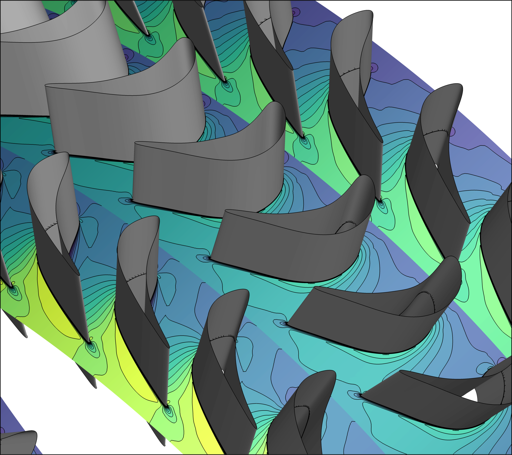
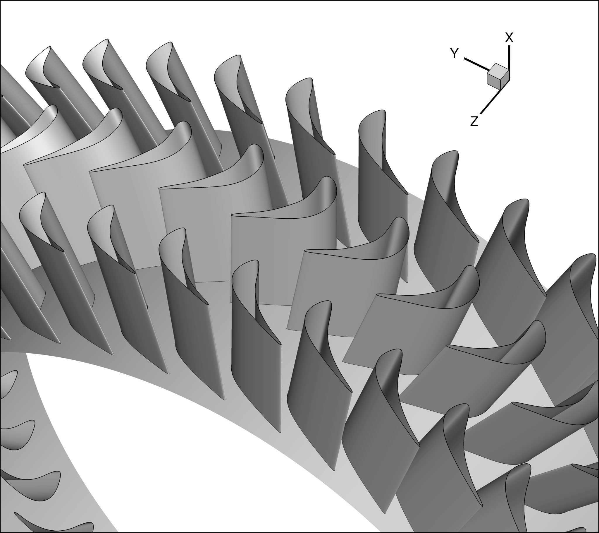
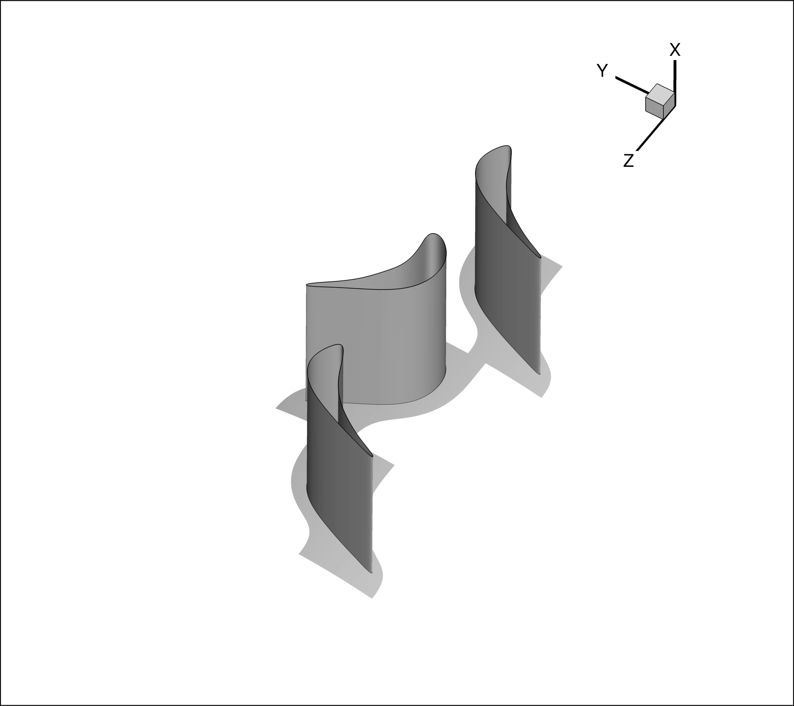
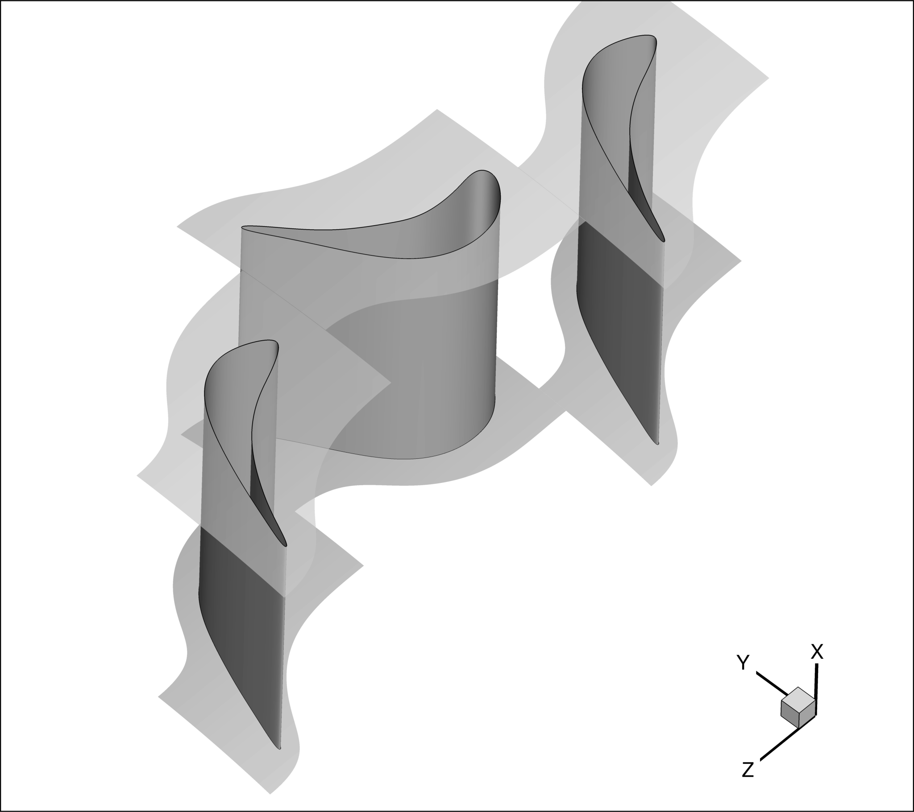
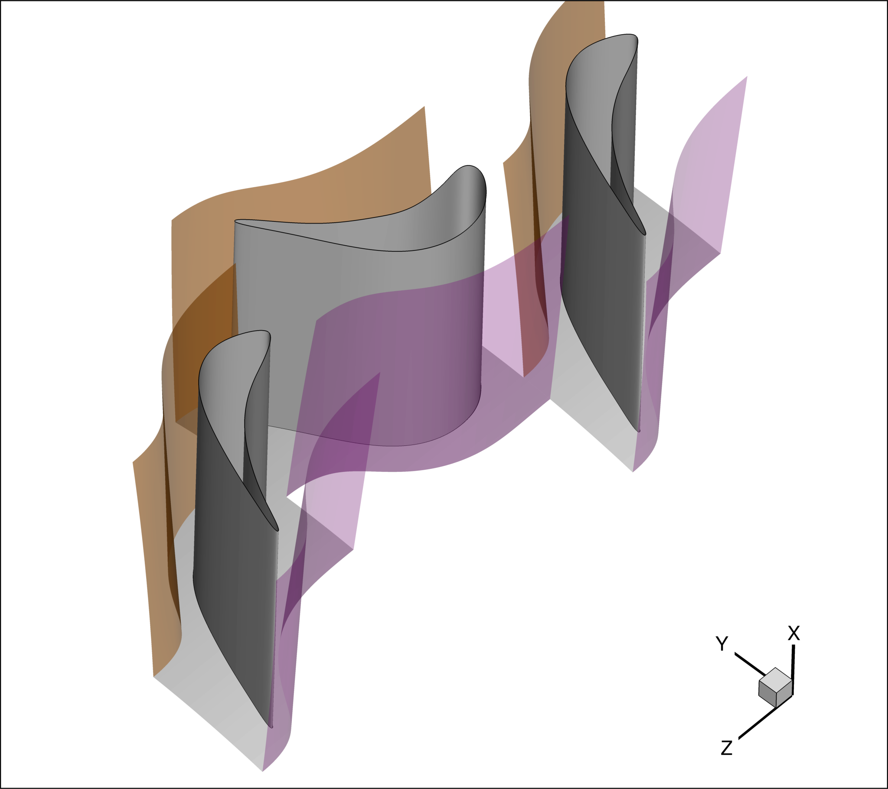
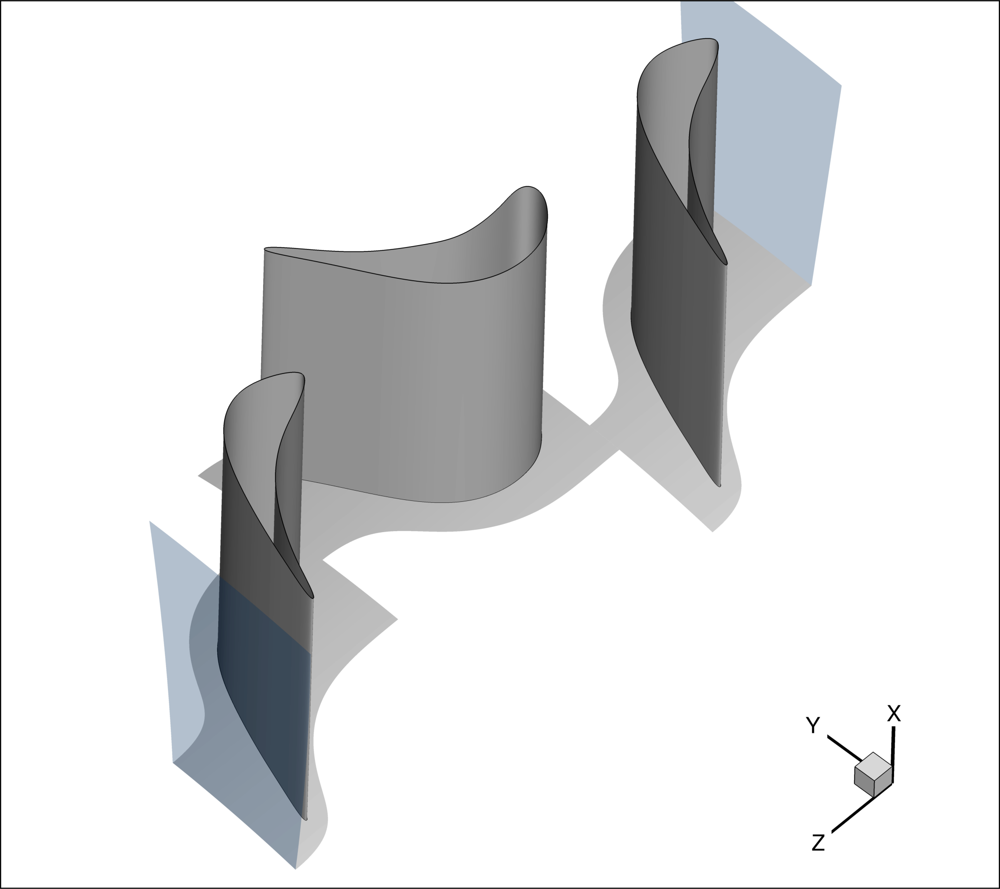
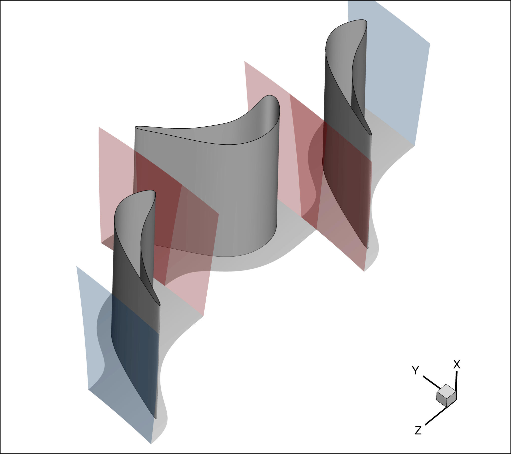
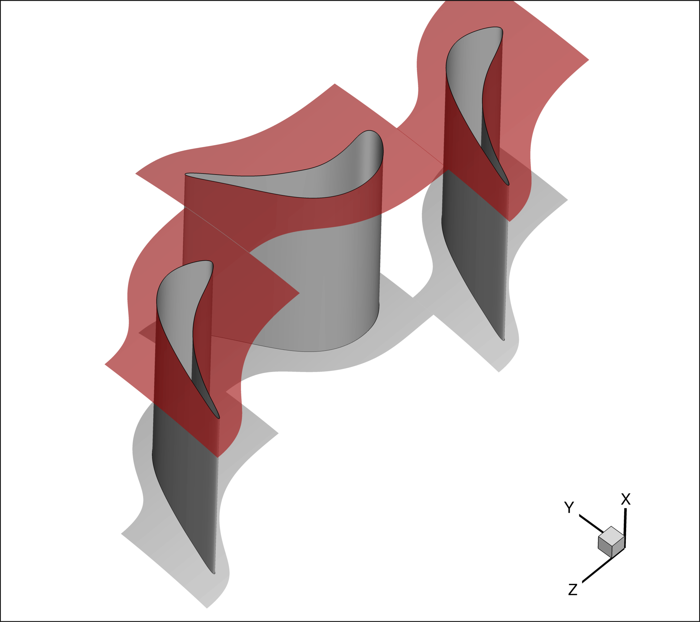
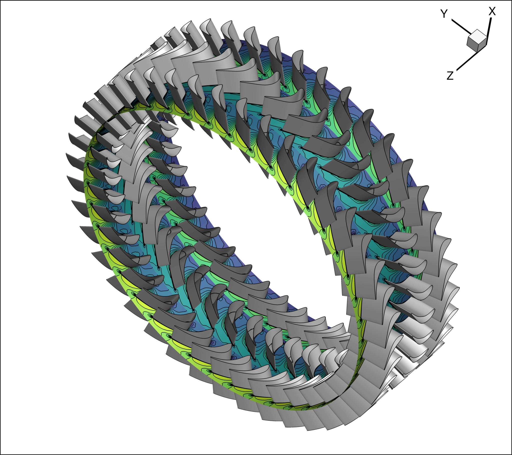
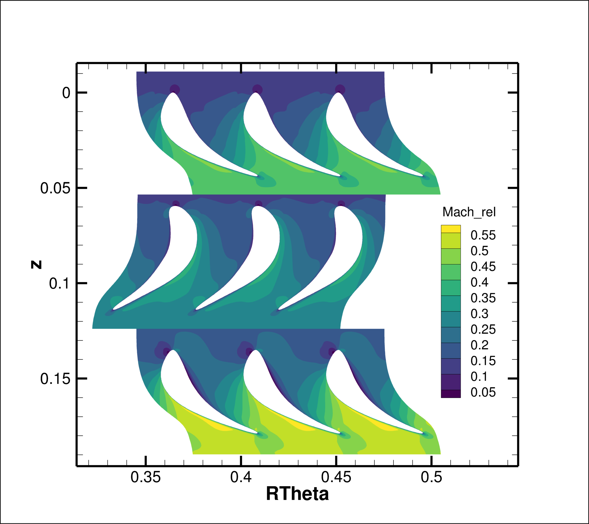

## Goals
Upon completing this tutorial, the user will become familiar with  3D steady-state RANS calculations of multi-row axial turbines, elaborating viscous, compressible flows of air, modelled as an ideal gas.


The geometry chosen for the tutorial is a 1-1/2 axial turbine stage (stator 1 - rotor - stator 2), from Gallus, H. E., et al. "*Endwall and Unsteady Flow Phenomena in an Axial Turbine Stage.*" ASME. J. Turbomach. October 1995; 117(4): 562–570. https://doi.org/10.1115/1.2836568. 


The solution will provide a flow field that can be compared against experimental data. However, to achieve a meaningful result, much more refined grids should be used.

*Note that the original stator geometries have been modified, increasing the blade count from 36 to 41.*


The intent of this tutorial is to introduce a compressible flow problem involving an axial turbine to explain how turbo-specific features are used within SU2. 
The following capabilities of SU2 will be showcased in this tutorial:
- Steady, 3D RANS equations with the Spalart–Allmaras (SA) turbulence model
- Giles non-reflective boundary conditions
- Non-reflective mixing-plane
- Hub and Shroud surface treatment
- Turbo Performance BCs
- Wall functions


## Resources

You can find the resources for this tutorial in the folder [compressible_flow/Aachen_Turbine](https://github.com/su2code/Tutorials/tree/master/compressible_flow/Aachen_Turbine) in the [tutorial repository](https://github.com/su2code/Tutorials).
You will need the mesh file [Aachen_Turbine.su2](https://github.com/su2code/Tutorials/tree/master/compressible_flow/Aachen_Turbine/Aachen_Turbine.su2) and the main config file [Aachen_Turbine.cfg](https://github.com/su2code/Tutorials/tree/master/compressible_flow/Aachen_Turbine/Aachen_Turbine.cfg), together with the sub-config files: [stator1.cfg](https://github.com/su2code/Tutorials/tree/master/compressible_flow/Aachen_Turbine/stator1.cfg), [rotor.cfg](https://github.com/su2code/Tutorials/tree/master/compressible_flow/Aachen_Turbine/rotor.cfg), [stator2.cfg](https://github.com/su2code/Tutorials/tree/master/compressible_flow/Aachen_Turbine/stator2.cfg).

*Note that, while the mesh used for this tutorial feature boundary layer refinements at the endwalls and on blade surfaces,
it does not include the rotor tip gap and it is rather coarse. For comparison of the results against literature, a finer meshes should be used.*


## Tutorial

The following tutorial will walk you through the steps required when solving state-state flows through multi-row turbines using SU2. It is assumed you have already obtained and compiled SU2_CFD. If you have yet to complete these requirements, please see the [Download](/docs_v7/Download/) and [Installation](/docs_v7/Installation/) pages.

### Background

This example uses a 3D one and a half turbine stage encompassing one stator, one rotor and a downstream stator, equal to the 
first one. Consequently, the case requires multiple frame of reference to account for the rotation of the rotor.


### Problem Setup

This tutorial will solve the flow through the Aachen turbine for the following boundary conditions:
- Working fluid is air
- Inlet Stagnation Temperature = 308.26 K
- Inlet Stagnation Pressure = 158245.38 Pa
- Inlet Flow Direction, unit vector (Flow dir-norm, Flow dir-tang, Flow dir-span) = (1.0, 0.0, 0.0)
- Outlet Static Pressure = 110050.96 Pa
- Rotor Rotational Speed, vector component (x y z) = 0.0 0.0 -366.52 rad/s


### Geometry Description

To reduce the computational cost, the geometrical periodicity of the system is exploited reducing the computational domain to one blade passage per row
(with the blade at the centre of the mesh). As it will be explained later, this requires the use of periodic boundary conditions.



Figure (1): Computational domain reduction.

### Mesh Description
The mesh is composed of hexahedral elements, with 53634 elements for stator 1 passage, 67935 elements for the rotor passage and 52374 for stator 2 passage.

*Upon preparing the mesh, it is important to make sure that the machine axis is the Z-axis and that the flow proceeds in the positive z-direction.*


### Multizone Config File
The current case features a multizone domain. As a consequence, the `MULTIZONE` option must be used, and the list of sub-config files (one per zone) must be provided via `CONFIG_LIST`. An example of the necessary syntax is provided in the following box.

```
MULTIZONE= YES

% List of config files for zone-specific options
CONFIG_LIST=(stator1.cfg, rotor.cfg, stator2.cfg)
```
#### Sub-config Files
The most important information that must be specified in the sub-config files concerns the grid movement. To activate it, the `GRID_MOVEMENT` option must be specified, together with the `MOTION_ORIGIN` and angular velocity (`ROTATION_RATE`) components about the rotation axis.\
For the solver initialization the motion Mach number is specified via the `MACH_MOTION`. \
Finally, a smoother convergence can be achieved via the `RAMP_ROTATING_FRAME`. Although not used in the present case, it can be activated similarly to the outlet pressure ramp, describe later in this tutorial.

These options are shown for the rotor sub-config file in the following box.

```
% Type of dynamic mesh (NONE, ROTATING_FRAME)
GRID_MOVEMENT = ROTATING_FRAME

MACH_MOTION= 0.35

MOTION_ORIGIN= 0.0 0.0 0.0

% Angular velocity vector in rad/s 
ROTATION_RATE= 0.0 0.0 -366.52

RAMP_ROTATING_FRAME= NO

% Parameters of the rotating frame ramp: 
   starting rotational speed, 
   updating-iteration-frequency, 
   total number of iterations for the ramp
RAMP_ROTATING_FRAME_COEFF= (0.0, 150.0, 2000)
```

### Boundary Conditions
To setup a turbomachinery CFD calculation, several kinds of boundary conditions are needed. The boundary conditions relevant to the Aachen turbine test case are discussed in the following, together with the necessary syntax to activate them.

#### Adiabatic, no-slip boundary conditions:

This kind of boundary condition is applied to all solid walls, highlighted in grey in Figure 2, such as HUB, SHROUD
AND BLADE belonging to each row. To make a wall adiabatic the ```MARKER_HEATFLUX``` can be used specifying a zero heatflux. This will also ensure that a no-slip condition is enforced on that wall.
The following box shows the syntax to be used to enforce this boundary condition at all solid walls present in the meshes.

```
% Format: (marker, 0.0)

MARKER_HEATFLUX = (BLADE1, 0.0, BLADE2, 0.0, BLADE3, 0.0, HUB1, 0.0, SHROUD1, 0.0, HUB2, 0.0, SHROUD2, 0.0, HUB3, 0.0, SHROUD3, 0.0)
```

Figure (2): Hub, shroud and blade surfaces.


#### (Rotational) Periodic boundary conditions:
This kind of boundary condition is applied to pairs of surfaces, such as the sides of the domain
(highlighted in Figure 3 in brown and purple). To enforce it, ```MARKER_PERIODIC``` should be used, providing the name of a "periodic marker" (purple surface), a "donor marker" (brown surface). 
In cases involving rotational periodicity (in contrast to translational periodicity) the coordinates of the rotation centre (x,y,z) and the rotation angle components (x-axis, y-axis, z-axis) should be provided.
The following box shows the syntax to be used to enforce this boundary condition at all sold walls present in the meshes.
```

% Format: ( periodic marker, donor marker, rot_cen_x, rot_cen_y, rot_cen_z, rot_angle_x-axis, rot_angle_y-axis, rot_angle_z-axis, translation_x, translation_y, translation_z)

MARKER_PERIODIC = (PER1_STATOR1, PER2_STATOR1, 0.0, 0.0, 0.0, 0.0, 0.0, 8.7804878, 0.0, 0.0, 0.0, PER1_ROTOR, PER2_ROTOR, 0.0, 0.0, 0.0, 0.0, 0.0, 8.7804878, 0.0, 0.0, 0.0, PER1_STATOR2, PER2_STATOR2, 0.0, 0.0, 0.0, 0.0, 0.0, 8.7804878, 0.0, 0.0, 0.0)

```

Figure (3): Periodic and donor surfaces.

#### Non-reflective boundary conditions 
Non-reflective boundary conditions can be enforced by means of the 
```MARKER_GILES``` boundary. They are used for both inlet-outlet, as well as mixing-plane boundaries. Furthermore, under-relaxation factors can be provided both for the average and Fourier components at any boundary where the Giles boundary condition is used. For additional details about their implementation and usage, the reader is referred to the paper by [Vitale et al.](https://doi.org/10.2514/1.B37685)

##### Inlet and outlet boundaries
The ```TOTAL_CONDITIONS_PT``` option allows to enforce the total inlet condition on a chosen boundary (identified by its marker). These include pressure and temperature, together with the incoming flow direction, expressed via its local coordinates (normal, tangential and radial to the chosen boundary).
The ```STATIC_PRESSURE_1D``` can be used to enforce the outlet static pressure value on a boundary where the flow is in radial equilibrium. 
These two options are applied to the inlet and outlet surfaces of the domain, respectively, highlighted in light blue in Figure 4. 
The following box presents the corresponding syntax.

```
% Non reflecting boundary condition for inflow and outflow:

% Format inlet:  
( marker, TOTAL_CONDITIONS_PT, Total Pressure , Total Temperature, Flow dir-norm, Flow dir-tang, Flow dir-span, under-relax-avg, under-relax-fourier)

(INFLOW_STATOR1, TOTAL_CONDITIONS_PT, 158245.38, 308.26, 1.0, 0.0, 0.0, 0.3, 0.0)


% Format outlet: 
(marker, STATIC_PRESSURE_1D, Static Pressure value, -, -, -, -, under-relax-avg, under-relax-fourier)

(OUTFLOW_STATOR2, STATIC_PRESSURE_1D, 110050.96,
0.0, 0.0, 0.0, 0.0 , 1.0, 0.0)
```


Figure (4): Non-reflective inlet and outlet boundary conditions

###### Mixing-plane surfaces
For mixing plane surfaces, as those highlight in light red in Figure 5, ```MIXING_IN``` and ```MIXING_OUT``` tags are used, depending on whether the flow enters or exits through that boundary.
The following box shows the corresponding syntax.

```
% Non reflecting boundary condition for mixing-plane:
% Format mixing-plane in and out: 
( marker, MIXING_IN or MIXING_OUT, -, -, -, -, -, -, under-relax-avg, under-relax-fourier)

(OUTFLOW_STATOR1, MIXING_OUT, 0.0, 0.0, 0.0, 0.0, 0.0, 0.3, 0.0,
INFLOW_ROTOR, MIXING_IN, 0.0, 0.0, 0.0, 0.0, 0.0, 0.3, 0.0)
```

Additionally, to activate the transfer of information between zones at the mixing planes, couples of boundaries forming a mixing-plane must be specified via the ```MARKER_MIXINGPLANE_INTERFACE``` and ```MARKER_ZONE_INTERFACE``` in stream-wise order, as shown in the following box.

```
MARKER_MIXINGPLANE_INTERFACE= (OUTFLOW_STATOR1, INFLOW_ROTOR, OUTFLOW_ROTOR, INFLOW_STATOR2)

MARKER_ZONE_INTERFACE= (OUTFLOW_STATOR1, INFLOW_ROTOR, OUTFLOW_ROTOR, INFLOW_STATOR2) 
```


The kind of interpolation method to be used at the mixing-planes can be specified via the ```MIXINGPLANE_INTERFACE_KIND```. Possible options are: ```LINEAR_INTERPOLATION```, ```NEAREST_SPAN```, ```MATCHING```.

```
MIXINGPLANE_INTERFACE_KIND= LINEAR_INTERPOLATION
```
To make the mixing-plane turbulent, the following option must be used:
```
TURBULENT_MIXINGPLANE= YES
```


Figure (5): Non-reflective mixing-plane

To turn on the non-reflective behaviour, the `SPATIAL_FOURIER` should be set to `YES`. However, for the current tutorial it is not activated, as in the following box.
```
SPATIAL_FOURIER = NO
```
If needed, extra under relaxation factor for the Giles BC at the hub and shroud can be provided as follows:
```
GILES_EXTRA_RELAXFACTOR = (0.05, 0.05)
```

Finally, the kind of average process for linearizing the Navier-Stokes equation at inflow and outflow boundaries, including mixing-plane(s), can be controlled by ```AVERAGE_PROCESS_KIND```. Possible options are: ```ALGEBRAIC```, ```AREA```, ```MASSSFLUX```, ```MIXEDOUT```. The default one is ```AREA```, however, only the ```MIXEDOUT``` option guarantees that the mixing plane treatment is conservative.\
The following box shows the setting to be used for the current case.

``` 
AVERAGE_PROCESS_KIND= MIXEDOUT
```


#### Shroud boundary condition
The ```MARKER_SHROUD``` allows to specify the mesh boundaries belonging to the shroud, as those highlighted in dark red in Figure 6.
When a boundary is tagged as part of the shroud, its grid velocity components are set to 0, mimicking the physical behaviour of a shroud wall. Only rotating zones, such as a rotor, are affected.
The following box shows the syntax to enforce this functionality.
```
MARKER_SHROUD = (SHROUD1, SHROUD2, SHROUD3)
```


Figure (6): Shroud boundary condition

#### Wall functions
To guarantee a low computational cost, a particularly coarse mesh, featuring large $y^{+}$ values, was used. Therefore, to achieve convergence of the present calculation, wall functions are needed. These are activated by the ```MARKER_WALL_FUNCTIONS```, followed by the ```MARKER_TAG``` of the boundaries to which the wall functions will be applied. 
The following box shows the basic syntax to active the wall functions for the current case.
```
% format: 
% MARKER_WALL_FUNCTIONS = (MARKER_TAG, STANDARD_WALL_FUNCTION)

MARKER_WALL_FUNCTIONS= ( BLADE1, STANDARD_WALL_FUNCTION, 
                         BLADE2, STANDARD_WALL_FUNCTION, 
                         BLADE3, STANDARD_WALL_FUNCTION, 
                         HUB1, STANDARD_WALL_FUNCTION, 
                         SHROUD1, STANDARD_WALL_FUNCTION, 
                         HUB2, STANDARD_WALL_FUNCTION, 
                         SHROUD2, STANDARD_WALL_FUNCTION, 
                         HUB3, STANDARD_WALL_FUNCTION, 
                         SHROUD3, STANDARD_WALL_FUNCTION)

WALLMODEL_KAPPA= 0.41
WALLMODEL_B= 5.5
WALLMODEL_MINYPLUS= 5.0
WALLMODEL_MAXITER= 200
WALLMODEL_RELFAC= 0.5
```


#### Ramps

To ease the convergence of turbomachinery cases, particularly when the pressure ratio of the machine is large, the use of ramps can be beneficial. These can be applied to both rotational speed and outlet pressure via ```RAMP_OUTLET_PRESSURE``` and ```RAMP_ROTATING_FRAME```. \
For the sake of completeness, the use of the outlet pressure ramp is demonstrated presenting in the following box the syntax to activate it.

```
% Specify ramp option for Outlet pressure (YES, NO) default NO
RAMP_OUTLET_PRESSURE= YES
%
% Parameters of the outlet pressure ramp (starting outlet pressure, updating-iteration-frequency, total number of iteration for the ramp)
RAMP_OUTLET_PRESSURE_COEFF= (140000.0, 150.0, 2000)
```


#### Turbo Performance and Analysis
To have SU2_CFD computing the typical turbomachinery performance indexes, the turbomachinery layout and machine kind must be specified by means of ```TURBOMACHINERY_KIND``` and ```TURBO_PERF_KIND```. The former lets you specify whether the machine is axial, centripetal, centrifugal, etc., while the latter lets you specify whether the machine is a compressor or a turbine. These data must be specified for each zone of which the machine is made up of.

Additionally, the inlet and outlet boundary to each zone must be specified in stream-wise order via the ```MARKER_TURBOMACHINERY```, as well as the inlet and the outlet boundaries of the full machine via the ```MARKER_ANALYZE```.

Finally, the performance averaging method, i.e. AREA, MASSSFLUX, MIXEDOUT, etc., must be specified via the ```PERFORMANCE_AVERAGE_PROCESS_KIND```. In case the MIXEDOUT option is selected, the parameters for the Newton method used for the mixed out process can be specified via ```MIXEDOUT_COEFF```.

The following box summarizes the setup for the Turbo Performance and Analysis of the current case.

```
% Specify kind of architecture (AXIAL, CENTRIPETAL, CENTRIFUGAL, CENTRIPETAL_AXIAL)
TURBOMACHINERY_KIND= AXIAL AXIAL AXIAL 

TURBO_PERF_KIND= (TURBINE, TURBINE, TURBINE)

MARKER_TURBOMACHINERY= (INFLOW_STATOR1, OUTFLOW_STATOR1,           
                        INFLOW_ROTOR, OUTFLOW_ROTOR, 
                        INFLOW_STATOR2, OUTFLOW_STATOR2)

MARKER_ANALYZE = (INFLOW_STATOR1, OUTFLOW_STATOR2)

% (ALGEBRAIC, AREA, MASSSFLUX, MIXEDOUT) default AREA
PERFORMANCE_AVERAGE_PROCESS_KIND= MIXEDOUT

%Parameters of the Newton method for the MIXEDOUT average algorithm (under relaxation factor, tolerance, max number of iterations) 
MIXEDOUT_COEFF= (1.0, 1.0E-05, 15)
```


#### Plotting

You can choose which boundaries to include in the surface flow file written by SU2_CFD via ```MARKER_PLOTTING```.
The following box shows the setting to export the three blade surfaces to the surface flow solution file.

```
% Marker(s) of the surface in the surface flow solution file
MARKER_PLOTTING= (BLADE1, BLADE2, BLADE3)
```


### Configuration File Options
The initialization of the flow solver can be performed from thermodynamic quantities, directly with `INIT_OPTION=TD_CONDITIONS`. It is recommended that you always confirm the resulting initialization state in the console output during runtime of SU2 that is reported just before the solver begins iterating. 
The initialization options are specified in the following box.

```
% Free-stream pressure (101325.0 N/m^2 by default, only Euler flows)
FREESTREAM_PRESSURE= 140000.0
%
% Free-stream temperature (273.15 K by default)
FREESTREAM_TEMPERATURE=  300.0
%
% Free-stream temperature (1.2886 Kg/m3 by default)
FREESTREAM_DENSITY= 1.7418
%
% Free-stream option to choose if you want to use Density (DENSITY_FS) or Temperature TEMPERATURE_FS) to initialize the solution
FREESTREAM_OPTION= TEMPERATURE_FS
%
% Free-stream Turbulence Intensity
FREESTREAM_TURBULENCEINTENSITY = 0.025
%
% Free-stream Turbulent to Laminar viscosity ratio
FREESTREAM_TURB2LAMVISCRATIO = 100.0
%
%
%Init option to choose between Reynolds (default) or thermodynamics quantities for initializing the solution (REYNOLDS, TD_CONDITIONS)
INIT_OPTION= TD_CONDITIONS
```

#### Final Remarks

To have the residuals exported from each volume zone `WRT_ZONE_HIST` should be set to `YES`.

### Running SU2

To run this test case, the standard procedure can be followed. At a terminal command line:

1.	Move to the directory containing the config files (Aachen_Turbine.cfg, stator1.cfg, rotor.cfg, stator2.cfg) and the mesh (Aachen_Turbine.su2) file. Make sure that the SU2 tools were compiled, installed, and that their install location was added to your path.
2. Run the executable by entering in the command line:

   ```
   $ SU2_CFD Aachen_Turbine.cfg
   ```

3. SU2 will print residual updates with each iteration of the flow solver, and the simulation will terminate after reaching the specified convergence criteria.
4. Files containing the results will be written upon exiting SU2. The flow solution can be visualized in ParaView (.vtk) or Tecplot (.dat for ASCII), depending on the user requirements in the config file.

### Results

Figure 7a and b show the relative Mach number distributions on a cylindrical cut slicing the flow domain at approximately mid-span. The resulting cylindrical surface is presented in Fig. 7a, while it 2D planar counter part is shown in Fig.7b for an easier visualization.

To compute it the following steps can be take in a post-processing tool, such as Tecplot or ParaView:

1. Compute Radius $R$, angualr coordinate $\theta$, and their product $R \cdot \theta$

2. Compute the relative velocity components and the relative Mach number

3. Slice the flow volume at $R = const$ and plot the relative Mach number on the corresponding iso-surface at $R = const$ (Fig. 7a)

3. Extract the slice 

4. Plot the relative Mach number contour of the extracted slice in a 2D space $(R \cdot \theta$ vs $z)$ and reverse the Z-axis, Fig. 7b. 



Figure (7): (a) Relative Mach number contour on a cylindrical cut (blade-to-blade view) at midspan of the turbine flow domain; (b) planar (blade-to-blade) view of the cylindrical cut.
