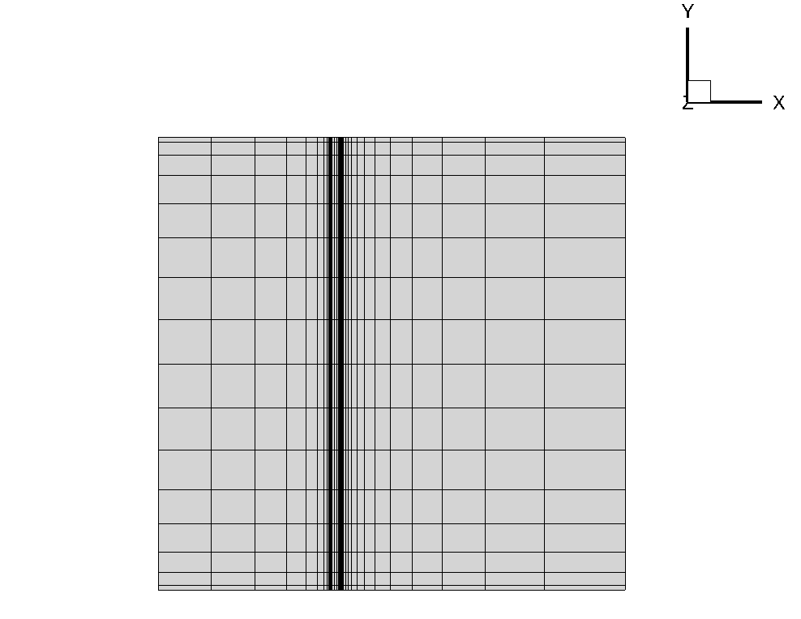
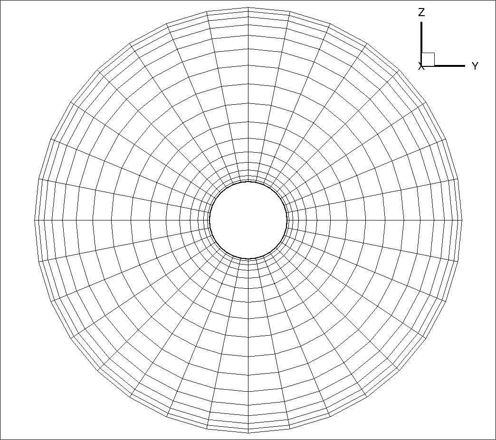
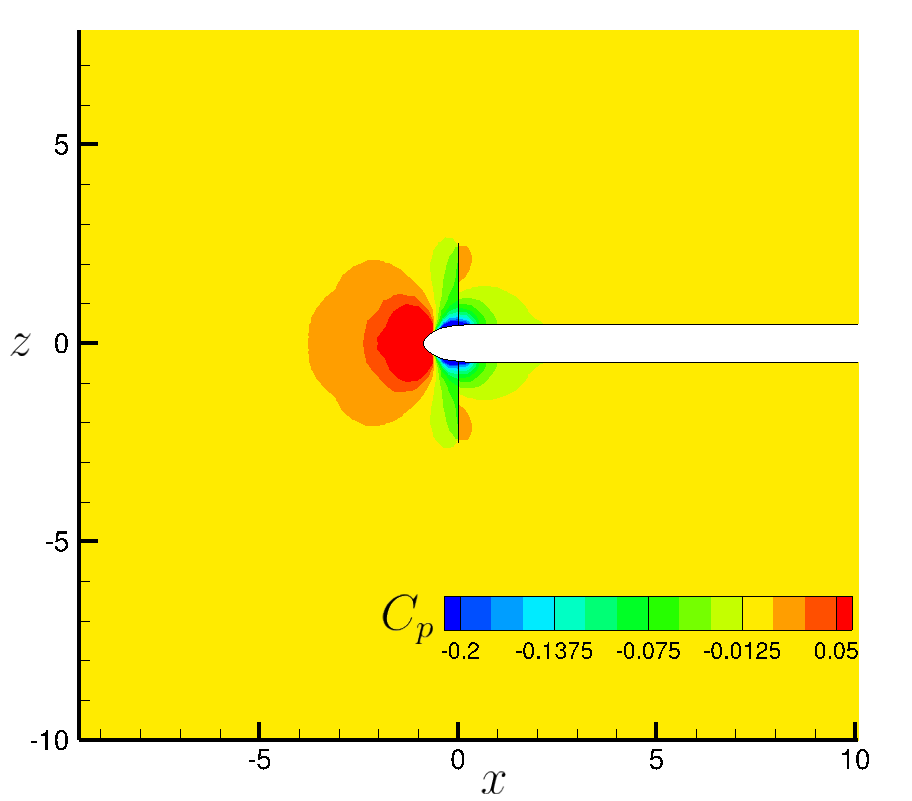

## Goals

Upon completing this tutorial, the user will be able to simulate the presence of a propeller by a general actuator disk boundary condition. The model enables the simulation of propellers with variable load distribution and including swirl. The specific geometry chosen for the tutorial is composed by an actuator disk and a semi-infinite spinner (grid file and propeller data courtesy of Mauro Minervino, Centro Italiano Ricerche Aerospaziali (CIRA)).

This tutorial is referred only to the actuator disk model `VARIABLE_LOAD` implemented in the V7.0.7.

## Resources

The resources for this tutorial can be found in the [compressible_flow/ActuatorDisk_VariableLoad](https://github.com/su2code/Tutorials/tree/feature_tutorial_ActuatorDisk/compressible_flow/ActuatorDisk_VariableLoad) directory in the [Tutorials repository](https://github.com/su2code/Tutorials). You will need the configuration file ([propeller_variable_load.cfg](https://github.com/su2code/Tutorials/blob/feature_tutorial_ActuatorDisk/compressible_flow/ActuatorDisk_VariableLoad/propeller_variable_load.cfg)), the mesh file ([propeller_variable_load.su2](https://github.com/su2code/Tutorials/blob/feature_tutorial_ActuatorDisk/compressible_flow/ActuatorDisk_VariableLoad/propeller_variable_load.su2)) and the propeller input data file ([ActuatorDisk.dat](https://github.com/su2code/Tutorials/blob/feature_tutorial_ActuatorDisk/compressible_flow/ActuatorDisk_VariableLoad/ActuatorDisk.dat)).
*It is important to note that the grid used in this tutorial is very coarse to keep computational effort low, finer meshes should be used.*

It is also presented the use of [OptimalPropeller.py](https://github.com/su2code/SU2/tree/master/SU2_PY/OptimalPropeller.py) script, very useful tool to generate a propeller input data file with variable load when only total thrust is known.

## Tutorial

The following tutorial will walk you through the steps required when solving a flow in presence of a propeller using SU2. The tutorial will also shows how to generate the propeller input data file witht the help of the [OptimalPropeller.py](https://github.com/su2code/SU2/tree/master/SU2_PY/OptimalPropeller.py) script when only total thrust is known. To this end, it is assumed you have already obtained and compiled SU2_CFD. If you have yet to complete these requirements, please see the [Download](/docs_v7/Download/) and [Installation](/docs_v7/Installation/) pages.

### Background

This test case is for an actuator disk with a semi-infinite spinner. The actuator disk is a model used to simulate the effects on the aiframe of rotary wings by a simple momentum theory [1].
In aeronautics it is a crucial topic for the airframe integration. Nowadays, a good actuator disk model is getting importance in order to simulate the effects of the propellers 
of given performance on the airframe by fast CFD analysis.
However, the disadvantage of using an actuator disk model is that the unsteady effects are neglected.

The actuator disk model used in this tutorial has been implemented referring to a propeller, so the input data file is suitable for a propeller, but not for a wind turbine. However, the model itself, can also be suitable for any rotary wing device. Note that the model has been tested only for propellers.

The hypothesis that we will consider are: compressible and axial flow (the angle between propeller axis and freestream is small).

### Problem Setup

This problem will solve the flow with these conditions:
- Freestream Mach number = 0.55996
- Angle of attack (AOA) = 0.0 deg
- Reynolds number = 3.65E7 (based on propeller diameter)
- Reynolds length = 5.0292 m

The global propeller data are:
- Thrust coefficient = 0.15
- Advance Ratio = 2.81487
- Radius = 2.5146 m

The thrust coefficient is defined using the "Renard" definition: the reference force is , where *n* are the propeller rounds per second and *D* is the propeller diameter
The advance ratio is defined as .

### Mesh Description

The computational domain contains the actuator disk mounted on a semi-infinite spinner. The mesh consists of 48,736 elements and 51,847 nodes. Again, we note that this is a very coarse mesh, and should one wish to obtain more accurate solutions for comparison with results in the literature, finer grids should be used. 

Three boundary conditions are employed:
- Actuator Disk on the two surfaces (upstream and downstream) of the actuator disk.
- Navier-Stokes adiabatic wall on the spinner.
- Far-field condition on the outer domain surface.


Figure (1): Far-field view of the computational domain.


Figure (2): Mesh of the domain in the *x-y* plane.


Figure (3): Close-up view of the mesh of the actuator disk in the *y-z* plane at *x=0*.


Figure (4): Close-up view of the mesh of the spinner in the *y-x* plane.

### Configuration File Options

Only the actuator disk boundary condition options are highlighted here:

```
% -------------------- ACTUATOR DISK BOUNDARY CONDITION --------------------------%
%
ACTDISK_DOUBLE_SURFACE = YES
%
% Actuator disk boundary type (VARIABLE_LOAD, VARIABLES_JUMP, BC_THRUST,
%                              DRAG_MINUS_THRUST)
ACTDISK_TYPE= VARIABLE_LOAD
%
% Actuator disk data input file name
ACTDISK_FILENAME= ActuatorDisk.dat
%
% Actuator disk boundary marker(s) with the following formats (NONE = no marker)
% Variable Load: (inlet face marker, outlet face marker,
%                 0.0, 0.0, 0.0, 0.0, 0.0, 0.0) Markers only effectively used.
MARKER_ACTDISK = ( DISK, DISK_BACK, 0.0, 0.0, 0.0, 0.0, 0.0, 0.0 )
```

The `ACTDISK_DOUBLE_SURFACE` option, in this case, is set to `true` because the actuator disk surface has been splitted in two parts: upstream and sownstream surfaces.
The `ACTDISK_TYPE` option, is used to choose the actuator disk boundary type. In this tutorial, we consider a variable load distribution along the disk, and that also take the *swirl* term into consideration. The actuator disk type that meets these conditions is the `VARIABLE_LOAD`.
The `ACTDISK_FILENAME` option is used to specify the name of the actuator disk data input file. Further we will see how to generate this file if only total thrust is known and not the details on the load distribution.
The `MARKER_ACTDISK` option, requires the following arguments:
- Marker of the upstream surface of the actuator disk.
- Marker of the downstream surface of the actuator disk.
- 6 zero arguments. These arguments have a different meaning using different `ACTDISK_TYPE`. In this case, they are all set to `0.0` because they are not needed.

*If there are more actuator disks, it is possible to append them in the `MARKER_ACTDISK` option.*

### Input Data File

The input data file is needed for the `VARIABLE_LOAD` actuator disk type.
An example of this file (used in this tutoral) is here reported:

```
MARKER_ACTDISK= DISK DISK_BACK
CENTER= 0.0 0.0 0.0
AXIS= 1.0 0.0 0.0
RADIUS= 2.5146
ADV_RATIO= 2.81487
NROW= 37
# rs=r/R    dCT/drs     dCP/drs     dCR/drs
  0.2031   0.020066   0.0890674         0.0
  0.2235   0.019963   0.0932674         0.0
  0.2439   0.021707   0.0982980         0.0
  0.2644   0.024667   0.1064153         0.0
  0.2848   0.029147   0.1189045         0.0
  0.3257   0.043674   0.1588513         0.0
  0.3461   0.053380   0.1849900         0.0
  0.3665   0.064327   0.2145367         0.0
  0.3870   0.076521   0.2471873         0.0
  0.4278   0.103679   0.3203392         0.0
  0.4483   0.118918   0.3609085         0.0
  0.4687   0.135619   0.4051864         0.0
  0.4891   0.152986   0.4518863         0.0
  0.5096   0.171453   0.5011266         0.0
  0.5300   0.190755   0.5528521         0.0
  0.5504   0.211062   0.6072281         0.0
  0.5709   0.231313   0.6620508         0.0
  0.5913   0.251252   0.7161404         0.0
  0.6117   0.271376   0.7700722         0.0
  0.6322   0.290980   0.8219708         0.0
  0.6526   0.309848   0.8715231         0.0
  0.6730   0.328502   0.9202496         0.0
  0.6935   0.346774   0.9681596         0.0
  0.7139   0.364895   1.0156277         0.0
  0.7343   0.381991   1.0603740         0.0
  0.7548   0.398417   1.1036331         0.0
  0.7752   0.413550   1.1442054         0.0
  0.7956   0.427447   1.1820164         0.0
  0.8161   0.440093   1.2163819         0.0
  0.8365   0.451007   1.2453084         0.0
  0.8569   0.460535   1.2682212         0.0
  0.8774   0.467765   1.2823500         0.0
  0.8978   0.471296   1.2839416         0.0
  0.9182   0.470303   1.2701343         0.0
  0.9387   0.460921   1.2317719         0.0
  0.9591   0.434937   1.1470356         0.0
  0.9795   0.377288   0.9746048         0.0
```

The `MARKER_ACTDISK` option, as the same for the configuration file, is used to specify the markers of the actuator disk surfaces. All the next propeller data will be referred to these surfaces.
The `CENTER` option contains the coordinates of the actuator disk center, expressed in the grid reference system.
The `AXIS` option contains the components of the unit vector normal to the actuator disk surface.
The `RADIUS` option is used to specify the actuator disk radius.
The `ADV_RATIO` option contains the advance ratio of the propeller defined as , where *n* are the propeller rounds per second and *D* is the propeller diameter.
The `NROW` option isused to indicate the number of radial stations of the actuator disk in which we assign the load distribution.
The next row is a dummy row, so it is skipped.
Then there are 4 columns containing respectively:
- The non dimensional radial station 
- The thrust coefficient distribution 
- The power coefficient distribution 
- The radial force coefficient distribution 

These coefficients are defined using the "Renard" definition: the reference force is , while the reference power is reference force is 

*It is possible to append other propellers data at the end of the input file. Note that the order and the format of the options should not be changed.*

The visualization of the tabular input for this case is shown in the following figure:


Figure (5): Thrust coefficient distribution along the non-dimensional radius.


Figure (6): Power coefficient distribution along the non-dimensional radius.

### Optimal Propeller Script

As already anticipated, the [OptimalPropeller.py](https://github.com/su2code/SU2/tree/master/SU2_PY/OptimalPropeller.py) script can be used to automatically generate the propeller input data file when the details on the variable load are not known.
This script allows the user to use the `VARIABLE_LOAD` actuator disk type also when only total thrust is known. The variable load distribution is obtained by the inviscid theory of the optimal propeller [1].

The input is interactive, and requires the following data:
1. Number of radial stations (where local data should be generated).
2. CT: the total thrust coefficient defined using the "Renard" definition.
3. R: The propeller radius expressed in meters.
4. r_hub: the hub radius expressed in meters.
5. J: the advance ratio.
6. Vinf: the free-stream velocity expressed in m/s.
7. Here, the script asks if you want to use the tip loss Prandtl correction (*yes* is the default choise).
8. N: if you chose yes in the previous stage, it requires also the number of propeller blades.

Once the input is given, the script provides 3 plots showing the tip loss Prandtl correction function, the axial and rotational interference factors and the thrust and power coefficients distributions along the non dimentional radius.
The script also provides 2 files:
- ActuatorDisk.cfg: containing the actuator disk boundary condition options needed in the configuration file.
- ActuatorDisk.dat: containing the propeller input data file.

*Note that the two generated files have some empty fields that need to be filled.*


### References

[1] *Glauert H., Airplane Propellers, in Aerodynamic Theory, Ed. Durand W. F., Vol. IV, pp. 169 - 360, Springer, 1935.*

### Running SU2

The actuator disk with variable load test case is small and will execute relatively quickly on a single workstation or laptop in serial. To run this test case, follow these steps at a terminal command line:
 1. Move to the directory containing the configuration file ([propeller_variable_load.cfg](https://github.com/su2code/Tutorials/blob/feature_tutorial_ActuatorDisk/compressible_flow/ActuatorDisk_VariableLoad/propeller_variable_load.cfg)), the mesh file ([propeller_variable_load.su2](https://github.com/su2code/Tutorials/blob/feature_tutorial_ActuatorDisk/compressible_flow/ActuatorDisk_VariableLoad/propeller_variable_load.su2)) and the propeller input data file ([ActuatorDisk.dat](https://github.com/su2code/Tutorials/blob/feature_tutorial_ActuatorDisk/compressible_flow/ActuatorDisk_VariableLoad/ActuatorDisk.dat)). Make sure that the SU2 tools were compiled, installed, and that their install location was added to your path.
 2. Run the executable by entering 
 
    ```
    $ SU2_CFD propeller_variable_load.cfg
    ```
   
    at the command line.
 3. SU2 will print residual updates with each iteration of the flow solver, and the simulation will terminate after meeting the specified convergence criteria.
 4. Files containing the results will be written upon exiting SU2. The flow solution can be visualized in ParaView (.vtk) or Tecplot (.dat for ASCII).

### Results

Some results for this test case are shown below.


Figure (7): Mach number contour in the *x-z* plane.


Figure (8): Pressure coefficient contour in the *x-z* plane.


Figure (9): Tangential velocity vectors just downstream the actuator disk. Swirl effect visualization.


Figure (10): Momentum in normal direction along *x* for different stations.


Figure (11): Pressure coefficient along *x* for different stations.


Figure (12): Tangential velocity component along *x* for different stations.


Figure (13): Pressure coefficient jump along the non-dimensional radius.


Figure (14): Tangential velocity component along *z* just upstream (State 1) and downstream (State 2) the actuator disk.
