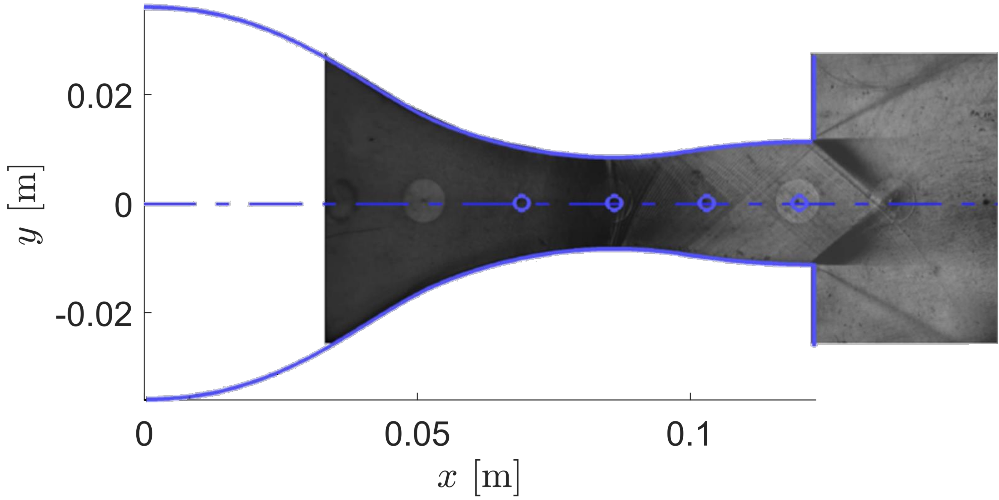

## Goals

Upon completing this tutorial, the user will be familiar with performing simulations of an internal, viscous flow with a non-ideal thermodynamic model through a 2D geometry. The solution will provide a flow field that can be compared with experimental results.
The specific geometry chosen for the tutorial is a converging-diverging supersonic nozzle.
The following capabilities of SU2 will be showcased in this tutorial:
- Steady, 2D RANS equations with the Shear Stress Transport model (SST) of Menter
- Peng-Robinson-Stryjek-Vera Equation of State
- Roe convective scheme in space (2nd-order, upwind)
- Riemann boundary conditions
- Euler implicit time integration
- CFL adaptation

The intent of this tutorial is to introduce a simple, compressible flow problem to explain how non-ideal thermodynamic models are used within SU2. This tutorial is also especially useful for showing how an internal flow computation can be performed using Riemann boundary conditions.

## Resources

You can find the resources for this tutorial in the folder [NICFD_nozzle](../../NICFD_nozzle) in the [project website repository](https://github.com/su2code/su2code.github.io).
You will need the mesh files [NICFD_nozzle.su2](../../NICFD_nozzle/NICFD_nozzle.su2) and the config file [NICFD_nozzle.cfg](../../NICFD_nozzle/NICFD_nozzle.cfg).

In the *Results* section of this tutorial, SU2 results are compared to the experimental data reported by Spinelli A., Cammi G., Gallarini S., Zocca M., Cozzi F., Gaetani P., Dossena V., Guardone A. *Experimental evidence of non ideal compressible effects in expanding flow of a high molecular complexity vapor*, Experiments in Fluids (2018) 59:126. You can find the experimental data for this test case in the tutorial directory, file [experimental_data.dat](../../NICFD_nozzle/experimental_data.dat), or access the full experimental database documented by Spinelli *et al.* at the [paper url](https://doi.org/10.1007/s00348-018-2578-0).

*Note that the mesh used for this tutorial is rather coarse, and for comparison of the results with literature, finer meshes should be used.*

## Tutorial

The following tutorial will walk you through the steps required when solving for the non-ideal compressible flow through the nozzle using SU2. It is assumed you have already obtained and compiled SU2_CFD. If you have yet to complete these requirements, please see the [Download](/docs/Download/) and [Installation](/docs/Installation/) pages.

### Background

This example uses a 2D converging-diverging nozzle geometry. It is the simplest geometry accelerating the flow from subsonic to supersonic speeds and is thus useful for investigating compressible flows whose thermodynamic behavior cannot be properly described by the simple ideal-gas law.
The geometry reported in this tutorial reproduces the test section of the Test-Rig for Organic Vapors (TROVA), a wind tunnel for non-ideal compressible flows at [CREA Lab](https://crealab.polimi.it/) of Politecnico di Milano. Experimental data for comparison with SU2 results are available at the reference reported in the *Resources* section.

### Problem Setup

This tutorial will solve the for the flow through the nozzle with these conditions:
- Working fluid MDM (Octamethyltrisiloxane)
- Inlet Stagnation Temperature = 542.13 K
- Inlet Stagnation Pressure = 904388 Pa
- Inlet Flow Direction, unit vector (x,y,z) = (1.0, 0.0, 0.0)

In design conditions, the total to exhaust pressure ratio of the nozzle is 3.125, which gives a supersonic outflow at Mach number 1.5. To run the test case, an outlet static pressure of 200,000 Pa is imposed.

### Mesh Description

The total length of the nozzle is 0.123 m, with an inlet height of 0.036 m and a throat height of 0.0084 m. The mesh is composed of quadrilateral elements, with 3,540 elements and 3,660 nodes. The figure shows the mesh topology and an indication of the boundary conditions. Characteristic-based Riemann boundary conditions are used on the INFLOW and OUTFLOW boundaries. The Navier-Stokes adiabatic wall condition is imposed on the WALL boundary. The symmetry boundary condition is used at the SYMMETRY boundary. The symmetry condition mirrors the flow about the x axis, thus allowing to reduce the size of the mesh and the computational cost.


Figure (1): Computational mesh.

### Configuration File Options

Several of the key configuration file options for this simulation are highlighted here.

The governing equations are Navier-Stokes, but by entering `KIND_TURB_MODEL= SST` we activate the RANS governing equations with the Shear Stress Transport model (SST) of Menter.

```
% ------------- DIRECT, ADJOINT, AND LINEARIZED PROBLEM DEFINITION ------------%
%
% Physical governing equations (EULER, NAVIER_STOKES,
%                               FEM_EULER, FEM_NAVIER_STOKES, FEM_RANS, FEM_LES,
%                               WAVE_EQUATION, HEAT_EQUATION, FEM_ELASTICITY,
%                               POISSON_EQUATION)
SOLVER= NAVIER_STOKES
%
% Specify turbulence model (NONE, SA, SA_NEG, SST, SA_E, SA_COMP, SA_E_COMP)
KIND_TURB_MODEL= SST
```

Initialization of the flow field for compressible problems can be performed by multiple methods. The default method is to initialize using the specified Reynolds number (`INIT_OPTION= REYNOLDS`) and free-stream temperature (`FREESTREAM_OPTION= TEMPERATURE_FS`). In this case, the flow is initialized from thermodynamic quantities directly with `INIT_OPTION= TD_CONDITIONS`, thus the Reynolds number option will be ignored. Regardless of the initialization method, we recommend that you always confirm the resulting initialization state in the console output during runtime of SU2 that is reported just before the solver begins iterating. In this case, the flow field is initialized with stagnation temperature and pressure.

```
% Init option to choose between Reynolds (default) or thermodynamics quantities
% for initializing the solution (REYNOLDS, TD_CONDITIONS)
INIT_OPTION= TD_CONDITIONS
%
% Free-stream option to choose between density and temperature (default) for
% initializing the solution (TEMPERATURE_FS, DENSITY_FS)
FREESTREAM_OPTION= TEMPERATURE_FS
%
% Free-stream pressure (101325.0 N/m^2, 2116.216 psf by default)
FREESTREAM_PRESSURE= 904388
%
% Free-stream temperature (288.15 K, 518.67 R by default)
FREESTREAM_TEMPERATURE= 542.13
```

For this problem, the ideal gas model is not suitable, and the Peng-Robinson-Stryjek-Vera equation of state is selected by setting the `FLUID_MODEL` to `PR_GAS`.
The parameter `GAMMA_VALUE` is computed in the dilute-gas limit (very low pressure, total temperature), while other entries are fluid data.

```
% ---- IDEAL GAS, POLYTROPIC, VAN DER WAALS AND PENG ROBINSON CONSTANTS -------%
%
% Fluid model (STANDARD_AIR, IDEAL_GAS, VW_GAS, PR_GAS,
%              CONSTANT_DENSITY, INC_IDEAL_GAS, INC_IDEAL_GAS_POLY)
FLUID_MODEL= PR_GAS
%
% Ratio of specific heats (1.4 default and the value is hardcoded
%                          for the model STANDARD_AIR, compressible only)
GAMMA_VALUE= 1.01767
%
% Specific gas constant (287.058 J/kg*K default and this value is hardcoded
%                        for the model STANDARD_AIR, compressible only)
GAS_CONSTANT= 35.17
%
% Critical Temperature (131.00 K by default)
CRITICAL_TEMPERATURE= 565.3609
%
% Critical Pressure (3588550.0 N/m^2 by default)
CRITICAL_PRESSURE= 1437500
%
% Acentric factor (0.035 (air))
ACENTRIC_FACTOR= 0.524
```

In addition, the models for transport coefficients can also be customized by exploring the viscosity and thermal conductivity options. By default with compressible flow, the laminar viscosity is governed by Sutherland’s law, and the thermal conductivity is assumed to depend on a constant Prandtl number. However, in the case of the Peng-Robinson-Stryjek-Vera equation of state (`PR_GAS`), the `CONSTANT_VISCOSITY` and `CONSTANT_CONDUCTIVITY` options are the only available. The values of the dynamic viscosity and thermal conductivity are imposed by entering the values for `MU_CONSTANT` and `KT_CONSTANT`.

```
% --------------------------- VISCOSITY MODEL ---------------------------------%
%
% Viscosity model (SUTHERLAND, CONSTANT_VISCOSITY, POLYNOMIAL_VISCOSITY).
VISCOSITY_MODEL= CONSTANT_VISCOSITY
%
% Molecular Viscosity that would be constant (1.716E-5 by default)
MU_CONSTANT= 1.21409E-05

% --------------------------- THERMAL CONDUCTIVITY MODEL ----------------------%
%
% Laminar Conductivity model (CONSTANT_CONDUCTIVITY, CONSTANT_PRANDTL,
% POLYNOMIAL_CONDUCTIVITY).
CONDUCTIVITY_MODEL= CONSTANT_CONDUCTIVITY
%
% Molecular Thermal Conductivity that would be constant (0.0257 by default)
KT_CONSTANT= 0.030542828
```

Characteristics-based Riemann boundary conditions are imposed on the INFLOW and OUTFLOW boundaries.
The parameters specified in the config excerpt below are:
- Label of the inflow boundary
- Type of input specified on the inflow boundary. For this test case, total pressure and temperature are specified.
- Total pressure [Pa]
- Total temperature [K]
- Inlet Flow Direction, unit vector (x,y,z) = (1.0, 0.0, 0.0)
- Label of the outflow boundary
- Type of input specified on the outflow boundary. For this test case, static pressure is specified
- Static pressure on the outflow boundary [Pa]

```
% Riemann boundary marker(s) (NONE = no marker)
% Format: (marker, data kind flag, list of data)
MARKER_RIEMANN= ( INFLOW, TOTAL_CONDITIONS_PT, 904388, 542.13, 1.0, 0.0, 0.0, OUTFLOW, STATIC_PRESSURE, 200000, 0.0, 0.0, 0.0, 0.0 )
```

In this test case, CFL adaptation is employed to accelerate convergence to steady state. Within this procedure, the CFL value at each iteration is determined based on the residual value at the current and previous iteration, as *CFL = CFL * (residual_old / residual_new)^power*. The value of *power* is given by the parameters `factor down` or `factor up` provided at the entry `CFL_ADAPT_PARAM`. The value of *power* is chosen depending on whether *residual_new* is greater or lower than the *residual_old*. The user can choose to only increase the CFL by setting the first entry of `CFL_ADAPT_PARAM` to `0`.

```
% CFL number (initial value for the adaptive CFL number)
CFL_NUMBER= 10.0
%
% Adaptive CFL number (NO, YES)
CFL_ADAPT= YES
%
% Parameters of the adaptive CFL number (factor down, factor up, CFL min value,
%                                        CFL max value )
CFL_ADAPT_PARAM= ( 0.1, 2.0, 10.0, 1000.0 )
```

For this test case, we chose the Roe upwind scheme with 2nd-order reconstruction (`MUSCL_FLOW = YES`). Note that, in order to activate the slope limiter for the upwind methods, `SLOPE_LIMITER_FLOW` must be set to something other than `NONE`. For turbulent convective and viscous fluxes, the default schemes are the scalar upwind method and the corrected average-of-gradients method, respectively. Convective fluxes are computed here to 1st-order (`MUSCL_TURB= NO`).

```
% ----------- SLOPE LIMITER AND DISSIPATION SENSOR DEFINITION -----------------%
%
% Monotonic Upwind Scheme for Conservation Laws (TVD) in the flow equations.
%           Required for 2nd order upwind schemes (NO, YES)
MUSCL_FLOW= YES
%
% Slope limiter (NONE, VENKATAKRISHNAN, VENKATAKRISHNAN_WANG,
%                BARTH_JESPERSEN, VAN_ALBADA_EDGE)
SLOPE_LIMITER_FLOW= NONE
%
% Monotonic Upwind Scheme for Conservation Laws (TVD) in the turbulence equations.
%           Required for 2nd order upwind schemes (NO, YES)
MUSCL_TURB= NO
```

### Running SU2

The nozzle simulation is relatively small and will execute quickly on a single workstation or laptop. This case will be run in serial. To run this test case, follow these steps at a terminal command line:

1. 1.	Move to the directory containing the config file (NICFD_nozzle.cfg) and the mesh file (NICFD_nozzle.su2). Make sure that the SU2 tools were compiled, installed, and that their install location was added to your path.
2. Run the executable by entering in the command line:

   ```
   $ SU2_CFD NICFD_nozzle.cfg
   ```

3. SU2 will print residual updates with each iteration of the flow solver, and the simulation will terminate after reaching the specified convergence criteria.
4. Files containing the results will be written upon exiting SU2. The flow solution can be visualized in ParaView (.vtk) or Tecplot (.dat for ASCII).

### Results

Results are given here for the SU2 solution of supersonic non-ideal compressible flow in the converging-diverging nozzle. As part of this tutorial, a coarse mesh was provided, but for comparison, results obtained by using a refined mesh (80,223 elements and 80,840 points) as well as experimental results are shown.
The figures below compare pressure and Mach number trends along the nozzle axis obtained from SU2 flow solutions and experimental data. Numerical results agree with the experimental data from the TROVA wind tunnel.




Figure (2): (a) Geometry of the test section and schlieren image of the nozzle flow. (b, c) Comparison Pressure (b) and Mach number (c) profiles of the experimental results of Spinelli *et al* (black dots with error bars) against SU2 computational results for the test case mesh (red lines) and a reference fine mesh (blue lines).
