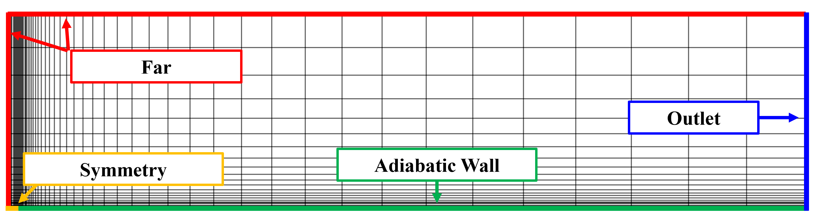
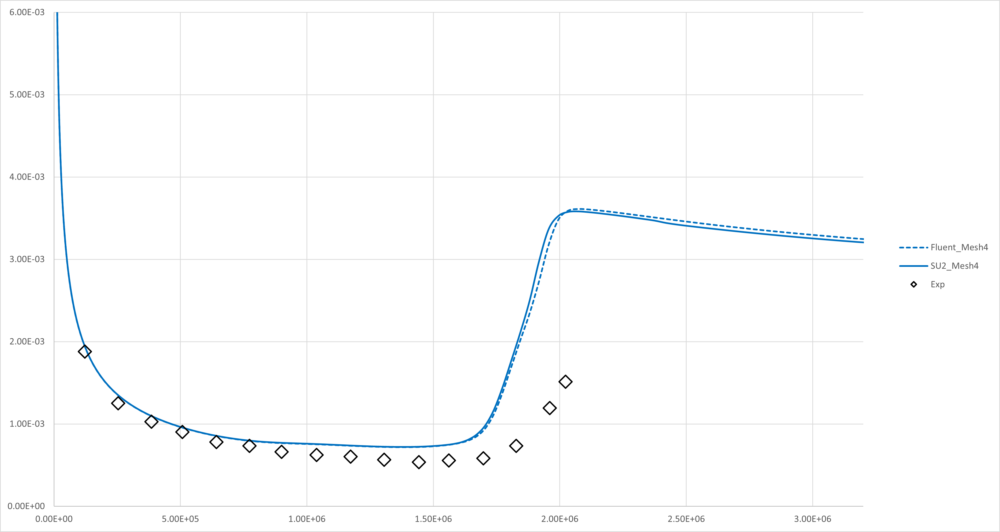

## Goals

Upon completing this tutorial, the user will be familiar with performing an external, transitional flow over a flat plate. The flow over the flat plate will be laminar until it reaches a point where a transition correlation depending on local flow variables is activated. The results can be compared to the zero pressure gradient natural transition experiment of T3A & T3A-[ERCOFTAC](http://cfd.mace.manchester.ac.uk/ercoftac/doku.php). The following capabilities of SU2 will be showcased in this tutorial:

- Steady, 2D, incompressible RANS equations
- k-w SST-2003m turbulence model with Langtry and Menter 2009 ([LM2009](https://turbmodels.larc.nasa.gov/langtrymenter_4eqn.html)) transition model
- L2Roe convective scheme in space (2nd-order, upwind)
- Corrected average-of-gradients viscous scheme
- Euler implicit time integration
- farfield, Outlet, Symmetry and No-Slip Wall boundary conditions

## Resources

The resources for this tutorial can be found in the [compressible_flow/Transitional_Flat_Plate/LM](https://github.com/su2code/Tutorials/tree/master/compressible_flow/Transitional_Flat_Plate/LM) directory in the [tutorial repository](https://github.com/su2code/Tutorials). 

## Tutorial

The following tutorial will walk you through the steps required when solving for the transitional flow over a flat plate using SU2. It is assumed you have already obtained and compiled the SU2_CFD code for a serial or parallel computation. If you have yet to complete these requirements, please see the [Download](/docs_v7/Download/) and [Installation](/docs_v7/Installation/) pages.

### Background

Practically, most CFD analyses are carried out using fully turbulent fields that do not account for boundary layer transition. Given that the flow is everywhere turbulent, no separation bubbles or other complex flow phenomena evolve. A transition model can be introduced, however, such that the flow begins as laminar by damping the production term of the turbulence model until a point where a transition correlation is activated. Currently, Langtry and Menter transition model ([LM](https://turbmodels.larc.nasa.gov/langtrymenter_4eqn.html)) that uses k-w SST-2003m as the baseline turbulence model is implemented in SU2.

For verification, we will be comparing SU2 results against the results of natural transition flat plate experiment of [ERCOFTAC](http://cfd.mace.manchester.ac.uk/ercoftac/doku.php). The experimental data include skin friction coefficient distribution versus the local Reynolds number over the flat plate.

### Problem Setup

The length of the flat plate is 20 meters, and it is represented by an adiabatic no-slip wall boundary condition. There is a symmetry plane located before the leading edge of the flat plate. far boundary condition is used on the left and top boundary of the domain, and outlet boundary condition is applied to the right boundaries of the domain. Flow condition, you can reference from  https://doi.org/10.2514/6.2022-3679.

### Mesh Description

The mesh used for T3A tutorial, which provided by [AIAA Transition modeling workshop-I](https://transitionmodeling.larc.nasa.gov).
The mesh used for T3A- tutorial, which consists of 122,880 quadrilaterals.
Both T3A and T3A- boundary conditions are shown below.



Figure (1): Mesh with boundary conditions (red: far, blue:out, orange:symmetry, green:wall)

### Configuration File Options

Several of the key configuration file options for this simulation are highlighted here.

```
% Physical governing equations (EULER, NAVIER_STOKES,
%                               WAVE_EQUATION, HEAT_EQUATION, 
%                               LINEAR_ELASTICITY, POISSON_EQUATION)
SOLVER= RANS
%
% Specify turbulent model (NONE, SA, SST)
KIND_TURB_MODEL= SST
%
% Specify versions/corrections of the SST model (V2003m, V1994m, VORTICITY, KATO_LAUNDER, UQ, SUSTAINING)
SST_OPTIONS= NONE
%
% Transition model (NONE, LM)
KIND_TRANS_MODEL= LM

...

%
% Free-stream turbulence intensity
FREESTREAM_TURBULENCEINTENSITY = 0.01

```

In the LM model, transition onset location is affected by freestream turbulence intensity.

### Running SU2

To run this test case, follow these steps at a terminal command line:

1.	Copy the ([config file](https://github.com/su2code/Tutorials/tree/master/compressible_flow/Transitional_Flat_Plate/LM/)) and ([mesh file](https://github.com/su2code/Tutorials/tree/master/compressible_flow/Transitional_Flat_Plate/LM/)) so that they are in the same directory. Move to the directory containing the config file and the mesh file. Make sure that the SU2 tools were compiled, installed, and that their install location was added to your path.

2.	Run the executable by entering 

    ```
    $ SU2_CFD transitional_LM_model_ConfigFile.cfg
    ``` 

    at the command line.

3.	SU2 will print residual updates for each iteration of the flow solver, and the simulation will finish upon reaching the specified convergence criteria.

4.	Files containing the results will be written upon exiting SU2. The flow solution can be visualized in Tecplot or ParaView.

### Results

The figure below compares the skin friction results obtained by the LM transition model to the result of another solver(=Fluent 19.0) and experimental data. 


Figure (2): Comparison of the skin friction coefficients for the T3A case.

Figure (3): Comparison of the skin friction coefficients for the T3A- case.


## Notes

The [LM model](https://turbmodels.larc.nasa.gov/langtrymenter_4eqn.html) is designed using general subsonic flow experiment results(T-S wave, bypass transition, and separation-induced transition). So, This LM model can't provide appropriate simulation results for crossflow,  supersonic, and hypersonic flow(= crossflow instability, 1st mode, Mack 2nd mode).
