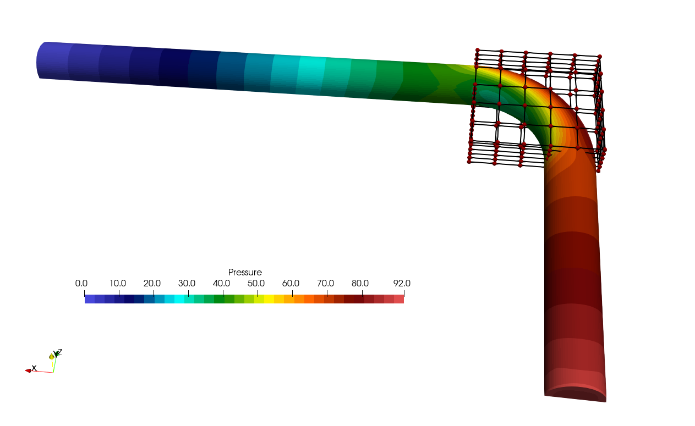
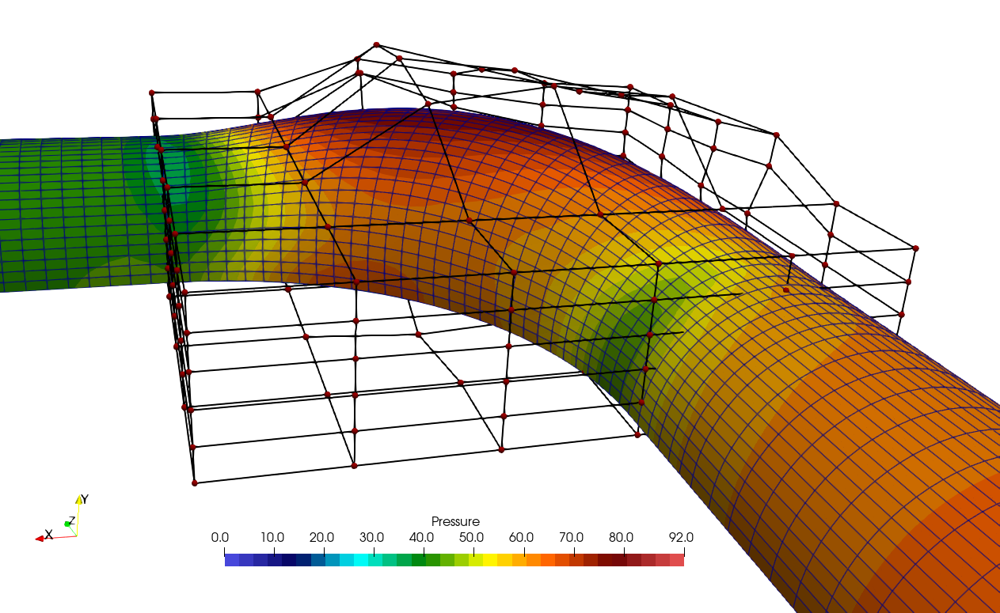

: The 90 degree bend with the FFD box.")
#### Figure (1): The 90 degree bend with the FFD box.


## Goals

This tutorial closely follows the design optimization setup of the 2D mixing channel, see the tutorial on design optimization for [Species Transport](/tutorials/Species_Transport/). We will use the python framework [FADO](https://github.com/su2code/FADO) to set up the optimization problem. In this tutorial however we will optimize the pressure drop of the 90 degree pipe bend. The CFD results were already discussed previously in  [this tutorial](/tutorials/Inc_Turbulent_Bend/). Here we focus on the following aspects:
* Setup of the FFD box for a 3D problem using SU2_DEF.
* Setup of the FADO problem: 
	- using previous solutions of the CFD and adjoint solver to reduce computing time.
	- automatically add the correct keywords for the FFD box (type and degrees of freedom).
	- discussion of mesh quality issues and improvement using FFD constraints.
* Presentation of the final setup and results.

If you have not done so already, please first have a look at the prerequisite tutorials for a better understanding.

## Prerequisites

Besides the python library FADO, you will need to compile SU2 with automatic differentiation support. Note that the script provided uses 8 cores, so you need to compile with mpi support as well as enable autodiff:
```
./meson.py build --optimization=2 -Ddebug=false -Denable-autodiff=true -Dwith-mpi=enabled --prefix=/home/user/Codes/su2_github_develop/su2/
```

## Resources

You can find the resources for this tutorial in the folder [design/Inc_Turbulent_Bend_Wallfunctions](https://github.com/su2code/Tutorials/tree/master/design/Inc_Turbulent_Bend_Wallfunctions) and the respective subfolders. Note that the setup used in this tutorial uses a pipe bend with a shorter pipe length before and after the bend to reduce the computing time. We have also merged all wall boundaries and all symmetry planes into one wall boundary and one symmetry plane. The gmsh file is provided in the repository so you can create your own pipe bend(s) with it.

## 1. Basic setup of FFD box and FADO
Usually, designs are created with a CAD tool. These designs are then discretized into a computational mesh for CFD analysis. When optimizing a design, we then only have the discretized mesh available. We could manipulate the mesh nodes directly but this does not lead to very smooth deformations. Instead we modify our mesh using FFD boxes. The nodes of the FFD box are moved according to the design sensitivities, and the mesh nodes inside the FFD box are then smoothly deformed using Bezier curves (default) or B-splines.
Figure (1) above shows the setup that we will be using. 

### Creation of the FFD box
The FFD box can be created and added to the .su2 mesh file using SU2_DEF. The important parameters to add to the configuration file are:

```
FFD_DEFINITION= (BOX, \
-0.06, -0.009, -0.001, \
 0.209, -0.009, -0.001, \
 0.209, 0.060, -0.001, \
-0.06, 0.060, -0.001, \
-0.06, -0.009 ,0.27, \
 0.209 ,-0.009, 0.27, \
 0.209, 0.060, 0.27, \
-0.06, 0.060, 0.27 )

FFD_DEGREE= (5,5,5)
DV_KIND= FFD_SETTING
DV_MARKER= ( wall, symmetry)
DV_PARAM= (1.0)
```
Our FFD box is 5x5x5 cells, or 6x6x6=216 nodes. With each 3 degrees of freedom for the x-,y- and z-direction, we get a total of 648 d.o.f. The box is slightly larger than our original bend, but most importantly the symmetry plane is completely inside the FFD box.
We run the command 

```
$ SU2_DEF sudo_0_add_FFD_box.cfg
```

We will only use the file *sudo_0_add_FFD_box.cfg* to create the FFD box. This command will create a new .su2 mesh called *mesh_out.su2* that has the definition of the FFD box added to the file. Note that at this stage we need to provide the boundaries inside the FFD box that are allowed to deform using the keyword **DV_MARKER**. The nodes on the boundaries inside the FFD box are part of the information that is added with the FFD box to the mesh_out.su2 mesh file. 


### Setup the FADO script optimization.py

Previously the python script *set_ffd_design_var.py* was used in the tutorial on the optimization of the mixing channel. We can however create the correct entries with a couple of simple python commands and add them directly to the main python script that FADO will use, *optimization.py*. We already used *optimization.py* before in the tutorial [Species Transport](/tutorials/Species_Transport/) and we will highlight some changes here. 

For the optimization, we need to modify 2 things in our config file: **DV_KIND** and **DV_PARAM**. The keyword **DV_PARAM** contains N entries of the form *( BOX, 0, 0, 0, 1.0, 0.0, 0.0 );*
 Note that the meaning of the entries are *( FFD_BoxTag, i_Ind, j_Ind, k_Ind, x_Disp, y_Disp, z_Disp )* , meaning that after the keyword **BOX**, we get the 3 indices i,j,k of the FFD box, followed by the allowed displacement of that index in the x-,y- and z-direction. Mesh nodes in the symmetry plane only move in the symmetry plane, so symmetry is preserved. 

The list of FFD control points can be created using:
```python
s = "FFD_CONTROL_POINT"
ffd_string = s
for i in range((DX**NDIM)*NDIM - 1):
  ffd_string = ffd_string + ", " + s 
```
In the sudo.cfg file we have a placeholder which has the form:
```
DV_KIND= __FFD_CTRL_PTS__ 
```
And we automatically replace the placeholder **\_\_FFD_CTRL_PTS\_\_** in the fado script during run-time using the command
```
replace_dv_kind = Parameter([ffd_string], LabelReplacer("__FFD_CTRL_PTS__"))
```

For the **DV_PARAM** string, we can use a similar piece of python code:

```python
dv_param_string=""
for idim in range(NDIM):
  xdim = ydim = zdim = "0.0"
  if (idim==0): xdim="1.0"
  elif (idim==1): ydim="1.0"
  elif (idim==2): zdim="1.0"
  for k in range(DX):
    for j in range(DX):
      for i in range(DX):
        s = "( BOX, " + str(i) + ", " + str(j) + ", " + str(k) + ", " + xdim + ", " + ydim + ", " + zdim + " );"
        dv_param_string += s
```
which is replaced using:
```python
replace_dv_param =Parameter([dv_param_string], LabelReplacer("__FFD_PARAM__"))
```

The only thing we need to take care of now is to define the correct number of FFD nodes DX=6 and the correct dimension of the problem, NDIM=3. You could even get these values from the .su2 mesh file if you want!

In our config file sudo.cfg, we also use the following setting:
```
FFD_CONTINUITY= 1ST_DERIVATIVE
```
Which means that when the sides of the FFD box cuts through the mesh, then at the cut, we want the mesh deformation to stay first order continuous. If you do not do this, you might get sharp jumps in your mesh at the location of the  intersection.

Unfortunately, if we use this unconstrained setup, the mesh deformation will be as shown in Figure (2) below:

: bad mesh for unconstrained FFD box.")
#### Figure (2): The unconstrained deformation leads to mesh cells that have collapsed on the symmetry plane. This leads to convergence issues at the next design iteration.

As you can see, the row of cells just above the symmetry plane has collapsed onto the symmetry plane, leading to a very bad mesh. In the next design iteration, the simulations do not converge anymore and the optimization procedure stops. So we need some additional constraints on the movement of the nodes of the FFD box.

### constrained FFD deformation

The problem here is that the mesh nodes on the symmetry plane are not allowed to move vertically, they only move horizontally outward inside the symmetry plane. Unfortunately, the FFD deformation is such that mesh nodes just above the symmetry plane are moved down, almost on the symmetry plane. To improve the quality of the mesh deformation, we disallow the vertical movement of the FFD box nodes on the nodes in the bottom plane of the FFD box, with j-index 0 and vertical displacement (0,1,0). In Figure (3), the plane with index j=0 is the bottom plane, indicated in yellow. So we remove entries in the **DV_PARAM** list of the form *(BOX, i_Ind, 0, k_Ind, 0,1,0)*. Additionally, we also disallow the vertical movement of the nodes in the plane j=1.
Since we disallow vertical movement in 2x(6x6)=72 nodes in the planes with $$j=0$$ and $$j=1$$,  The total degrees of freedom is then $$648 - 72 = 576$$ d.o.f. 



#### Figure (3): The 90 degree bend with the FFD box.


The number of design variables needs to be reduced by 2x6x6 and we need to remove 2x6x6 strings from the ffd_string:
```python
nDV = nDV - 2*DX*DX
ffd_string.replace(s+", ","",2*DX*DX)
```

Additionally, we need to remove the vertical movement of the nodes in the plane with j=[0,1]:

```python
jlist = [0,1]
dof = "0.0, 1.0, 0.0"

for j in jlist:
  for k in range(DX):
    for i in range(DX):
      remove_dof = "( BOX, " + str(i) + ", " + str(j) + ", " + str(k) + ", " + dof + " )"
      print("removing ", remove_dof)
      dv_param_string = dv_param_string.replace(remove_dof+";", "", 1)
      # in case the plane is at the end, the string does not have a semicolon
      dv_param_string = dv_param_string.replace(remove_dof, "", 1)
```

Another modification to the configuration file that we would like to add is to restart from the solution of the previous design. SU2 will automatically interpolate the solution to the nearest neighbor if the mesh coordinates do not match. Since we might not have an initial solution to start with, we would like to switch from **RESTART= NO** to **RESTART= YES** after the first iteration. 

We can do this with a simple *sed* command that searches and replaces the string in config.cfg in the working directory and then copies the config file back to the base dir:

```python
restart_yes="sed -i 's/RESTART_SOL= NO/RESTART_SOL= YES/' config.cfg && cp " + configCopy + " ../../"
```

The easiest way to perform the update is to simply add it as another ExternalRun process: 
```python
update_restart = ExternalRun("UPDATE_RESTART",restart_yes,False) # True means sym links are used for addData
update_restart.addData(configCopy)
```
This means that we will call this function every design iteration, but only in the first design iteration will it have an effect. 

FADO copies the restart file and all other necessary files from the base directory (where you start your script) into the working directory. Here, the working directory is called *OPTIM*. Inside *OPTIM* we have subdirectories for the different runs, i.e. *OPTIM/DEFORM*, OPTIM/DIRECT*, *OPTIM/ADJOINT* and *OPTIM/DOT*. When all runs in this directory are done, they are archived in *DSN_001*, *DSN_002*, etc.

So what we will do now is every time after we run the primal solver, we copy the restart file from the working directory *OPTIM/DIRECT* back to the base dir.

```python
cfd_command = "mpirun -n " + ncores + " " + su2_run + "SU2_CFD " + configMaster  + "&& cp restart.csv ../../solution.csv"
```

Note that the primal solver by default saves the file restart.csv (keyword: **RESTART_FILENAME= restart**), but reads the file solution.csv (keyword: **SOLUTION_FILENAME= solution**). Note that we save ASCII files here, which is determined by the option **OUTPUT_FILES= RESTART_ASCII**. When reading ASCII restart files, we also need **READ_BINARY_RESTART= NO**.
Please go through the *optimization.py* script now and check the settings. By default, the above procedure to restart from a previous solution is not active. You can activate it now if you wish.

## 2. FADO optimized result

We run the optimization script:

```
$ python optimization.py
```

We have set it to run 5 design iterations. Please note that the optimization was set up for a parallel run.

The objective values for the 5 design iterations are given in the table below.


| iteration | $$\Delta P$$, total| $$\Delta P$$, bend| gain, total| gain, bend | 
| --------|--------|--------|--------|--------|
|0|89.0 [Pa]|20.7 [Pa]| -| - |
|1|84.9 [Pa]|16.6 [Pa]|4.6 %|19.8 %|
|2|82.1 [Pa]|13.8 [Pa]|7.8 %|33.3 %|
|3|81.6 [Pa]|13.3 [Pa]|8.3 %|35.7 %|
|4|79.9 [Pa]|11.6 [Pa]|10 %|44 %|


We see that the global pressure drop between the inlet and the outlet reduces from 89 Pa to 80 Pa, a reduction of more than 10 %. However, since we are optimizing only the bend, we should subtract the pressure drop of the straight parts and only consider the pressure drop of the bend for a more fair comparison. In paraview, we can integrate the pressure in a 2D slice at the start and end of the bend. The pressure drop of the bend comes to $$\Delta P = 20.7 Pa$$. That means that the reduction of pressure drop in the bend is actually 44 % !


#### Figure (4): Optimized bend after 5 design iterations, with the deformed FFD box.
