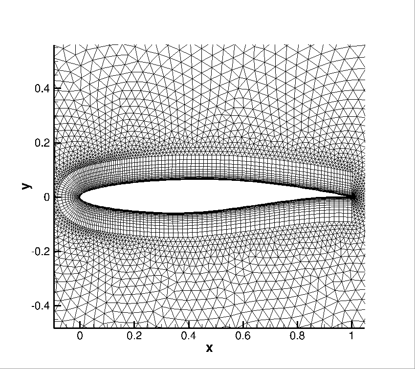
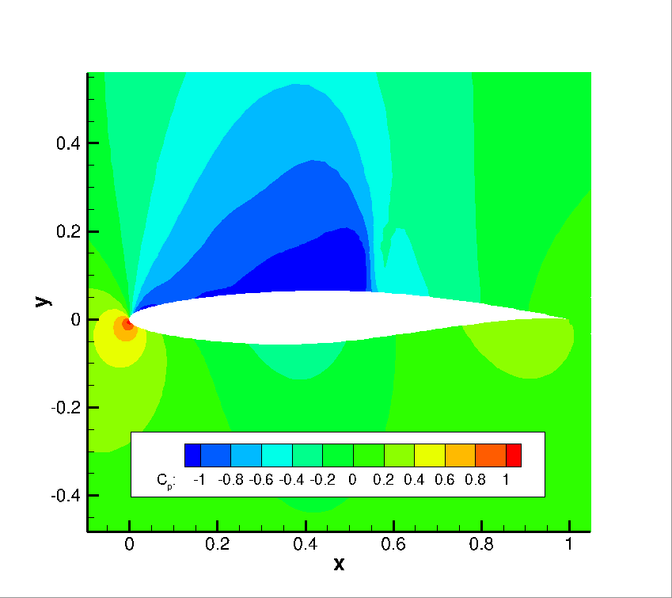
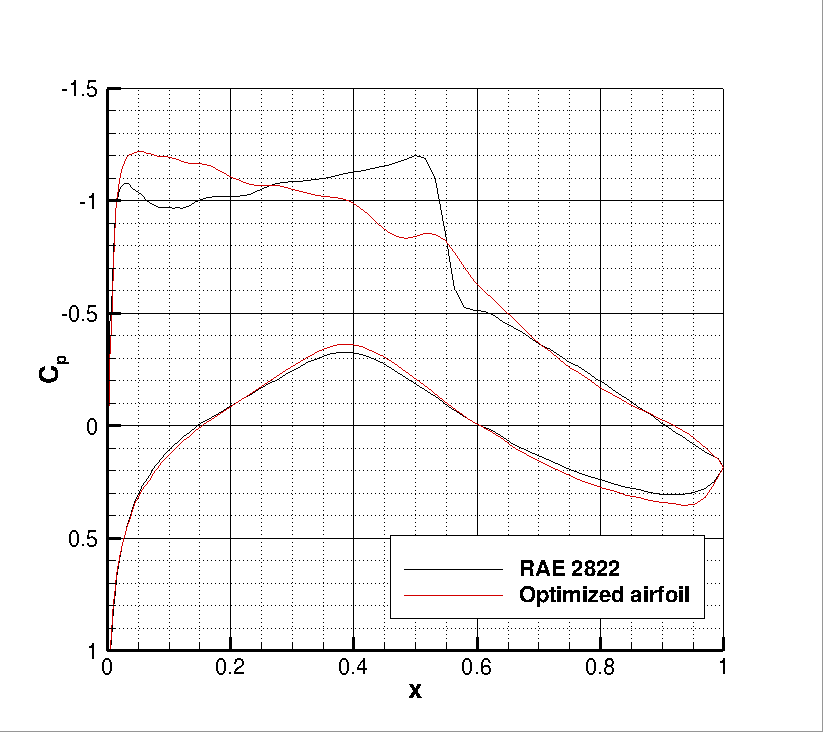
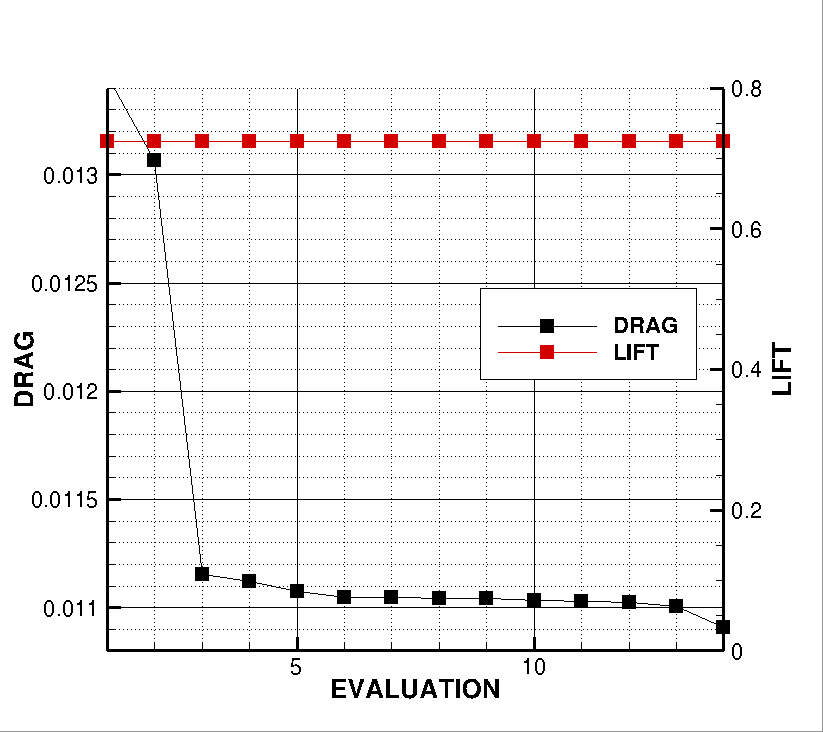

## Goals

Upon completing this tutorial, the SU2 user will be familiar with performing a constrained optimal shape design of a 2D airfoil geometry. The airfoil geometry chosen for this tutorial is a RAE2822 airfoil (AGARD Report AR 138, 1979) at transonic speed in viscous turbulent fluid and constant C<sub>L</sub>. The following SU2 tools will be showcased in this tutorial:
- **SU2_CFD** - performs the direct flow simulations
- **SU2_CFD_AD** - performs the adjoint flow simulations using automatic differentiation
- **SU2_DOT_AD** - projects the adjoint surface sensitivities into the design space to obtain the gradient
- **SU2_DEF** - deforms the geometry and mesh with changes in the design variables during the shape optimization process
- **SU2_GEO** - evaluates the thickness of airfoil and its gradient with respect to each design variable.
- **shape_optimization.py** - automates the entire shape design process by executing the SU2 tools and optimizer

We will walk through the shape design process and highlight several options related to the discrete adjoint (Automatic Differentiation) in SU2 and the configuration options for shape design.

## Resources

You can find the resources for this tutorial in the folder [Turbulent_Shape_Design](https://github.com/su2code/su2code.github.io/tree/master/Turbulent_2D_Constrained_RAE2822) in the [tutorial repository](https://github.com/su2code/Tutorials). You will need the mesh file [mesh_RAE2822_turb.su2](../../Turbulent_2D_Constrained_RAE2822/mesh_RAE2822_turb.su2), the config file [turb_SA_RAE2822.cfg](../../Turbulent_2D_Constrained_RAE2822/turb_SA_RAE2822.cfg) and initial solution files for the solver and adjoint [solution_flow.dat](../../Turbulent_2D_Constrained_RAE2822/solution_flow.dat), [solution_adj_cd.dat](../../Turbulent_2D_Constrained_RAE2822/solution_adj_cd.dat), and [solution_adj_cmz.dat](../../Turbulent_2D_Constrained_RAE2822/solution_adj_cmz.dat).

## Tutorial

The following tutorial will walk you through the steps required when performing shape design for the transonic turbulent airfoil using SU2 and the automatic differentiation tool. It is assumed that you have already obtained and compiled SU2_CFD, SU2_CFD_AD, SU2_DOT, SU2_DOT_AD, SU2_GEO, and SU2_DEF. The design loop is driven by the shape_optimization.py script, and thus Python along with the NumPy and SciPy Python modules are required for this tutorial. If you have yet to complete these requirements, please see the [Download](/docs/Download/) and [Installation](/docs/Installation/) pages. And do not forget to install the AD design capability [AD Build](/docs/AD-Build/).

### Background

We start with a baseline geometry (RAE 2822) and grid as input to our design cycle, along with a chosen objective function, constraints and set of design variables. For this tutorial, drag coefficient at a constant lift coefficient will be our objective function. In terms of constraints we will use pitching moment and airfoil thickness. As in the NACA 0012 case, we will use Hicks-Henne bump functions to parameterize the shape (design variables).

By launching the shape_optimization.py script, a gradient-based optimizer will orchestrate the design cycle consisting of the flow solver, adjoint solver, geometry evaluation, and geometry/mesh deformation tools available in SU2. This iterative design loop will proceed until a minimum is found or until reaching a maximum number of optimizer iterations. Many useful output files will be available to you at the conclusion.

### Problem Setup

The flow conditions of this numerical experiment are such that a transonic shock appear on the upper surface causing shock induced separation, which causes drag. The goal of the design process is to minimize the coefficient of drag at a constant lift value by changing the shape of the airfoil and everything reducing the pitching moment and keeping a minimum thickness. This problem will solve the RANS and adjoint RANS (drag at cte. lift objective function and pitching moment constraint) equations on the RAE 2822 airfoil at a lift coefficient value of 0.724 using air with the following free-stream conditions:

- Temperature = 288.15 K
- Mach number = 0.8
- Reynolds number = 6.5E6

Remember that the free-stream pressure is computed from this values (assuming perfect gas).
### Mesh Description

The mesh consists of a far-field boundary and a Navier-Stokes wall (non-slip) along the airfoil surface. The mesh can be seen in Figure (1).


Figure (1): Zoom view of the initial computational mesh.

### Configuration File Options

Several of the key configuration file options for this simulation are highlighted here. First, we note that we are choosing a drag objective and pitching moment constraint. A number of objective functions/constraitns are implemented in SU2, and we recommend that you check the config_template.cfg file in the root directory for a list of those that are available. 
```
% --------------------- OPTIMAL SHAPE DESIGN DEFINITION -----------------------%
%
% Optimization objective function with scaling factor, separated by semicolons.
% To include quadratic penalty function: use OPT_CONSTRAINT option syntax within the OPT_OBJECTIVE list.
% ex= Objective * Scale
OPT_OBJECTIVE= DRAG
%
% Optimization constraint functions with pushing factors (affects its value, not the gradient  in the python scripts), separated by semicolons
% ex= (Objective = Value ) * Scale, use '>','<','='
OPT_CONSTRAINT= ( MOMENT_Z < 0.093 ) * 0.001; ( AIRFOIL_THICKNESS  > 0.12 ) * 0.001
```
In this particular case we are running at a constant lift value, in order to set that feature the relevant part of the configuration file is presented below. The `FIXED_CL_MODE` works by updating the angle of attack (AoA) during the simulation run such that the resulting CL matches the `TARGET_CL` value. The `UPDATE_AOA_ITER_LIMIT` specifies the maximum number of iterations between two AoA updates. The AoA might update sooner if the solution converges (as defined by the convergence parameters) to the wrong CL. The level of CL convergence can be specified by the `CAUCHY_EPS` value which is defined in the Convergence Parameters. `DCL_DALPHA` is the proportional constant that is used to calculate the change in AoA when it updates (Change in AoA = (TARGET_CL - CURRENT_CL)/DCL_DALPHA)

```
% -------------------------- CL DRIVER DEFINITION -----------------------------%
%
% Activate fixed lift mode (specify a CL instead of AoA, NO/YES)
FIXED_CL_MODE= YES
%
% Target coefficient of lift for fixed lift mode (0.80 by default)
TARGET_CL= 0.724
%
% Estimation of dCL/dAlpha (0.2 per degree by default)
DCL_DALPHA= 0.2
%
% Maximum number of iterations between AoA updates
UPDATE_AOA_ITER_LIMIT= 100
%
% Number of iterations to evaluate dCL/dAlpha at the end of the simulation
ITER_DCL_DALPHA= 500
%
% Evaluate dObjFunc/dCL during runtime (YES) or use the value stored in the
% direct solution file (NO).
EVAL_DOF_DCX= NO
```

The options that specify the optimal shape design problem are:
```
% --------------------- OPTIMAL SHAPE DESIGN DEFINITION -----------------------%
%
% Optimization objective function with scaling factor, separated by semicolons.
% To include quadratic penalty function: use OPT_CONSTRAINT option syntax within the OPT_OBJECTIVE list.
% ex= Objective * Scale
OPT_OBJECTIVE= DRAG
%
% Optimization constraint functions with pushing factors (affects its value, not the gradient  in the python scripts), separated by semicolons
% ex= (Objective = Value ) * Scale, use '>','<','='
OPT_CONSTRAINT= ( MOMENT_Z < 0.093 ) * 0.001; ( AIRFOIL_THICKNESS  > 0.12 ) * 0.001
%
% Factor to reduce the norm of the gradient (affects the objective function and gradient in the python scripts)
% In general, a norm of the gradient ~1E-6 is desired.
OPT_GRADIENT_FACTOR= 1E-6
%
% Factor to relax or accelerate the optimizer convergence (affects the line search in SU2_DEF)
% In general, surface deformations of 0.01'' or 0.0001m are desirable
OPT_RELAX_FACTOR= 1E2
%
% Maximum number of iterations
OPT_ITERATIONS= 100
%
% Requested accuracy
OPT_ACCURACY= 1E-10
%
% Optimization bound (bounds the line search in SU2_DEF)
OPT_LINE_SEARCH_BOUND= 1E6
%
% Upper bound for each design variable (bound in the python optimizer)
OPT_BOUND_UPPER= 1E10
%
% Lower bound for each design variable (bound in the python optimizer)
OPT_BOUND_LOWER= -1E10
%
% Optimization design variables, separated by semicolons
DEFINITION_DV= ( 30, 1.0 | AIRFOIL | 0, 0.05 ); ( 30, 1.0 | AIRFOIL | 0, 0.10 ); ( 30, 1.0 | AIRFOIL | 0, 0.15 ); ( 30, 1.0 | AIRFOIL | 0, 0.20 ); ( 30, 1.0 | AIRFOIL | 0, 0.25 ); ( 30, 1.0 | AIRFOIL | 0, 0.30 ); ( 30, 1.0 | AIRFOIL | 0, 0.35 ); ( 30, 1.0 | AIRFOIL | 0, 0.40 ); ( 30, 1.0 | AIRFOIL | 0, 0.45 ); ( 30, 1.0 | AIRFOIL | 0, 0.50 ); ( 30, 1.0 | AIRFOIL | 0, 0.55 ); ( 30, 1.0 | AIRFOIL | 0, 0.60 ); ( 30, 1.0 | AIRFOIL | 0, 0.65 ); ( 30, 1.0 | AIRFOIL | 0, 0.70 ); ( 30, 1.0 | AIRFOIL | 0, 0.75 ); ( 30, 1.0 | AIRFOIL | 0, 0.80 ); ( 30, 1.0 | AIRFOIL | 0, 0.85 ); ( 30, 1.0 | AIRFOIL | 0, 0.90 ); ( 30, 1.0 | AIRFOIL | 0, 0.95 ); ( 30, 1.0 | AIRFOIL | 1, 0.05 ); ( 30, 1.0 | AIRFOIL | 1, 0.10 ); ( 30, 1.0 | AIRFOIL | 1, 0.15 ); ( 30, 1.0 | AIRFOIL | 1, 0.20 ); ( 30, 1.0 | AIRFOIL | 1, 0.25 ); ( 30, 1.0 | AIRFOIL | 1, 0.30 ); ( 30, 1.0 | AIRFOIL | 1, 0.35 ); ( 30, 1.0 | AIRFOIL | 1, 0.40 ); ( 30, 1.0 | AIRFOIL | 1, 0.45 ); ( 30, 1.0 | AIRFOIL | 1, 0.50 ); ( 30, 1.0 | AIRFOIL | 1, 0.55 ); ( 30, 1.0 | AIRFOIL | 1, 0.60 ); ( 30, 1.0 | AIRFOIL | 1, 0.65 ); ( 30, 1.0 | AIRFOIL | 1, 0.70 ); ( 30, 1.0 | AIRFOIL | 1, 0.75 ); ( 30, 1.0 | AIRFOIL | 1, 0.80 ); ( 30, 1.0 | AIRFOIL | 1, 0.85 ); ( 30, 1.0 | AIRFOIL | 1, 0.90 ); ( 30, 1.0 | AIRFOIL | 1, 0.95 )
```
The `OPT_GRADIENT_FACTOR` of 1E-6 is chosen to reduce the value of the gradient norm (based on our experience, for the SLSQP python implementation a norm of the gradient ~1E-6 is desired) and `OPT_RELAX_FACTOR` of 1E2 is used to aid the optimizer in taking a physically appropriate first step (i.e., not too small that the optimizer is not able to detect a change in the objective function or too large that the subsequent calculations go unstable due to a large, non-physical deformation). 

The SLSQP optimizer from the SciPy package for Python is the default optimizer called by the shape_optimization.py script. In addition to the hooks to the objective and gradient functions, this optimizer accepts options for the maximum number of optimizer iterations (`OPT_ITERATIONS`), requested accuracy (`OPT_ACCURACY`), and design variable bounds (`OPT_BOUND_UPPER`, `OPT_BOUND_LOWER`). During the optimization process, the SLSQP optimizer will call the flow and adjoint problems as necessary to take the next step in the design space. However, note that the optimizer will often make multiple function calls per major optimizer iteration in order to compute the next step size.

The `DEFINITION_DV` is the list of design variables. For the airfoil problem, we want to minimize the drag by changing the surface profile shape. To do so, we define a set of Hicks-Henne bump functions. Each design variable is separated by a semicolon, although **note that there is no final semicolon at the end of the list**.

The first value in the parentheses is the variable type, which is 30 for a Hicks-Henne bump function. The second value is the scale of the variable (typically left as 1.0). The name between the vertical bars is the marker tag where the variable deformations will be applied. Only the airfoil surface will be deformed in this problem. The final two values in the parentheses specify whether the bump function is applied to the upper (1) or lower (0) side and the x-location of the bump between 0 and 1 (we assume a chord of 1.0 for the Hicks-Henne bumps), respectively.

Note that there are many other types of design variables available in SU2 (including 2D FFD), and each has their own specific input format. 3D design variables based on the free-form deformation approach (FFD) will be discussed in another tutorial.


Figure (2): Pressure contours for the baseline RAE 2822 airfoil.

### Running SU2_GEO

To prepare the ground for the optimization with geometrical constraints we execute the SU2_GEO software by typing
```
$ SU2_GEO turb_SA_RAE2822.cfg
```
The screen output of this software provides useful geometrical information (airfoil thickness, chord, etc).

### Running SU2

The discrete adjoint methodology for obtaining surface sensitivities is implemented for several equation sets within SU2. After solving the direct flow problem, the adjoint problem is also solved which offers an efficient approach for calculating the gradient of an objective function and constraints with respect to a large set of design variables. This leads directly to a gradient-based optimization framework. With each design iteration, the direct and adjoint solutions are used to compute the objective function and gradient, and the optimizer drives the shape changes with this information in order to minimize the objective. Two other SU2 tools are used to compute the gradient from the adjoint solution (SU2_DOT_AD) and deform the computational mesh (SU2_DEF) during the process. Note that if a geometrical constraint is added, its value and gradient will be computed by SU2_GEO


Figure (3): Adjoint density contours on the baseline RAE 2822 airfoil.

To run this design case, follow these steps at a terminal command line:
1. Move to the directory containing the config file ([turb_SA_RAE2822.cfg](../../ Turbulent_2D_Constrained_RAE2822/ turb_SA_RAE2822.cfg) the mesh file ([mesh_RAE2822_turb.su2](../../Turbulent_2D_Constrained_RAE2822/ mesh_RAE2822_turb.su2)) and the solution files ([solution_flow.dat](../../Turbulent_2D_Constrained_RAE2822/ solution_flow.dat)), ([solution_adj_cd.dat](../../Turbulent_2D_Constrained_RAE2822/ solution_adj_cd.dat)), and ([solution_adj_cmz.dat](../../Turbulent_2D_Constrained_RAE2822/ solution_adj_cmz.dat)). Assuming that SU2 tools were compiled, installed, and that their install location was added to your path, the shape_optimization.py script, SU2_CFD, SU2_CFD_AD, SU2_DOT, SU2_DOT_AD, SU2_GEO and SU2_DEF should all be available.

2. Execute the shape optimization script by entering

```
$ python shape_optimization.py -g DISCRETE_ADJOINT -o SLSQP -f turb_SA_RAE2822.cfg
```

at the command line. Again, note that Python, NumPy, and SciPy are all required to run the script. If the compilation of the software have be done in parallel then we will add the option 
```
$ python shape_optimization.py -n #cores -g DISCRETE_ADJOINT -o SLSQP -f turb_SA_RAE2822.cfg
```
where #cores is the number of cores. Depending of the installation, the keyword python maybe not required.
 

3. The python script will drive the optimization process by executing flow solutions, adjoint solutions, gradient projection, and mesh deformation in order to drive the design toward an optimum. The optimization process will cease when certain tolerances set within the SciPy optimizer are met.

4. Solution files containing the flow and surface data will be written for each flow solution and adjoint solution and can be found in the DESIGNS directory that is created. The flow solutions are in the DESIGNS/DSN_*/DIRECT/ directories. The file named history_project.dat (or history_project.csv for ParaView) will contain the functional values of interest resulting from each evaluation during the optimization.

### Results for the optimal shape design problem:


Figure (4): Cp distribution comparison for the initial and final airfoil designs.


Figure (5): Objective function evaluation history during the optimization process.


Figure (6): Constraints evaluation history during the optimization process.
