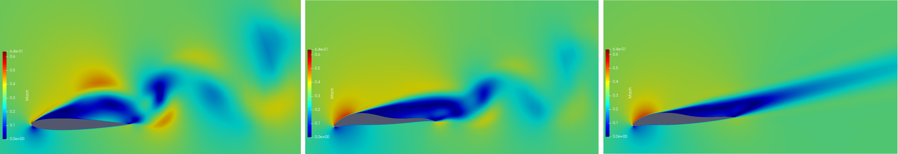
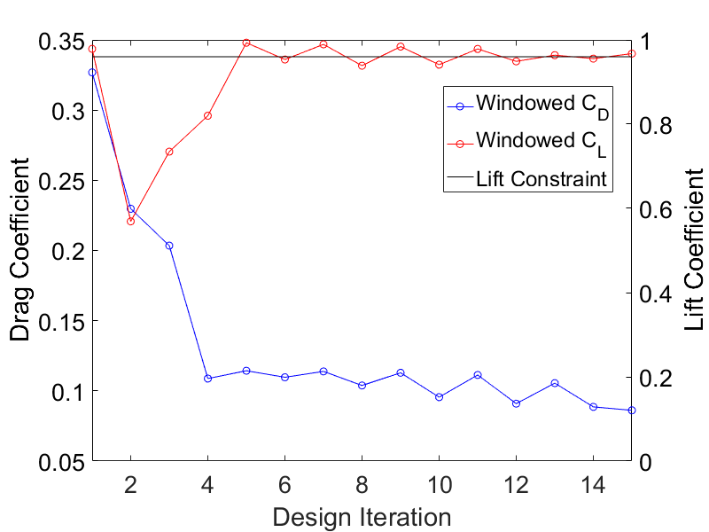

Figure (1): Baseline NACA0012 airfoil (left), optimized design using Square-windowing (middle) and optimized design using Hann-Square-windowing (right).

## Goals ##
It is assumed, that the user is familiar with the shape optimization capabilities of SU2 in steady state flows, which are explained in
 the previous tutorials.
Upon completing this tutorial, the user will be familiar with perfoming an optimization of a viscous, unsteady, periodic flow about 
a 2D geometry using the URANS equations. 
The specific geometry chosen for the tutorial is the classic NACA0012 airfoil.
Consequently, the following capabilities of SU2 will be showcased in this tutorial:
- Windowed sensitivity calculation
- Unsteady adjoints
- Unsteady Optimization
- Code parallelism (optional)

This tutorial uses the windowing techniques explained in [here](../Unsteady_NACA0012.md), to compute meaningful optimization objectives.
 Hence it is recommended to read that tutorial first. 


## Resources ##

The resources for this tutorial can be found in the [Unsteady_NACA0012](https://github.com/su2code/su2code.github.io/tree/master/Unsteady_Shape_Opt_NACA0012) directory in the [project website repository](https://github.com/su2code/su2code.github.io). 

You will need the configuration file ([unsteady_naca0012_opt.cfg](../../Unsteady_Shape_Opt_NACA0012/unsteady_naca0012_opt.cfg)) and 
the mesh file ([unsteady_naca0012_FFD.su2](../../Unsteady_Shape_Opt_NACA0012/unsteady_naca0012_FFD.su2)).

## Tutorial ##

The following tutorial will walk you through the steps required when performing a shape optimization of the  NACA0012  airfoil using SU2. 
The tutorial will also address procedures for parallel computations.
To this end, it is assumed you have already obtained and compiled SU2_CFD and its adjoint capabilities. 
If you have yet to complete these requirements, please see the [Download](/docs/Download/) and [Installation](/docs/Installation/) pages.

### Background ###

This test case is for the NACA0012 airfoil in viscous unsteady flow. The NACA airfoils are two dimensional shapes for aircraft wings developed by the National Advisory Committee for Aeronautics (NACA, 1915-1958, predeccessor of NASA). The NACA-4-Digit series is a set of 78 airfoil configurations, which were created for wind-tunnel tests to explore the effect of different airfoil shapes on aerdynamic coefficients as drag or lift. 

### Mesh Description ###
The computational domain consists of a grid of 14495 quadrilaterals, that sourrounds the NACA0012 airfoil. We note that this is a very coarse mesh, and should one wish to obtain more accurate solutions for comparison with results in the literature, finer grids should be used. 

Two boundary conditions are employed: The Navier-Stokes adiabatic wall condition on the wing surface and the far-field characteristic-based condition on the far-field marker.

### Problem Setup ###

This problem will solve the flow about the airfoil with these conditions:

- Freestream Temperature = 293.0 K
- Freestream Mach number = 0.3
- Angle of attack (AOA) = 17.0 deg
- Reynolds number = 1E6
- Reynolds length = 1.0 m
- Number of time iterations: 2200
- Restart Iteration: 1100
- Start of the windowed time-average: 1500

These subsonic flow conditions will cause a detached flow about the airfoil, that exhibts a vortex street and is therefore periodic for the baseline geometry. 
Depending on the windowing-function used to average the optimization objective, the flow about the optimized geometry will eventually be a steady state flow.

We want to solve an optimization problem with a time dependent system output, e.g. Drag. A meaningful objective and constraint function is therefore a time average over a period. 
The period average is approximated by a windowed time average over a finite time span $$M$$

$$ \frac{1}{M}\int_0^M w(t/M)C_D(\sigma, t) \mathcal{d}t,$$

where $$C_D(\sigma, t) $$ denotes the drag coefficient. $$C_D(\sigma, t)$$ depends on time $$t$$ and the design parameters $$\sigma$$. The window-function is denoted by $$w$$.
There are different windows available. Depending on their smoothness, they have different regularizing effects on the time average and its sensitivity and therefore, the windowed time
average converges with different speed to the period average.
The following options are implemented:

| Window | Convergence Order | Convergence Order (sensitivity) |
| --- | --- | --- |
| `SQUARE`| 1 | 0 |
| `HANN`| 3 | 2 |
| `HANN_SQUARE`| 5 | 4 |
| `BUMP`| exponential | exponential |


For each optimization run, we have to compute the sensitivity of above windowed time average, that reads

$$ \frac{1}{M}\int_0^M w(t/M)\partial_\sigma C_D(\sigma, t) \mathcal{d}t.$$

Figure 2 shows the time dependent drag and its sensitivity. As one can see,  the amplitude of the drag sensitivity grows faster than linear. This is the reason why Square-windowing
is not a viable option for many application cases. 


Figure (2): Instantaneous drag and drag sensitivity shown. The time frame to average the drag coefficient is in between iteration $$n_{tr} = 1500 $$ and $$N=2200$$.

Using the midpoint rule for above integral, we arrive at the following constrained optimization problem

$$ \min_{\sigma} \frac{1}{M} \sum_{n_{tr}}^{N} w\left(\frac{n-n_{tr}}{N-n_{tr}}\right)C_D(\sigma,n) $$
$$ s.t. \qquad R(u^n) = 0 \qquad \forall n=1,\dots,N $$
$$ \qquad\qquad\frac{1}{M} \sum_{n_{tr}}^{N} w\left(\frac{n-n_{tr}}{N-n_{tr}}\right)C_L(\sigma,n) \geq c$$

The optimization constraint is given by the windowed time-averaged lift, that should be greater than a specific value $$c$$. We choose arbitrarily as $$c=0.96$$, which is the windowed
time-averaged lift of the baseline geometry.


### Configuration File Options ###

To compute the unsteady shape-optimization, we set up the unsteady simulation according to our test case above. More information about unsteady simulations can be found [here](../Unsteady_NACA0012.md)

```
% -------- UNSTEADY SIMULATION -----------------%
%
TIME_DOMAIN = YES
%
% Numerical Method for Unsteady simulation(NO, TIME_STEPPING, DUAL_TIME_STEPPING-1ST_ORDER, DUAL_TIME_STEPPING-2ND_ORDER, TIME_SPECTRAL)
TIME_MARCHING= DUAL_TIME_STEPPING-2ND_ORDER
%
% Time Step for dual time stepping simulations (s)
TIME_STEP= 5e-3
%
% Maximum Number of physical time steps.
TIME_ITER= 2200
%
% Number of internal iterations (dual time method)
INNER_ITER= 400
%
% Time discretization for inner iteration.
TIME_DISCRE_FLOW= EULER_IMPLICIT
%
```
Furthermore, we specify the time frame to average the optimization objective. The starting iteration is given by `WINDOW_START_ITER` and the final iteration is the final time-step
of the simulation. The windowing-function can be specified using the option `WINDOW_FUNCTION`.

```
% Iteration to start the windowed time average
WINDOW_START_ITER = 1500
%
% Window-function to weight the time average. Options (SQUARE, HANN, HANN_SQUARE, BUMP), SQUARE is default.
WINDOW_FUNCTION = HANN_SQUARE
```

To compute the sensitivity of the optimization objective and constraint, SU2 uses an adjoint iterator. This means, sensitivies are calculated using a dual time-stepping method similar
to the one used for the direct simulation. Asymptotically, the convergence speed of the adjoint inner iteration matches the speed of the direct inner iteration. However, 
it may happen that the adjoint inner iterator needs more iterations to reach a steady state. Make sure that the option `INNER_ITER` is chosen big enough in your test case to get
correct sensitivity results. 

Note, that the adjoint iterator runs backwards in time, i.e. it starts at iteration given by `UNST_ADJOINT_START_ITER` and ends at iteration 0.
We set the start iter to the final iteration of the direct run, i.e. `UNST_ADJOINT_START_ITER = TIME_ITER = 2200`.
The time to average the objective and constraint function is given by the option `ITER_AVERAGE_OBJ`. Here we set `ITER_AVERAGE_OBJ=TIME_ITER-WINDOW_START_ITER=700`.

```
%Iteration number to begin the reverse time integration in the direct solver for the unsteady adjoint.
UNST_ADJOINT_START_ITER = 2200
%
%Number of iterations to average the objective 
ITER_AVERAGE_OBJ =  700
```

The optimization problem is given by the following known options.

```
% Optimization objective function with scaling factor
OPT_OBJECTIVE= DRAG * 1.0
%
% Optimization constraint functions with scaling factors, separated by semicolons
OPT_CONSTRAINT= ( LIFT > 0.96 ) * 1.0
%
% Box constraints for the design. 
OPT_BOUND_UPPER= 0.05
OPT_BOUND_LOWER= -0.05
%
```

### Running SU2

With each design iteration, the direct and adjoint solutions are used to compute the objective function and gradient, and the optimizer drives the shape changes with this information in order to minimize the objective. Each flow constraint requires the solution of an additional adjoint problem to compute its gradient (lift in this case). Three other SU2 tools are used in the design process here: SU2_DOT to compute the gradient from the adjoint surface sensitivities and input design space, SU2_GEO to compute wing section thicknesses and their gradients, and SU2_DEF to deform the computational mesh between design cycles. To run this case, follow these steps at a terminal command line:
 
 1. Execute the shape optimization script by entering 
    
    ```
    $ shape_optimization.py -f unsteady_naca0012_opt.cfg
    ```
    
    at the command line, add `-n 16` in case you want to run the optimization in parallel (16 cores). Again, note that Python,  NumPy, and SciPy are all required to run the script.
    It is recommendend to run this optimization with at least 16 cores. However, if you don't have a high number of cores available, you can reduce the time frame to optimize.
    One could choose for example
    
    ```
    % Maximum Number of physical time steps.
	TIME_ITER= 600
	%
    % Iteration to start the windowed time average
	WINDOW_START_ITER = 350
	%
	%Iteration number to begin the reverse time integration in the direct solver for the unsteady adjoint.
	UNST_ADJOINT_START_ITER = 600
	%
	%Number of iterations to average the objective 
	ITER_AVERAGE_OBJ =  250
	```
	
	Note, that this configuration will produce different designs. To best showcase the difference between the windowing function, the original configuration is recommended.
    

 2. The python script will drive the optimization process by executing flow solutions, adjoint solutions, gradient projection, geometry evaluations, and mesh deformation in order to drive the design toward an optimum. The optimization process will cease when certain tolerances set within the SciPy optimizer are met.
 3. Solution files containing the flow and surface data will be written for each flow solution and adjoint solution and can be found in the DESIGNS directory that is created. The file named history_project.dat (or history_project.csv for ParaView) will contain the functional values of interest resulting from each evaluation during the optimization. The major iterations and function evaluations for the SLSQP optimizer will be written to the console during execution.


### Results

One can see in Fig. (1) the baseline geometry alonside optimized designs created with different windowing functions.
The following figures display the shape optimization process with different windowing functions. The shape optimization performed with higher order windows, i.e. all windows exept the `SQUARE`-window perform well, whereas the 
optimization computied using the `SQUARE`-window struggles to fulfill its optimization constraint. 


Figure (3): Shape optimization using Square-windowing.

Figure (4): Shape optimization using Hann-windowing.

Figure (5): Shape optimization using Hann-Square-windowing.

Figure (6): Shape optimization using Bump-windowing.
