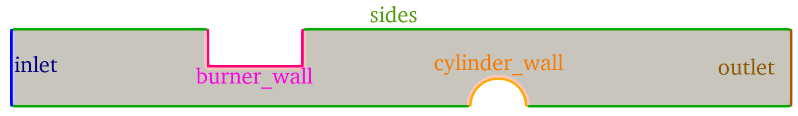
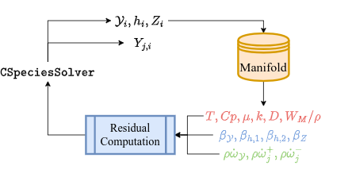
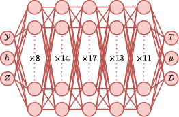
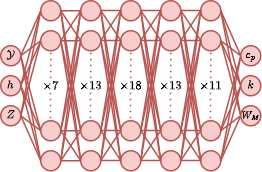
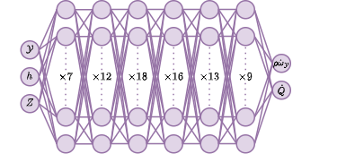
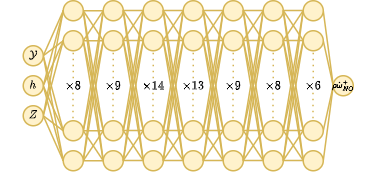
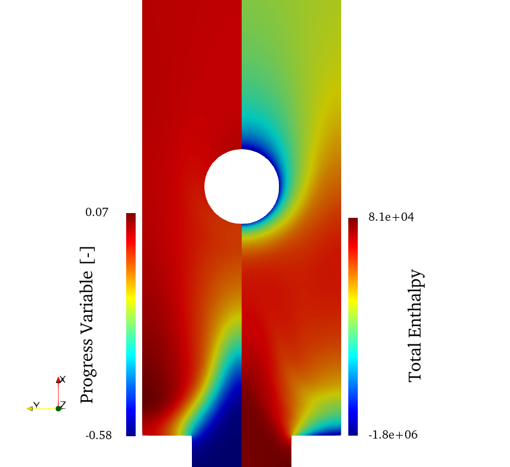
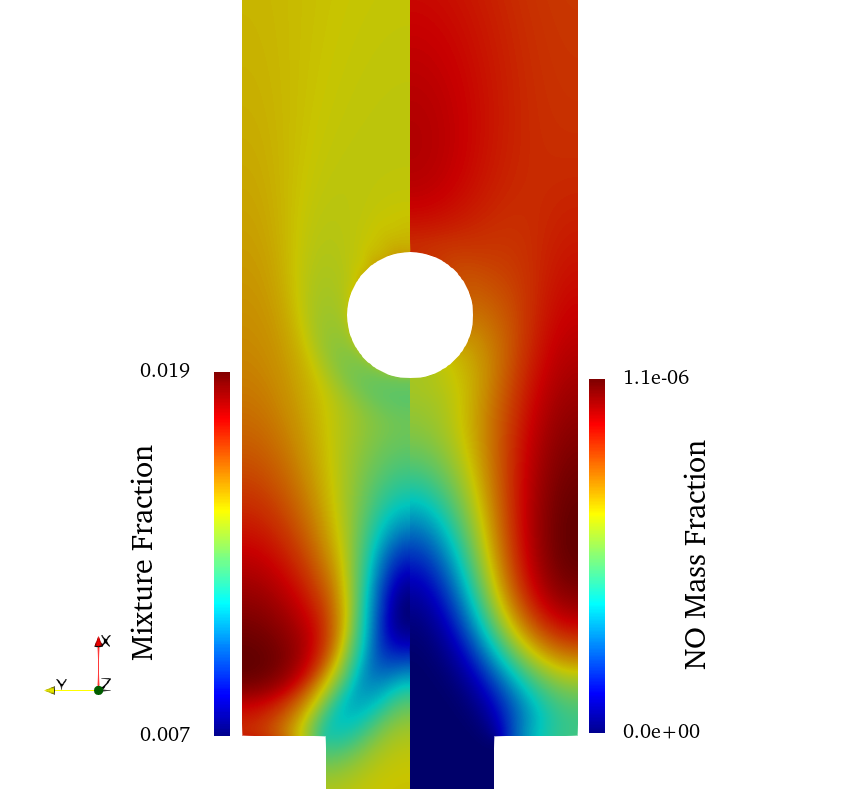
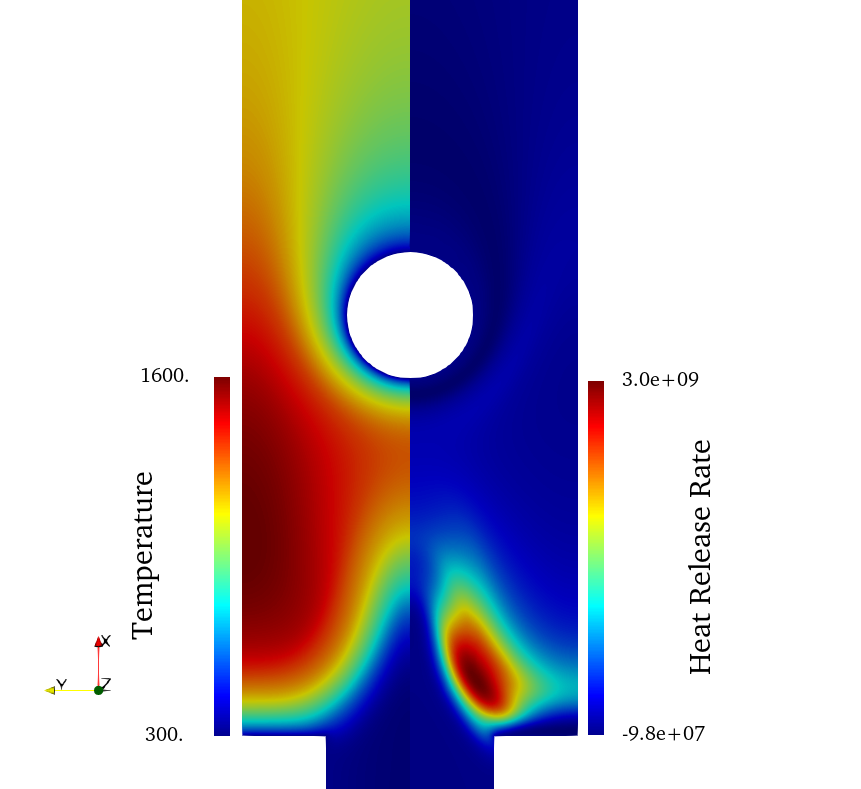

## Goals

Version 8.0.0 of SU2 supports the simulation of reduced-order combustion simulations. In particular, flamelet-generated manifold (FGM) simulations. The FGM solver in SU2 computes the transport of a set of controlling variables. These are used to interpolate a manifold of detailed-chemistry flamelet data to retrieve the thermo-chemical state of the mixture, and reaction source terms. This capability can be used to solve 2D and 3D, laminar, (partially) premixed, direct and adjoint simulations with heat loss and modeling of differential diffusion effects. The latter is relevant specifically lean hydrogen flames. This tutorial describes how to set up a premixed hydrogen combustion simulation case. Additionally, information is provided regarding the governing equations and preferential diffusion model. Finally, the relevant options in the configuration file regarding the SU2 FGM solver are discussed.

## Resources and Prerequisites

The resources for this tutorial can be found in the [incompressible_flow/Inc_Combustion/1__premixed_hydrogen](https://github.com/su2code/Tutorials/tree/master/incompressible_flow/Inc_Combustion/1__premixed_hydrogen) directory in the [tutorial repository](https://github.com/su2code/Tutorials). You will need the following files:
1. *Configuration file*: The configuration file for this case is named [H2_burner.cfg](https://github.com/su2code/Tutorials/tree/master/incompressible_flow/Inc_Combustion/1__premixed_hydrogen/H2_burner.cfg).
2. *Mesh file*: The geometry for this test case is a simple, 2D burner geometry with a cooled burner plate ([H2_Burner.su2](https://github.com/su2code/Tutorials/tree/master/incompressible_flow/Inc_Combustion/1__premixed_hydrogen/H2_burner.su2)).
3. *Manifold files*: The working principle of the FGM method is the manifold containing the flamelet data. From this manifold, thermo-chemical and reaction source term information is retrieved during the simulation. SU2 supports the use of 2D and 3D look-up tables (LUT), as well as multi-layer perceptrons (MLP). In the current tutorial, MLP's will be utilized. These files have the `.mlp` extension. Evaluating MLP's in SU2 is done through the `MLPCpp` sub-module. Make sure you configure SU2 with the flag `-Denable-mlpcpp=true` to clone this submodule.

The mesh is created using [gmsh](https://gmsh.info/) and a respective `.geo` script is available to recreate/modify the mesh [H2_Burner.geo](https://github.com/su2code/Tutorials/tree/master/incompressible_flow/Inc_Combustion/1__premixed_hydrogen/H2_burner.geo). The mesh is unstructured (i.e. only contains triangular elements) with 70495 elements and 35926 points. This mesh is quite large, but a high resolution is required in order to resolve the flame front.


Figure (1): Computational mesh with color indication of the used boundary conditions.

The MLP files describe five architectures. These are used to predict the thermo-chemical state, preferential diffusion scalars, and reaction source terms. 


## Prerequisites

The following tutorial assumes you already compiled `SU2_CFD` in serial or parallel, please see the [Download](/docs_v8/Download/) and [Installation](/docs_v8/Installation/) if that is not done yet. Additionally it is advised to perform an entry level incompressible tutorial first, as this tutorial only goes over species transport with combustion.

## Background

The SU2 FGM solver solves two sets of transport equations: FGM controlling variables and optionally passive species. The solver supports up to three controlling variables, those representing the progress variable $$(\mathcal{Y})$$, total enthalpy ($$h$$), and optionally mixture fraction $$(Z)$$. The controlling variables are used as inputs to the flamelet data manifold to extract the thermo-chemical state variables and reaction source terms. The passive species $$(Y_j)$$ represent species of interest such as emissions. The solutions of the passive species distribution do not affect the behavior of the controlling variables, but can be used to define custom outputs and objective functions. The solution process is visualized in the [solution process](#solutionprocess). 



The `CSpeciesSolver` object in SU2 solves the controlling variables and passive species transport equations. These come in three variations, depending on the problem set-up and reactants:

1. pre-mixed, no preferential diffusion: 

$$
\begin{equation}
    \frac{\partial \rho \mathcal{Y}}{\partial t} + \nabla\cdot(\rho\vec{u}\mathcal{Y}) - \nabla\cdot\left(\rho D\nabla\mathcal{Y}\right) = \dot{\omega}_\mathcal{Y}
\end{equation}
$$

$$
\begin{equation}
    \frac{\partial \rho h}{\partial t} + \nabla\cdot(\rho\vec{u} h) - \nabla\cdot\left(\rho D\nabla h\right) = 0
\end{equation}
$$

$$
\begin{equation}
    \frac{\partial \rho Y_j}{\partial t} + \nabla\cdot(\rho\vec{u}Y_j) - \nabla\cdot\left(\rho D\nabla Y_j\right) = \dot{\omega}^+ + \dot{\omega}^- Y_j
\end{equation}
$$

2. partially or non-premixed, no preferential diffusion:

$$
\begin{equation}
    \frac{\partial \rho \mathcal{Y}}{\partial t} + \nabla\cdot(\rho\vec{u}\mathcal{Y}) - \nabla\cdot\left(\rho D\nabla\mathcal{Y}\right) = \dot{\omega}_\mathcal{Y}
\end{equation}
$$

$$
\begin{equation}
    \frac{\partial \rho h}{\partial t} + \nabla\cdot(\rho\vec{u} h) - \nabla\cdot\left(\rho D\nabla h\right) = 0
\end{equation}
$$

$$
\begin{equation}
    \frac{\partial \rho Z}{\partial t} + \nabla\cdot(\rho\vec{u}Z) - \nabla\cdot\left(\rho D\nabla Z\right) = \dot{\omega}_\mathcal{Y}
\end{equation}
$$

$$
\begin{equation}
    \frac{\partial \rho Y_j}{\partial t} + \nabla\cdot(\rho\vec{u}Y_j) - \nabla\cdot\left(\rho D\nabla Y_j\right) = \dot{\omega}^+ + \dot{\omega}^- Y_j
\end{equation}
$$

3. pre-mixed, partially pre-mixed, non-premixed, with preferential diffusion:

$$
\begin{equation}
    \frac{\partial \rho \mathcal{Y}}{\partial t} + \nabla\cdot(\rho\vec{u}\mathcal{Y}) - \nabla\cdot\left(\rho D\nabla\beta_\mathcal{Y}\right) = \dot{\omega}_\mathcal{Y}
\end{equation}
$$

$$
\begin{equation}
    \frac{\partial \rho h}{\partial t} + \nabla\cdot(\rho\vec{u} h) - \nabla\cdot\left(\beta_{h,1}\nabla T + \rho D\nabla\beta_{h,2}\right) = 0
\end{equation}
$$

$$
\begin{equation}
    \frac{\partial \rho Z}{\partial t} + \nabla\cdot(\rho\vec{u}Z) - \nabla\cdot\left(\rho D\nabla\beta_Z\right) = 0
\end{equation}
$$

$$
\begin{equation}
    \frac{\partial \rho Y_j}{\partial t} + \nabla\cdot(\rho\vec{u}Y_j) - \nabla\cdot\left(\rho D\nabla Y_j\right) = \dot{\omega}^+ + \dot{\omega}^- Y_j
\end{equation}
$$

Here, $D$ is the diffusion coefficient in $$m^2s^{-1}$$, $$\rho\dot{\omega}_\mathcal{Y}$$ the progress variable source term in $$kg m^{-3} s^{-1}$$, and $$\rho\dot{\omega}^+$$ and $$\rho\dot{\omega}^-$$ the passive species production and consumption rates respectively. The $$\beta-$$ terms on the left hand side of equations 8-10 are used to model preferential diffusion. These are discussed in more detail in the section describing the preferential diffusion model. 


The test case covered in this tutorial represents a simplified version of a two-dimensional, pre-mixed hydrogen burner with preferential diffusion and a heat exchanger emulator suspended in the hot exhaust. The purpose of this test case is to demonstrate the capabilities of the SU2 FGM solver (differential diffusion, heat loss), not a solution for a realistic hydrogen combustion problem.


## Problem Setup

In order to run a FGM simulation in SU2, an additional set-up step apart from defining the mesh and configuration file is required. This step involves the definition of a flamelet data manifold which includes the necessary data required by SU2 to include the relevant phenomena. This section describes the two manifold formats supported by SU2 for FGM simulations, as well as an example of the set-up of the manifold used in the current tutorial. One of the key features in accurately modeling (lean) hydrogen combustion is the modeling of the effects of preferential diffusion. The preferential diffusion model currently implemented in SU2 is the model formulated by [Nithin et al](https://doi.org/10.1080/13647830.2021.1970232). This section briefly summarizes this model and how to enable it in SU2 FGM simulations. Finally, this section describes the boundary and initial condition of the current test case, as well as the methodologies available to ignite the mixture. 

### Manifold set-up 

During FGM simulations, thermo-chemical, as well as reaction data is interpolated from a manifold of detailed-chemistry flamelet data based on a set of controlling variables. In SU2, two types of manifold are supported: two or three-dimensional look-up tables (LUT) and feed-forward, dense, multi-layer perceptrons (MLP). 

The flamelet fluid model in SU2 requires thermo-chemical and scalar source term data from the manifold to function. First the manifold should have the controlling variable names as input variables in with the corresponding units:

1. Progress variable ($$\mathcal{Y}$$)[-]
2. Total enthalpy ($$h$$)[J kg^-1]
3. optional: mixture fraction ($$Z$$)[-]

In the current tutorial, the following progress variable definition is used:

$$
\begin{split}
\mathcal{Y} = -7.36Y_{H_2}-23.01Y_H-2.04Y_{O_2}-4.8Y_O\\+1.83Y_{H_2O}
-15.31Y_{OH}-57.02Y_{H_2O_2}+24.55Y_{HO_2}
\end{split}
$$

The manifold should also contain the following thermo-chemical data. The variable name in the manifold should correspond to the bracketed term and be stored in the corresponding units.
1. Temperature (`Temperature`)[K] 
2. Specific heat (`Cp`)[J kg^-1 K^-1] 
3. Dynamic viscosity (`ViscosityDyn`)[]
4. Thermal conductivity (`Conductivity`)[W m^-1 K^-1]
5. Diffusivity (`DiffusionCoefficient`)[m^2 s^-1]
6. Density (`Density`) [kg m^-3] or mixture molar weight (`MolarWeightMix`) [kg mol^-1]

The distinction between storing the fluid density or molar weight depends on the configuration file setting for `INC_DENSITY_MODEL`. MOre on that the section on configuration file settings.

Finally, the manifold should contain the source terms for the progress variable and optionally passive species.

1. Progress variable source term [kg m^-3 s^-1]
2. Optionally: Passive species production and consumption terms [kg m^-3 s^-1]

The manifold may contain more data for passive look-up purposes. If these are not defined, they will be ignored during the SU2 FGM solution process.

The two manifold formats currently supported in SU2 are the unstructured look-up table and dense, feed-forward multi-layer perceptron. 
The look-up table format supported in SU2 is based around the two-dimensional, trapezoidal map approach. The table file format should be in the dragon file format. For pre-mixed problems without differential diffusion (e.g. pre-mixed methane problems), a two-dimensional table is sufficient. An example of such a table can be found in the [methane combustion test case](https://github.com/su2code/TestCases/tree/master/flamelet/01_laminar_premixed_ch4_flame_cfd/fgm_ch4.drg). The two table dimensions should span the progress variable and total enthalpy dimension.

For partially- or non-premixed problems or pre-mixed problems with preferential diffusion, a three-dimensional table is required. SU2 supports a quasi-3D table format, consisting of two-dimensonal trapezoidal maps stacked in the third dimension. An example of this can be found in the [partially premixed methane combustion test case](https://github.com/su2code/TestCases/tree/master/flamelet/06_laminar_partial_premixed_ch4_flame_cfd/LUT_methane_3D.drg). The first two dimensions should span the progress variable and total enthalpy dimension, while the third dimension should be mixture fraction.


### Preferential diffusion model

Pre-mixed combustion of reactants with high hydrogen content at lean conditions undergo a phenomenon called preferential diffusion. Here, the hydrogen diffuses differently from the other species in the mixture, causing local variations in mixture fraction and inherent instabilities in the flame front, even during laminar flow. Accurately modeling preferential diffusion is therefore crucial to capturing the behavior of pre-mixed hydrogen flames. The modeling of preferential diffusion is supported in SU2 through the [Efimov model](https://doi.org/10.1080/13647830.2021.1970232). When solving hydrogen FGM problems, SU2 solves the following transport equations for the controlling variables:

$$
\begin{equation}
    \frac{\partial \rho \mathcal{Y}}{\partial t} + \nabla\cdot(\rho\vec{u}\mathcal{Y}) - \nabla\cdot\left(D\nabla\beta_\mathcal{Y}\right) = \dot{\omega}_\mathcal{Y}
\end{equation}
$$

$$
\begin{equation}
    \frac{\partial \rho h}{\partial t} + \nabla\cdot(\rho\vec{u} h) - \nabla\cdot\left(\beta_{h,1}\nabla T + D\nabla\beta_{h,2}\right) = 0
\end{equation}
$$

$$
\begin{equation}
    \frac{\partial \rho Z}{\partial t} + \nabla\cdot(\rho\vec{u}Z) - \nabla\cdot\left(D\nabla\beta_Z\right) = 0
\end{equation}
$$

Here, $$\mathcal{Y},h$$ and $$Z$$ are the progress variable, total enthalpy, and mixture fraction respectively. Preferential diffusion is modeled through the $$\beta$$-terms in the third term on the left hand side of equations 2-4. [The following work](https://doi.org/10.1080/13647830.2021.1970232) contains details on the definitions of these scalars. 
Within the manifold, these scalars shall be named as follows:

1. $$\beta_\mathcal{Y}$$ (`Beta_ProgVar`)[-]
2. $$\beta_{h,1}$$ (`Beta_Enth_Thermal`)[J kg^-1 K^-1]
3. $$\beta_{h,2}$$ (`Beta_Enth`)[J kg^-1]
4. $$\beta_Z$$ (`Beta_MixFrac`)[-]

If not all the $$\beta$$- terms are detected, while preferential diffusion is enabled, an error will be raised. During the initialization of the fluid model, a message will be displayed in the terminal indicating whether the preferential diffusion model is enabled.

## Configuration File Options 

The SU2 FGM solver is enabled through the options in the configuration file. In this section, the key settings are discussed, as well as recommended settings for specific problems. All available options concerning the FGM solver are listed below as they occur in the [config_template.cfg](https://github.com/su2code/SU2/blob/master/config_template.cfg).

### Enabling Flamelet Fluid Model
The SU2 FGM solver is enabled by setting `FLUID_MODEL=FLUID_FLAMELET`. This option results in the `CFluidFlamelet` class to be used as the fluid model during the simulation. Using the `FLUID_FLAMELET` option requires the options for `KIND_SCALAR_MODEL`, `DIFFUSIVITY_MODEL`, `VISCOSITY_MODEL`, and `CONDUCTIVITY_MODEL` to be set to `FLAMELET` as well. For the `INC_DENSITY_MODEL`, there are two options. By setting `INC_DENSITY_MODEL=VARIABLE`, the local density is calculated through the ideal gas law.

$$
\begin{equation}
\rho=\frac{pW_M}{R_uT}
\end{equation}
$$

where $$p$$ is the free-stream pressure, $$R_u$$ the universal gas constant, and $$W_M$$ and $$T$$ the mean molecular weight and temperature respectively, which are obtained from the manifold. Finally, the option for `INC_ENERGY_EQUATION` should be set to `YES` when solving FGM problems. In order to enable preferential
diffusion, set the option `PREFERENTIAL_DIFFUSION` to `YES` (set by default to `NO`).

In the current example for the hydrogen burner, the following options are used:
```
FLUID_MODEL= FLUID_FLAMELET
KIND_SCALAR_MODEL= FLAMELET      
DIFFUSIVITY_MODEL= FLAMELET
PREFERENTIAL_DIFFUSION= YES
VISCOSITY_MODEL= FLAMELET
CONDUCTIVITY_MODEL= FLAMELET
INC_DENSITY_MODEL= VARIABLE
INC_ENERGY_EQUATION = YES
```
### Controlling variable definition

The names of the controlling variables can be defined by the user through `CONTROLLING_VARIABLE_NAMES`. At least two names are required, corresponding to the progress variable and total enthalpy respectively. When a third is provided, it will be interpreted as the mixture fraction. 

The names of the controlling variable source terms may be defined through the option `CONTROLLING_VARIABLE_SOURCE_NAMES`. The length of this array should correspond to that defined under `CONTROLLING_VARIABLE_NAMES`. In case no source terms are required for certain controlling variables (e.g. total enthalpy and/or mixture fraction), the corresponding term may be set to `NULL`. The controlling variable source terms can be included in the volume output by including `SOURCE` in the `VOLUME_OUTPUT`.

It is also possible to define convergence criteria based on the controlling variables through the `CONV_FIELD` option. Here, include `RMS_<cv name>` where `<cv_name>` is the name of the controlling variable as defined under `CONTROLLING_VARIABLE_NAMES`. 

In the current example, the controlling variables and their respective sources are defined as
```
CONTROLLING_VARIABLE_NAMES=(ProgressVariable,EnthalpyTot,MixtureFraction)
CONTROLLING_VARIABLE_SOURCE_NAMES=(ProdRateTot_PV,NULL,NULL)
```
corresponding to the progress variable, total enthalpy, and mixture fraction respectively.

### Manifold options

The manifold format is defined through the option `INTERPOLATION_METHOD` (same as for using the data-driven fluid model), for which the options `LUT` and `MLP` are supported, corresponding to using a look-up table and one or more multi-layer perceptrons respectively.

The file name(s) corresponding to the files describing the manifold are to be listed under `FILENAMES_INTERPOLATOR`. When using the `LUT` option for `INTERPOLATION_METHOD`, only one `.drg` file is required, while multiple files may be listed when using the `MLP` option. Any number of `.mlp` files may be provided, as long as they have the controlling variable names as their input variables and collectively are able to predict the required quantities. When using the `MLP` option, make sure one `.mlp` file is included which p`SU2` will raise an error if certain required variables are not present in the manifold.

The table format supported under the option `LUT` allows for the interpolation of 2D or 3D unstructured data. The algorithm used by the table is a simplified version of the trapezoidal map to perform 2D queries on unstructured data. The query algorithm is described in detail in section 6.1 of [Computational Geometry: Algorithms and Applications by de Berg et. al.](https://link.springer.com/book/10.1007/978-3-540-77974-2). In order to perform 3D queries, the table shall be constructed of multiple, 2D trapezoidal maps, stacked in the third dimension. Interpolation is performed through identifying the nearest two table levels, performing a 2D query on each, and linearly interpolating the final result along the third dimension. For FGM purposes, the x- and y-dimension of the table are assumed to be the progress variable and total enthalpy respectively. In the case of simulations involving mixing and/or preferential diffusion, the third table dimension is assumed to be the mixture fraction.
Examples of such 2D and 3D tables can be found in the `SU2` [unit tests](https://github.com/su2code/SU2/tree/master/UnitTests/Common/containers/) or [test cases](https://github.com/su2code/TestCases/tree/master/flamelet/01_laminar_premixed_ch4_flame_cfd).


The artificial neural network type supported under the option `MLP` is the dense, feed-forward multi-layer perceptron. For FGM simulations, one or multiple MLP's can be loaded, over which the required flamelet manifold variables should be distributed. This offers the benefit of being able to use different MLP architectures for different data. `SU2` uses the [MLPCpp module](https://github.com/EvertBunschoten/MLPCpp.git) to evaluate MLP's during simulations. After training MLP architectures on flamelet data, it is possible to load these into `SU2` by storing the architecture, weights, biases, and activation function information in the supported `.mlp` format. Information on how to translate networks trained through TensorFlow to the `.mlp` format, see the [MLPCpp repository](https://github.com/EvertBunschoten/MLPCpp.git). Examples of such MLP files can be found in the `SU2` [unit tests](https://github.com/su2code/SU2/tree/master/UnitTests/Common/toolboxes/multilayer_perceptron), [test cases](https://github.com/su2code/TestCases/tree/master/flamelet/07_laminar_premixed_h2_flame_cfd), and the [MLPCpp repository](https://github.com/EvertBunschoten/MLPCpp.git). The neural networks were trained using the [SU2 DataMiner](https://github.com/EvertBunschoten/SU2_DataMiner) code. This repository contains test cases and tutorials which explain the data generation and set-up needed to train multi-layer perceptrons for flamelet-generated manifold applications.


The preferred choice of manifold depends on the application, available computational resources, and available know-how. Typically, using a table results in shorter query times, and therefore simulation times compared to using MLP's. On the other hand, storing three-dimensional look-up tables with sufficient resolution for accurate FGM simulations requires substial amounts of memory (in the order of giga-bytes per core). If memory usage is not a constraint, using a LUT manifold therefore results in superior computational performance compared to using MLP's. The LUT uses linear interpolation over each cell in 2D queries. For highly non-linear data, this may result in inaccuracies and subsequent numerical instabilities during the simulation process. Using the MLP option allows for the use of non-linear activation functions, resulting in more smooth output data trends. The latter may result in improved solver robustness if the corresponding MLP can be trained to be sufficiently accurate. Finally, training artificial neural networks on flamelet data can be a cumbersome process and choosing an appropriate network architecture may not always be straightforward. On the other hand, generating a look-up table is comparatively easier. 

In the current example, a set of MLP's is used to define the manifold:
```
INTERPOLATION_METHOD= MLP
FILENAMES_INTERPOLATOR= (MLP_TD1.mlp, MLP_TD2.mlp, MLP_PD.mlp, MLP_SPV.mlp, MLP_PNO.mlp, MLP_null.mlp)
```
Here, [MLP_TD1.mlp](https://github.com/su2code/Tutorials/tree/master/incompressible_flow/Inc_Combustion/1__premixed_hydrogen/MLP_TD1.mlp), and [MLP_TD2.mlp](https://github.com/su2code/Tutorials/tree/master/incompressible_flow/Inc_Combustion/1__premixed_hydrogen/MLP_TD2.mlp) are used to predict the thermo-chemical fluid properties, [MLP_PD.mlp](https://github.com/su2code/Tutorials/tree/master/incompressible_flow/Inc_Combustion/1__premixed_hydrogen/MLP_PD.mlp) the preferential diffusion scalars, [MLP_SPV.mlp](https://github.com/su2code/Tutorials/tree/master/incompressible_flow/Inc_Combustion/1__premixed_hydrogen/MLP_SPV.mlp) the progress variable source term and heat release, and [MLP_PNO.mlp](https://github.com/su2code/Tutorials/tree/master/incompressible_flow/Inc_Combustion/1__premixed_hydrogen/MLP_PNO.mlp) the production term for the passive $NO$ specie. [MLP_null.mlp](https://github.com/su2code/Tutorials/tree/master/incompressible_flow/Inc_Combustion/1__premixed_hydrogen/MLP_null.mlp) is a dummy MLP which returns 0 irrespective of the controlling variable values. This file is required when using `NULL` for any parameters such as source terms.


### Passive species definition

The option `USER_SCALAR_NAMES` can be used to define species of interest for which respective transport equations will be solved. The list of species names defined in this option will correspond to the names of the species in the volume output of `SU2`. 

The source terms for the species of interest are defined under `USER_SOURCE_NAMES`, which expects two inputs per specie defined under `USER_SCALAR_NAMES`; the species production and consumption term as per equation 3. If no production and/or consumption term is required, use the `NULL` variable instead. Like the controlling variables, the net source term for the passive species is included in the volume output by including `SOURCE` in the options for `VOLUME_OUTPUT`.

In the current example, the solution for $NO$ is computed as a species of interest. This specie is defined as 
```
USER_SCALAR_NAMES= (Y_NO)
USER_SOURCE_NAMES = ( \
    Y_dot_net-NO,  NULL \
)
```
The solution for $$NO$$ will be stored in the volume output under the name ```Y_NO``` and only the production term will be used to define this species' source term. The name `Y_dot_net-NO` corresponds to the MLP output in the file [MLP_PNO.mlp](https://github.com/su2code/Tutorials/tree/master/incompressible_flow/Inc_Combustion/1__premixed_hydrogen/MLP_PNO.mlp).

### Passive look-up terms

Not all output variables from the manifold are included in the volume output by default. In order to monitor the spatial distribution of for example the preferential diffusion scalars, mean molecular weight, or any other output variable included in the manifold, they can be included in the `LOOKUP_NAMES` option. The parameters defined under `LOOKUP_NAMES` will be interpolated from the manifold during the solution process and are included in the volume output when including the option `LOOKUP` in the options for `VOLUME_OUTPUT`.`SU2` will raise an error if the variable is not present in the manifold outputs.

A quantity of interest which is not computed in `SU2` is the heat release per unit volume. In the current example, this term is included in the volume output through a passive look-up. 
```
LOOKUP_NAMES=(Heat_Release)
```
which corresponds to the heat release predicted by [MLP_SPV.mlp](https://github.com/su2code/Tutorials/tree/master/incompressible_flow/Inc_Combustion/1__premixed_hydrogen/MLP_SPV.mlp).

### Ignition methods

The flames simulated in any combustion simulation need to be initialized (or numerically 'ignited'). Three options are available for this artificial ignition process in `SU2` through the option `FLAME_INIT_METHOD`.

The first option is a straight flame front, enabled through setting `FLAME_INIT_METHOD=FLAME_FRONT`. Here a straight flame front is constructed during the solution initialization where the progress variable linearly transitions from the initial value to its upper limit over a defined flame thickness. This option is prefered in simulations where not a lot of iterations are required for the flow to develop before initiating a flame. The options for defining this flame front can be defined under `FLAME_INIT=(x,y,z,n_x,n_y,n_z,t_f,L_f)` where:

- `x,y,z`: spatial location of flame front (m).
- `n_x,n_y,n_z`: flame front normal unit vector components.
- `t_f`: flame thickness (m) over which the progress variable transition takes place.
- `L_f`: Extend of the hot solution after the flame front (m).

The second option is through an artificial spark, enabled through setting `FLAME_INIT_METHOD=SPARK`. This option produces a sphere within which artificial source terms are applied to the controlling variables over a set of (outer) iterations. This ignition method is preferred in simulations where the flow needs a substantial number of iterations to develop (e.g. partially or non-premixed simulations). The parameters for defining an artificial spark are defined under the option `SPARK_INIT=(x,y,z,r,iter_start,duration)` where:

- `x,y,z` : spatial location of the spark center (m).
- `r`: spark sphere radius (m).
- `iter_start`: (outer) iteration after which the spark will be applied.
- `duration`: number of (outer) iterations for which the artificial spark will be applied.

The source terms applied to the controlling variables are defined under the option `SPARK_REACTION_RATES`. This option expects an array with the same length as `CONTROLLING_VARIABLE_NAMES` containing the source terms applied to the controlling variables within the spark sphere. 

The final and default option for initializing the solution is to perform a cold flow analysis without a flame front. This option is enabled through setting `FLAME_INIT_METHOD=NONE`. 

In the current example, the `SPARK` ignition method is used. Here, an artificial spark is placed in the domain, which applies a source term to the progress variable transport equation. The spark location and radius is highlighed in the figure below by the red circle. 
```
FLAME_INIT_METHOD= SPARK
SPARK_INIT= (0.001, 0.0004, 0.00, 1e-4, 100, 5)
SPARK_REACTION_RATES=(1000, 0, 0)
```
The spark will be initialized at iteration 100 and will remain active for another 5 iterations. This should be sufficient to artificially ignite the mixture and have the flame front propagate naturally. 


### Boundary conditions

The boundary conditions for the `SU2` FGM solver are defined similarly as those defined for regular species transport problems. Make sure that the the number of species defined under `MARKER_INLET_SPECIES` equates the sum of controlling variables and passive species. By default, all boundary conditions are perceived as weak boundary conditions. 

Iso-thermal wall or conjugate heat transfer boundary conditions affect the transport of total enthalpy. When using weak boundary conditions for iso-thermal walls, a heat flux term is applied to the enthalpy transport equation:

$$
\begin{equation}
f = k \nabla T \cdot \vec{n}
\end{equation}
$$

where $f$ is the heat flux perceived as a residual term to the enthalpy transport equation, and $n$ the local boundary normal unit vector.
When defining the iso-thermal wall as a strong boundary condition, a 1D Newton solver process is initialized along the boundary, where

$$
h_{i+1} = h_i + c_p(\mathcal{y},h_i,Z) (T_b - T(\mathcal{y},h_i,Z)) 
$$

is iterated until the temperature difference $$T_b - T(\mathcal{y},h_i,Z)$$ is less than 1e-3K.

For the current example, the equivalence ratio at the inlet was set to 0.5, translating to a mixture fraction of 1.447e-2. The reactants are presumed at a temperature of 300K at the inlet, while isothermal wall boundary conditions are applied on the burner wall (350K) and heat exchanger emulator (400K). The iso-thermal wall boundary conditions are defined as strong boundary conditions, meaning that the total enthalpy is locally enforced to achieve the imposed temperature.
```
SPECIES_INIT=(-0.575, 2.227e3, 1.447e-2)
MARKER_INLET_SPECIES = (inlet, -0.575, 2.227e3, 1.447e-2, 0)
MARKER_INLET=(inlet, 300.0, 0.565,1,0,0)

MAKER_SPECIES_STRONG_BC=(burner_wall, cylinder_wall)
MARKER_ISOTHERMAL= (burner_wall, 350, cylinder_wall, 400)
```
### Convective scheme
Just like for regular species transport problems, there are two options available for the `CONV_NUM_METHOD_SPECIES`, those being `SCALAR_UPWIND` and `BOUNDED_SCALAR`. 

The convective residual term in cell volume $$\Omega$$ as computed through `SCALAR_UPWIND` is as follows:

$$
R_{C, \mathrm{SCALAR\_UPWIND}} = \iiint_\Omega\nabla\cdot(\rho\vec{u}Y)\,d\Omega
$$

When using the `BOUNDED_SCALAR` option, a correction term is applied, which compensates for the effect of flow divergence.

$$
R_{C, \mathrm{BOUNDED\_SCALAR}} = R_{C, \mathrm{SCALAR\_UPWIND}} - \iiint_\Omega Y \nabla\cdot\rho\vec{u}\,d\Omega
$$

The effect of flow divergence can be significant in the early stages of convergence near boundaries. This may result in solution instabilities for transported scalars with source terms such as the progress variable. Therefore, it is  highly recommended to use `BOUNDED_SCALAR` for FGM simulations in SU2.

The current example uses the ```BOUNDED_SCALAR``` option.


# Hydrogen Burner Tutorial Set-Up

The current section describes the hydrogen burner tutorial in more detail.

## Manifold set-up 

In the current tutorial, a set of MLP's is used for the manifold. These MLP's are visualized below.
- Thermodynamic properties:





- Preferential diffusion scalars:


- Progress variable source term and heat release rate:



- NO source term:



All networks use the Gaussian Error Linear Unit (GELU) activation function for all hidden layers and were trained on flamelet data consisting of adiabatic free-flame data, burner-stabilized data, and chemical equilibrium data obtained over a range of equivalence ratio's and reactant temperature of 0.3-6.0 and 280K-900K respectively. 

## Initial conditions

This test case represents a simplified version of a pre-mixed hydrogen burner with a heat exchanger emulator downstream of the burner hole. The reactants (hydrogen and air at 1 atm) are pre-mixed at an equivalence ratio of 0.5 and at a temperature of 300 Kelvin. Given the species mass fractions at this equivalence ratio and the given temperature, the initial value for the transported species are

$$
\begin{align}
\mathcal{Y}_{\mathrm{init}} = -0.575 && h_{\mathrm{init}} = 2227 J kg^{-1} && Z_{\mathrm{init}} = 1.447e-2
\end{align}
$$

No $$NO$$ is present in the pre-mixed solution, so the value of $$Y_{NO}$$ is zero upon initialization. The initial values for the species are therefore
```
SPECIES_INIT=(-0.575, 2.227e3, 1.447e-2, 0)
```

## Configuration File Options

All available options concerning species transport are listed below as they occur in the [config_template.cfg](https://github.com/su2code/SU2/blob/master/config_template.cfg).

The majority of the relevant options for the current tutorial are discussed in the previous sections. 

All available output can be printed to screen using the `dry-run` feature of SU2:
```
$ SU2_CFD -d <config-filename>.cfg
```

## Running SU2

The simulation can be run in serial using the following command:
```
$ SU2_CFD H2_burner.cfg
```
or in parallel with your preferred number of cores:
```
$ mpirun -n <#cores> SU2_CFD H2_burner.cfg
```

## Results

After 3000 iterations, the simulation converges to the following solution. This solution should not be taken as a fully accurate representation of the current problem, as neither the mesh nor manifold were optimized for the current application.

 The following image shows the solution for the progress variable and total enthalpy side-by-side. The progress variable solution indicates the progress of the reaction, with a local maximum next to the flame front, as is the case for lean, pre-mixed flames with preferential diffusion and no stretch. The total enthalpy solution correctly shows decreases near the cooled surfaces.



The solution for the mixture fraction and NO species is shown in the next figure. Due to the effects of preferential diffusion, the mixture fraction solution shows a local minimum in regions of positive flame curvature. The NO solution contains a local maximum in the region of maximum temperature and remaining nearly constant afterwards due to the reduction in temperature from the heat exchanger emulator.


Finally, the results for the temperature and heat release rate are shown below. These quantities are not retrieved through solving transport equations, but by retrieving them from the flamelet manifold. 


