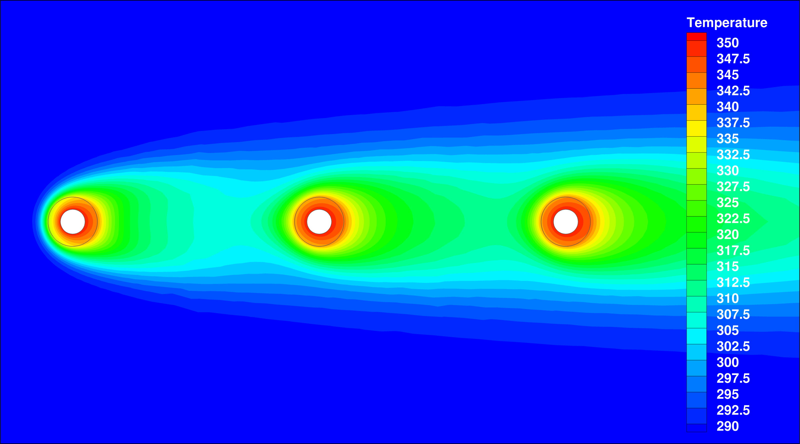
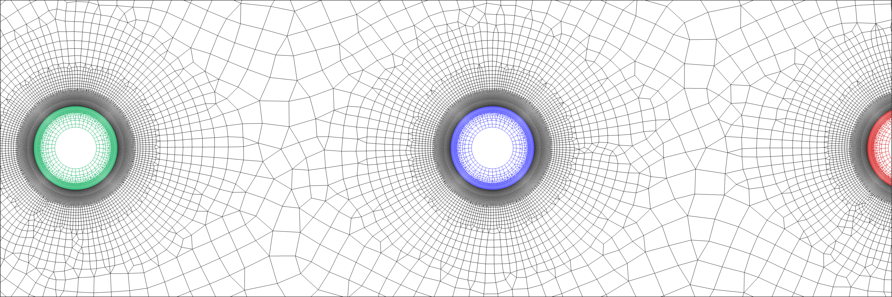
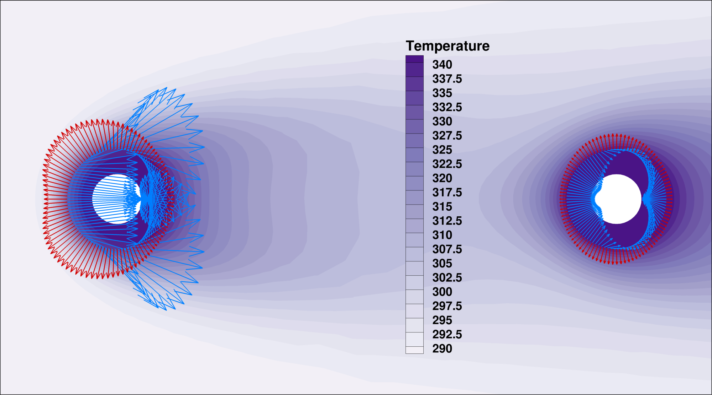

## Goals

This tutorial builds on the [laminar flat plate with heat transfer tutorial](/tutorials/Inc_Laminar_Flat_Plate/) where incompressible solver with solution of the energy equation is introduced.  
The following capabilities of SU2 will be showcased in this tutorial:

- Setting up a multiphysics simulation with Conjugate Heat Transfer (CHT) interfaces between zones
- Solution of the energy equation in solids
- Steady, 2D, laminar, incompressible, Navier-Stokes equations 
- Discrete adjoint solutions and sensitivities for heat-related objective functions

The intent of this tutorial is to introduce a simple multiple physical zones case (one incompressible flow domain, three solid domains) where solvers are coupled by sharing a common interface.

## Resources

The resources for this tutorial can be found in the [Inc_Heated_Cylinders](https://github.com/su2code/su2code.github.io/tree/master/Inc_Heated_Cylinders) directory in the [tutorial repository](https://github.com/su2code/su2code.github.io/tree/master/). You will need the configuration files for all physical zones ([flow_cylinder.cfg](../../Inc_Heated_Cylinders/flow_cylinder.cfg), [solid_cylinder1.cfg](../../Inc_Heated_Cylinders/solid_cylinder1.cfg), [solid_cylinder2.cfg](../../Inc_Heated_Cylinders/solid_cylinder2.cfg), [solid_cylinder3.cfg](../../Inc_Heated_Cylinders/solid_cylinder3.cfg)), the cofiguration file to invoke a multiphysics simulation run ([cht_2d_3cylinders.cfg](../../Inc_Heated_Cylinders/cht_2d_3cylinders.cfg)) and the mesh file ([mesh_cht_3cyl.su2](../../Inc_Heated_Cylinders/mesh_cht_3cyl.su2)).


## Tutorial

The following tutorial will walk you through the steps required when solving for a coupled CHT solution incorporating multiple physical zones. It is assumed you have already obtained and compiled the SU2_CFD code for a serial computation. If you have yet to complete these requirements, please see the [Download](/docs/Download/) and [Installation](/docs/Installation/) pages.

### Background

CHT simulations become important when we cannot assume an isomthermal wall boundary or when we even have no suitable temperature distribution estimate at hand. This is typically the case when a wall happens to be the boundary of a solid (e.g. metal) part and heat transfer across the boundary cannot be neglected.  
The correct interface temperature distribution has then to be found by the simulation run as well, that is, by coupling energy quantities in all zones.

### Problem Setup

This problem will solve for the incompressible flow over three cylinders as well as for the heat equation in all cylinders that are coupled by energy conservation across the interfaces.  

The following flow conditions that are set to match the Reynolds number of 40. For hollow cylinders with outer diameters of 1m:
- Density (variable) = 0.00042 kg/m^3
- Farfield Velocity Magnitude = 3.40297 m/s
- Farfield Flow Direction, unit vector (x,y,z) = (1.0, 0.0, 0.0) 
- Farfield Temperature = 288.15 K
- Viscosity (constant) = 1.7893e-05 kg/(m-s)
- Specific heat (constant) = 1004.703 J/(kg-K)
- Prandtl Number (constant) = 0.72

The hollow cylinders will have the same material properties for its density (set to 0.00042 kg/m^3) and specific heat but a 4 times higher thermal conductivity of 0.1 W/(m-K).  
A constant temperature boundary condition of 350 K on the inner core drives the heating in the solid and fluid zones.

### Mesh Description

The computational mesh for the fluid zone is composed 33700 elements (quad-dominant). The far-field boundary contains 80 line elements and the cylinders surfaces all have 400 line elemtents.  
The meshes for all three cylinders are composed of 4534 elements (quad-dominant) each, their inner diamaters are composed of 40 line elements, at their outer diamaters the mesh matches the one of the fluid zone.


Figure (1): Figure of the computational mesh with all four physical zones.

Uniform velocity boundary conditions are used for the farfield.

### Configuration File Options

Several of the key configuration file options for this simulation are highlighted here. First we show how we start a multiphysics simulation run incorporating CHT by choosing the following options in a main config file [cht_2d_3cylinders.cfg](../../Inc_Heated_Cylinders/cht_2d_3cylinders.cfg) (see [https://su2code.github.io/docs/Multizone](https://su2code.github.io/docs/Multizone) how to setup a multiphysics simulation in general):

```
MARKER_ZONE_INTERFACE= (cylinder_outer1, cylinder_inner1, cylinder_outer2, cylinder_inner2, cylinder_outer3, cylinder_inner3)
%
%
MARKER_CHT_INTERFACE= (cylinder_outer1, cylinder_inner1, cylinder_outer2, cylinder_inner2, cylinder_outer3, cylinder_inner3)
```

By setting `MARKER_CHT_INTERFACE` for the outer diameters, temperature and heat flux data will be exchanged between the solvers at these boundaries in each outer iteration.  

As in the [laminar flat plate with heat transfer tutorial](/tutorials/Inc_Laminar_Flat_Plate/), we activate the energy equation in the flow domain config ([flow_cylinder.cfg](../../Inc_Heated_Cylinders/flow_cylinder.cfg)) but this time we allow for variable density as the heat input causes a non-neglectable influence on the density:

```
% ---------------- INCOMPRESSIBLE FLOW CONDITION DEFINITION -------------------%
%
% Density model within the incompressible flow solver.
% Options are CONSTANT (default), BOUSSINESQ, or VARIABLE. If VARIABLE,
% an appropriate fluid model must be selected.
INC_DENSITY_MODEL= VARIABLE
%
% Solve the energy equation in the incompressible flow solver
INC_ENERGY_EQUATION = YES
```

With the energy equation with variable density active, a value for the specific heat at constant pressure (Cp) should be specified as well as an appropriate fluid model that relates temperature and density.

```
% ---- IDEAL GAS, POLYTROPIC, VAN DER WAALS AND PENG ROBINSON CONSTANTS -------%
%
% Fluid model (STANDARD_AIR, IDEAL_GAS, VW_GAS, PR_GAS,
%              CONSTANT_DENSITY, INC_IDEAL_GAS)
FLUID_MODEL= INC_IDEAL_GAS
%
% Specific heat at constant pressure, Cp (1004.703 J/kg*K (air)).
% Incompressible fluids with energy eqn. only (CONSTANT_DENSITY, INC_IDEAL_GAS).
SPECIFIC_HEAT_CP= 1004.703
```

The config files for the solid zones are quite short and mostly identical. E.g. for the first cylinder in upstream direction ([solid_cylinder1.cfg](../../Inc_Heated_Cylinders/solid_cylinder1.cfg)), we have to invoke the heat equation solver by

```
% Physical governing equations (EULER, NAVIER_STOKES,
%                               WAVE_EQUATION, HEAT_EQUATION, FEM_ELASTICITY,
%                               POISSON_EQUATION)                           
SOLVER= HEAT_EQUATION_FVM
```
and then set in inner (core) diameter temperature to 350 K (as mentioned above), that is we set

```
% -------------------- BOUNDARY CONDITION DEFINITION --------------------------%
%
MARKER_ISOTHERMAL= ( core1, 350.0 )
```

The solid's material properties are chosen as follows.
```
% Solid density (kg/m^3)
SOLID_DENSITY= 0.00021
%
% Solid specific heat (J/kg*K)
SPECIFIC_HEAT_CP_SOLID = 1004.703
%
% Solid thermal conductivity (W/m*K)
THERMAL_CONDUCTIVITY_SOLID= 0.1028
```

### Running SU2

The CHT simulation for the provided mesh  will execute relatively, given that the coupled outer loop has to converge to a interface temperature solution as well. To run this test case, follow these steps at a terminal command line:
 1. Move to the directory containing the config files and the mesh files. Make sure that the SU2 tools were compiled, installed, and that their install location was added to your path.
 2. Run the executable by entering 
 
    ```
    $ SU2_CFD cht_2d_3cylinders.cfg
    ```
 
    at the command line. 
 3. SU2 will print residual updates with each outer iteration of the flow solver, and the simulation will terminate after reaching the specified convergence criteria.
 4. Files containing the results will be written upon exiting SU2. The flow solution can be visualized in ParaView (.vtk) or Tecplot (.dat for ASCII).


### Discrete adjoint solutions

For optimization purposes, SU2 can perform discrete adjoint solutions for multiphysics simulations as well. Given the solution files from all the zones, we only have to change `MATH_PROBLEM` from `DIRECT` to

```
% Mathematical problem (DIRECT, CONTINUOUS_ADJOINT, DISCRETE_ADJOINT)
MATH_PROBLEM= DISCRETE_ADJOINT
```

in the main config file.  
SU2 will then compute coupled discrete adjoint solutions for all physical zones for a given objective function. Note that all cross dependencies from the CHT coupling at the interfaces are captured by default to give accurate sensitivities later on.

As for this test case, the objective function will be the sum of all integrated heat fluxes at the CHT interfaces. This can be done by setting

```
% For a weighted sum of objectives: separate by commas, add OBJECTIVE_WEIGHT and MARKER_MONITORING in matching order.
OBJECTIVE_FUNCTION= TOTAL_HEATFLUX
%
% Marker(s) of the surface where the functional (Cd, Cl, etc.) will be evaluated
MARKER_MONITORING= (cylinder_outer1, cylinder_outer2, cylinder_outer3)
```

in [flow_cylinder.cfg](../../Inc_Heated_Cylinders/flow_cylinder.cfg) and 

```
% Marker(s) of the surface where the functional (Cd, Cl, etc.) will be evaluated
MARKER_MONITORING= ( NONE )
```

in [solid_cylinder1.cfg](../../Inc_Heated_Cylinders/solid_cylinder1.cfg), [solid_cylinder2.cfg](../../Inc_Heated_Cylinders/solid_cylinder2.cfg) and  [solid_cylinder3.cfg](../../Inc_Heated_Cylinders/solid_cylinder3.cfg).  
One could also set objective functions in all the solid config files seperately which would in the end give same results.

Based on all four solution files from the different zones ([solution_flow_0.dat](../../Inc_Heated_Cylinders/solution_flow_0.dat), [solution_flow_1.dat](../../Inc_Heated_Cylinders/solution_flow_1.dat), [solution_flow_2.dat](../../Inc_Heated_Cylinders/solution_flow_2.dat), [solution_flow_3.dat](../../Inc_Heated_Cylinders/solution_flow_3.dat)) that can be found in the directory that contains the config files and the mesh, we start the discrete adjoint run by entering

```
$ SU2_CFD_AD cht_2d_3cylinders.cfg
```

### Results

Results are given here for the SU2 discrete adjoint solutions for the integrated heat fluxes from all three solid cylinders into the incompressible fluid flow.  
Surface node sensitivities can be obtained from the discrete adjoint solutions via 

```
$ SU2_DOT_AD cht_2d_3cylinders.cfg
```

and be checked against finite differences to find a perfect agreement.


Figure (2): Heat flux sensitivities obtained from the discrete adjoint flow solution (blue) and the discrete adjoint heat solutions (red), their sum giving the correct result. Note the sensitivity change in downstream direction in both directions and magnitude.