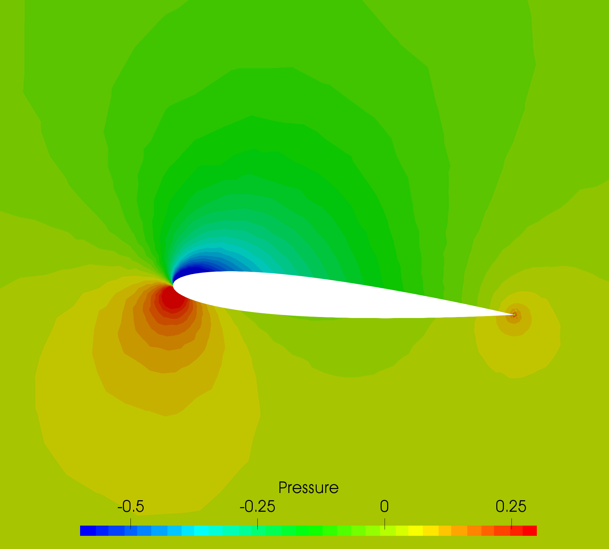

## Goals

Upon completing this tutorial, the user will be familiar with performing a simulation of internal, inviscid, incompressible flow through a 2D channel with a hydrofoil. The specific geometry chosen for the tutorial is a straight channel with a NACA 0012 hydrofoil at 5 degress angle of attack in the center. Consequently, the following capabilities of SU2 will be showcased in this tutorial:
- Steady, 2D, incompressible Euler equations 
- JST convective scheme in space (2nd-order, centered)
- Euler implicit time integration
- Inlet, Outlet, and Euler Wall boundary conditions

The intent of this tutorial is to introduce the density-based incompressible flow solver (coupled algorithm with custom preconditioning) within SU2 using a simple example. It is assumed that the user has worked through the previous compressible flow tutorials.

## Resources

You can find the resources for this tutorial in the folder [Inc_Inviscid_Hydrofoil](https://github.com/su2code/su2code.github.io/tree/master/Inc_Inviscid_Hydrofoil) in the [project website repository](https://github.com/su2code/su2code.github.io). You will need the mesh file [mesh_NACA0012_5deg_6814.su2](../../Inc_Inviscid_Hydrofoil/mesh_NACA0012_5deg_6814.su2)
and the config file [inv_naca0012.cfg](../../Inc_Inviscid_Hydrofoil/inv_naca0012.cfg).

## Tutorial

The following tutorial will walk you through the steps required when solving for the flow past the hydrofoil. It is assumed you have already obtained and compiled SU2_CFD. If you have yet to complete these requirements, please see the [Download](/docs/Download/) and [Installation](/docs/Installation/) pages.

## Background

This example uses a 2D water channel geometry that features a hydrofoil in the center with a NACA 0012 profile. The channel is 20c wide and 12c in height, where c is the airfoil chord (c = 1 m). The hydrofoil is inclined at 5 degrees angle of attack relative to the parallel channel walls. It is meant to be a simple test in an inviscid, incompressible liquid.

## Problem Setup

This tutorial will solve the for the flow past the hydrofoil with these conditions:
- Density (constant) = 998.2 kg/m^3
- Inlet Velocity Magnitude = 1.775 m/s
- Inlet Flow Direction, unit vector (x,y,z) = (1.0, 0.0, 0.0) 
- Outlet Pressure = 0.0 N/m^2

### Mesh Description

The mesh is composed of 6814 triangles with 3559 vertices in total, 128 edges along the airfoil, and 49 edges along the upper and lower walls of the channel. Inlet, outlet, and Euler wall boundary conditions are used. The Euler wall boundary condition enforces flow tangency at the airfoil, upper, and lower walls. 

### Configuration File Options

In order to use the incompressible solver, the flow regime should first be switched from COMPRESSIBLE (default) to INCOMPRESSIBLE with the following option:

```
% Regime type (COMPRESSIBLE, INCOMPRESSIBLE)
REGIME_TYPE= INCOMPRESSIBLE
```
 
Once the incompressible mode is activated, the flow throughout the domain is initialized using a different set of options as compared to the compressible mode. The present problem is inviscid (no energy equation), so the only required initialization data is the density (constant) and flow velocity. These initialization values are set with the following options:

 ```
% Initial density for incompressible flows
% (1.2886 kg/m^3 by default (air), 998.2 Kg/m^3 (water))
INC_DENSITY_INIT= 998.2
%
% Initial velocity for incompressible flows (1.0,0,0 m/s by default)
INC_VELOCITY_INIT= ( 1.775, 0.0, 0.0 )
 ```

As in internal flow, the problem is driven by the inlet and outlet boundary conditions, i.e., the final solution depends on the values specified at the inlets and outlets and *not* the initialization values. The details for the Euler wall, inlet, and outlet boundary conditions are given below:

```
% ----------------------- BOUNDARY CONDITION DEFINITION -----------------------%
%
% Euler wall boundary marker(s) (NONE = no marker)
MARKER_EULER= ( airfoil, lower_wall, upper_wall )
%
% Inlet boundary marker(s) with the following formats (NONE = no marker)
% Incompressible: (inlet marker, temperature, velocity magnitude, flow_direction_x,
%           flow_direction_y, flow_direction_z, ... ) where flow_direction is
%           a unit vector.
MARKER_INLET= ( inlet, 0.0, 1.775, 1.0, 0.0, 0.0 )
%
% Outlet boundary marker(s) (NONE = no marker)
MARKER_OUTLET= ( outlet, 0.0 )
```

The inlet condition is prescribed as a uniform velocity inlet, where the velocity magnitude and direction are imposed and held fixed at the inflow boundary. It is also possible to impose non-uniform boundary inlet data from a file, and this will be shown in a later tutorial. A pressure outlet boundary condition is applied to the outflow. 

The format for the uniform velocity inlet boundary condition is (marker name, temperature, velocity magnitude, x-component of flow direction, y-component of flow direction, z-component of flow direction), where the final three components make up a unit flow direction vector (magnitude = 1.0). In this problem, the flow is exactly aligned with the x-direction of the coordinate system, and thus the flow direction vector is `(1.0, 0.0, 0.0)`. We are not solving the energy equation for this inviscid problem, so the temperature input value is ignored.

The pressure outlet condition is prescibed as a uniform static (gauge) pressure. Note that, in the incompressible solver, the pressure variable is interpreted as a dynamic pressure instead of the thermodynamic pressure, as in the compressible solver. Therefore, the specified outlet pressure is a gauge value relative to the operating pressure, which is typically taken as the local atmospheric value at the outlet, and thus, the gauge pressure at the outlet is often set to 0.0 Pa. 

### Running SU2

The channel simulation uses a small mesh and a very aggressive CFL number, so this case will be run in serial. To run this test case, follow these steps at a terminal command line:
 1. Move to the directory containing the config file ([inv_naca0012.cfg](../../Inc_Inviscid_Hydrofoil/inv_naca0012.cfg)) and the mesh file ([mesh_NACA0012_5deg_6814.su2](../../Inc_Inviscid_Hydrofoil/mesh_NACA0012_5deg_6814.su2)). Make sure that the SU2 tools were compiled, installed, and that their install location was added to your path.
 2. Run the executable by entering 
 
    ```
    $ SU2_CFD inv_naca0012.cfg
    ```
     
     at the command line.
 3. SU2 will print residual updates with each iteration of the flow solver, and the simulation will finish after reaching the specified convergence criteria.
 4. Files containing the results will be written upon exiting SU2. The flow solution can be visualized in ParaView (.vtk) or Tecplot (.dat for ASCII).

### Results

The following images show some SU2 results for the inviscid hydrofoil problem.


Figure (2): Velocity contours around the hydrofoil.


Figure (3): Pressure contours around the hydrofoil.
