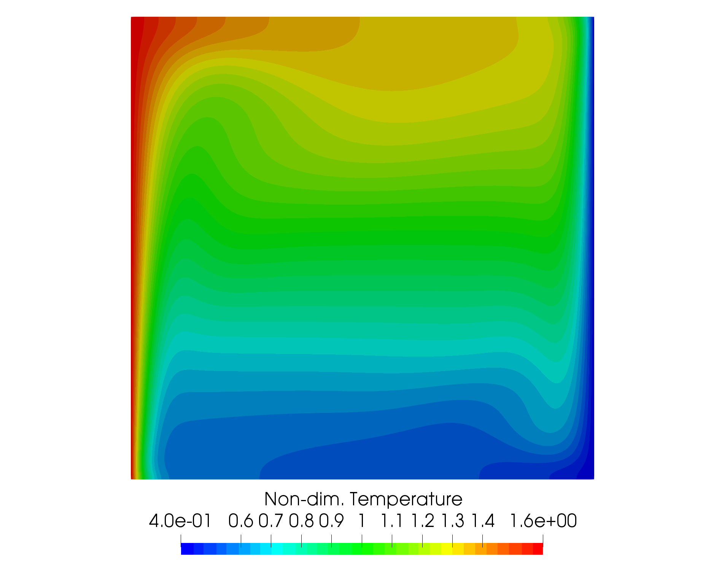
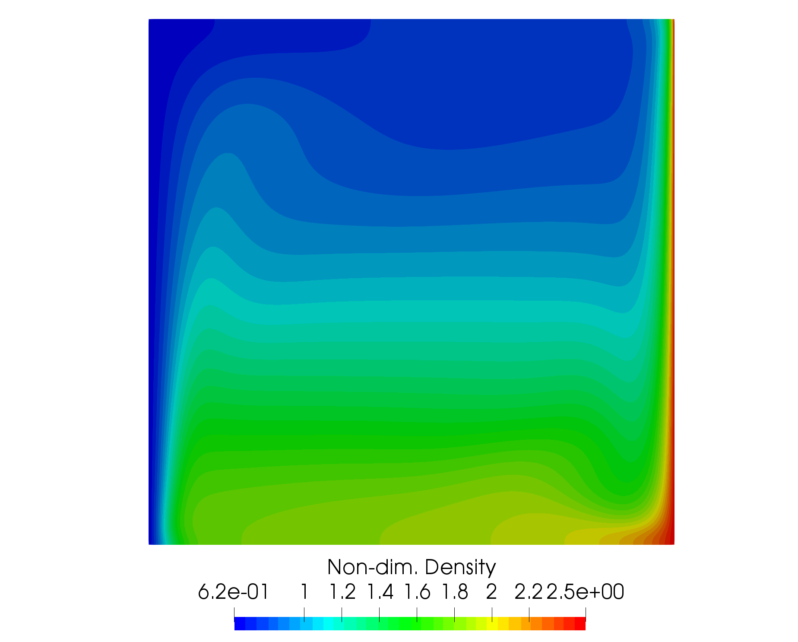
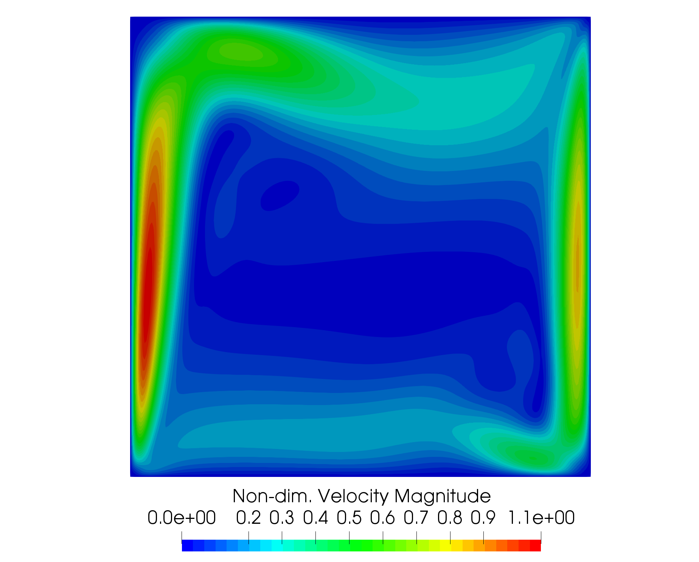
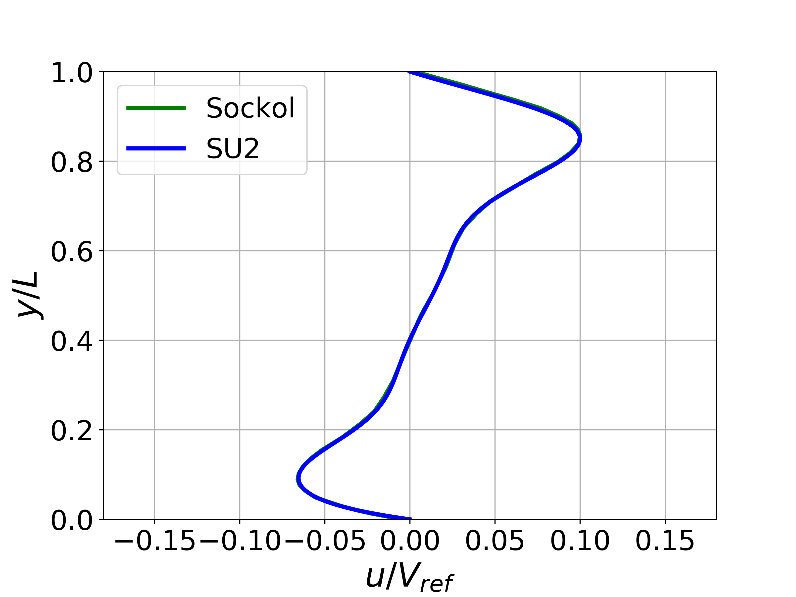

## Goals

Upon completing this tutorial, the user will be familiar with performing a simulation of laminar, incompressible, buoyancy-driven flow within a cavity. Consequently, the following capabilities of SU2 will be showcased in this tutorial:

- Steady, 2D, laminar, incompressible, Navier-Stokes equations 
- Flux Difference Splitting (FDS) convective scheme in space (2nd-order, upwind)
- Euler implicit time integration
- No-slip wall (constant temperature and adiabatic) boundary conditions

The intent of this tutorial is to demonstrate the variable density capability of the incompressible solver using an incompressible ideal gas model for a simple natural convection test case.


## Resources

The resources for this tutorial can be found in the [Inc_Laminar_Cavity](https://github.com/su2code/su2code.github.io/tree/master/Inc_Laminar_Cavity) directory in the [tutorial repository](https://github.com/su2code/su2code.github.io/tree/master/). You will need the configuration file ([lam_buoyancy_cavity.cfg](../../Inc_Laminar_Cavity/lam_buoyancy_cavity.cfg)) and the mesh file ([mesh_cavity_257x257.su2](../../Inc_Laminar_Cavity/mesh_cavity_257x257.su2)).


## Tutorial

The following tutorial will walk you through the steps required when solving for the flow in the buoyancy-driven cavity using the incompressible solver in SU2. It is assumed you have already obtained and compiled the SU2_CFD code for a serial computation. If you have yet to complete these requirements, please see the [Download](/docs/Download/) and [Installation](/docs/Installation/) pages.

### Background

The buoyancy-driven cavity is a classic natural convection case for testing incompressible flow solvers with heat transfer effects. The geometry consists of a square cavity in 2D with opposing hot and cold vertical walls and insulated horizontal walls. A gravity force is added in the negative y-direction. Heat transfer through the walls causes density changes in the fluid, and the buoyancy effect induces flow velocity in the cavity given the variable density.

### Problem Setup

We use the problem set up of Sockol here for comparison purposes (Peter M. Sockol. Multigrid solution of the navier–stokes equations at low speeds with large temperature variations. Journal of Computational Physics, 192(2):570 – 592, 2003). The Rayleigh number is the key parameter controlling the flow, defined as


where ∆T = 2(Th − Tc)/(Th + Tc), Th is the constant temperature of the hot left wall, Tc is the constant temperature of the cold right wall, g is the acceleration due to gravity, and L is the length of a side of the square cavity. Additionally, we impose that Th/Tc = 4 and that μ_dyn and κ are constants with κ = μ_dyn cp/Pr_d. The laminar Prandtl (Prd) and Froude (Fr) numbers are 0.7 and 1.2, respectively. A reference velocity can then be computed as V_ref = sqrt(F r g L).

This problem will solve the for the incompressible flow in the cavity at Ra = 1e3, 1e5, and 1e6 using the parameters above and standard air as a fluid, as described below.


### Mesh Description

The computational mesh for the cavity is composed of quadrilaterals with 257 uniformly spaced nodes in both the x- and y-directions. The 4 boundaries of the cavity are no-slip walls. The vertical walls are both constant temperature walls, while the horizontal walls are adiabatic. The cavity is 1 m by 1 m.


### Configuration File Options

Several of the key configuration file options for this simulation are highlighted here. For small temperature differences between the two walls, the Boussinesq approximation is valid. However, a large temperature difference is imposed between the two plates in order to test the full variable density capability of the solver. To activate variable density, we choose the following options:

```
% ---------------- INCOMPRESSIBLE FLOW CONDITION DEFINITION -------------------%
%
% Density model within the incompressible flow solver.
% Options are CONSTANT (default), BOUSSINESQ, or VARIABLE. If VARIABLE,
% an appropriate fluid model must be selected.
INC_DENSITY_MODEL= VARIABLE
%
% Solve the energy equation in the incompressible flow solver
INC_ENERGY_EQUATION = YES
```

Once the density model is chosen as `INC_DENSITY_MODEL= VARIABLE`, the energy equation will be required by setting `INC_ENERGY_EQUATION = YES`, as we assume for now that the density will vary as a function of temperature. Next, we select a fluid model for controlling the equation of state for density:

```
% ---- IDEAL GAS, POLYTROPIC, VAN DER WAALS AND PENG ROBINSON CONSTANTS -------%
%
% Fluid model (STANDARD_AIR, IDEAL_GAS, VW_GAS, PR_GAS,
%              CONSTANT_DENSITY, INC_IDEAL_GAS)
FLUID_MODEL= INC_IDEAL_GAS
%
% Specific heat at constant pressure, Cp (1004.703 J/kg*K (air)).
% Incompressible fluids with energy eqn. only (CONSTANT_DENSITY, INC_IDEAL_GAS).
SPECIFIC_HEAT_CP= 1004.703
%
% Molecular weight for an incompressible ideal gas (28.96 g/mol (air) default)
% Incompressible fluids with energy eqn. only (CONSTANT_DENSITY, INC_IDEAL_GAS).
MOLECULAR_WEIGHT= 28.96
```

At the time of writing, only an incompressible ideal gas model is available for variable density incompressible flows by choosing `FLUID_MODEL= INC_IDEAL_GAS`. To define the ideal gas, we supply SU2 with the molecular weight in g/mol and the specific heat at constant pressure (Cp) should be specified. For standard air, we have `SPECIFIC_HEAT_CP= 1004.703` J/(kg-K) and `MOLECULAR_WEIGHT= 28.96` g/mol.

For the buoyancy-driven cavity problem, the viscosity and thermal conductivity have been assumed constant. However, these transport propoerties can also vary as functions of temperature, using Sutherland's law and a constant Prandtl number model for dynamic viscosity and thermal conductivity, respectively. In the future, the models for the fluid properties, including transport coefficients, will be expanded. Constant transport coefficients can be set with the following options:

```
% --------------------------- VISCOSITY MODEL ---------------------------------%
%
% Viscosity model (SUTHERLAND, CONSTANT_VISCOSITY).
VISCOSITY_MODEL= CONSTANT_VISCOSITY
%
% Molecular Viscosity that would be constant (1.716E-5 by default)
MU_CONSTANT= 1.716e-5

% --------------------------- THERMAL CONDUCTIVITY MODEL ----------------------%
%
% Conductivity model (CONSTANT_CONDUCTIVITY, CONSTANT_PRANDTL).
CONDUCTIVITY_MODEL= CONSTANT_CONDUCTIVITY
%
% Molecular Thermal Conductivity that would be constant (0.0257 by default)
KT_CONSTANT= 0.0246295028571
```

Lastly, in order to impose gravity, we apply a body force in the negative y-direction as follows:

```
% ----------------------- BODY FORCE DEFINITION -------------------------------%
%
% Apply a body force as a source term (NO, YES)
BODY_FORCE= YES
%
% Vector of body force values (BodyForce_X, BodyForce_Y, BodyForce_Z)
BODY_FORCE_VECTOR= ( 0.0, -9.81, 0.0 )
```

However, this body force specification can also be applied for general purpose in any direction.

### Running SU2

#### In Serial

To run this test case in serial, follow these steps at a terminal command line:
1. Copy the config file ([lam_buoyancy_cavity.cfg](../../Inc_Laminar_Cavity/lam_buoyancy_cavity.cfg)) and the mesh file ([mesh_cavity_257x257.su2](../../Inc_Laminar_Cavity/mesh_cavity_257x257.su2)) so that they are in the same directory. Move to the directory containing the config file and the mesh file. Make sure that the SU2 tools were compiled, installed, and that their install location was added to your path.
 2. Run the executable by entering in the command line:
      
    ```
    $ SU2_CFD lam_buoyancy_cavity.cfg
    ```

 3. SU2 will print residual updates with each iteration of the flow solver, and the simulation will terminate after reaching the specified convergence criteria.
 4. Files containing the results will be written upon exiting SU2. The flow solution can be visualized in ParaView (.vtk) or Tecplot (.dat for ASCII).

#### In Parallel

If SU2 has been built with parallel support, the recommended method for running a parallel simulation is through the use of the parallel_computation.py Python script. This automatically handles the domain decomposition and execution with SU2_CFD, and the merging of the decomposed files using SU2_SOL. Follow these steps to run the case in parallel:
 1. Move to the directory containing the config file ([lam_buoyancy_cavity.cfg](../../Inc_Laminar_Cavity/lam_buoyancy_cavity.cfg)) and the mesh file ([mesh_cavity_257x257.su2](../../Inc_Laminar_Cavity/mesh_cavity_257x257.su2)). Make sure that the SU2 tools were compiled with parallel support, installed, and that their install location was added to your path.
 2. Run the python script which will automatically call SU2_CFD and will perform the simulation using `NP` number of processors by entering in the command line:

    ```
    $ parallel_computation.py -f lam_buoyancy_cavity.cfg -n NP
    ```

 3. SU2 will print residual updates with each iteration of the flow solver, and the simulation will terminate after reaching the specified convergence criteria.
 4. The python script will automatically call the SU2_SOL executable for generating visualization files from the native restart file written during runtime. The flow solution can then be visualized in ParaView (.vtk) or Tecplot (.dat for ASCII).

### Results

Results are given here for the SU2 solution of incompressible laminar flow in the buoyancy-driven cavity. The results show excellent agreement with the numerical results of Sockol.


Figure (1): A plot of non-dim. temperature contours in the cavity.



Figure (2): A plot of non-dim. density contours in the cavity.



Figure (3): A plot of non-dim. velocity magnitude contours in the cavity.


Figure (4): X-velocity comparison at the centerline for Ra = 1e3.


Figure (5): X-velocity comparison at the centerline for Ra = 1e5.



Figure (6): X-velocity comparison at the centerline for Ra = 1e6.
