## Goals

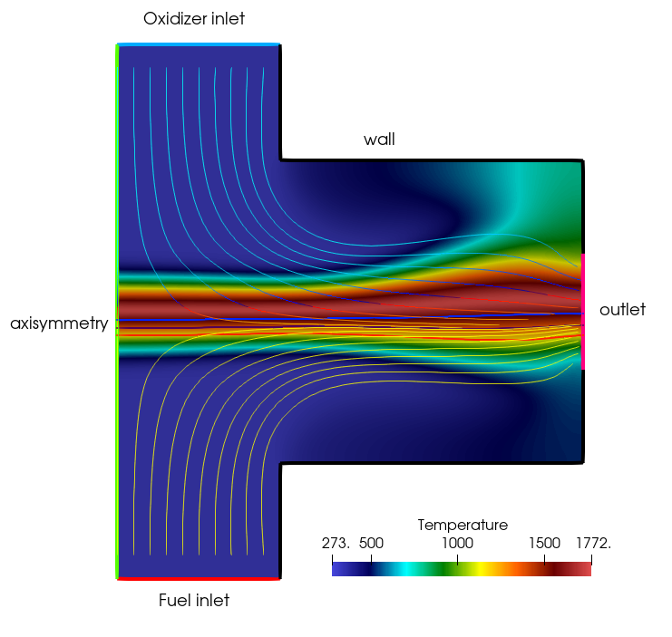
*Figure (1): 2D axisymmetric configuration of the laminar counterflow diffusion flame. The axisymmetry is shown here vertically to align the simulation results with the usual lab orientation, but in the simulations, the axisymmetry axis is always horizontally at y=0.*

In this tutorial we show how to setup a laminar diffusion flame computation for a counterflow flame. We will use a flamelet method to model combustion, which is a tabulated chemistry approach. The table was precomputed from 1D Cantera solutions using the SU2_DataMiner code. We then reproduce the experiments of C.K. Law, mentioned in his book *Combustion Physics* (2006).
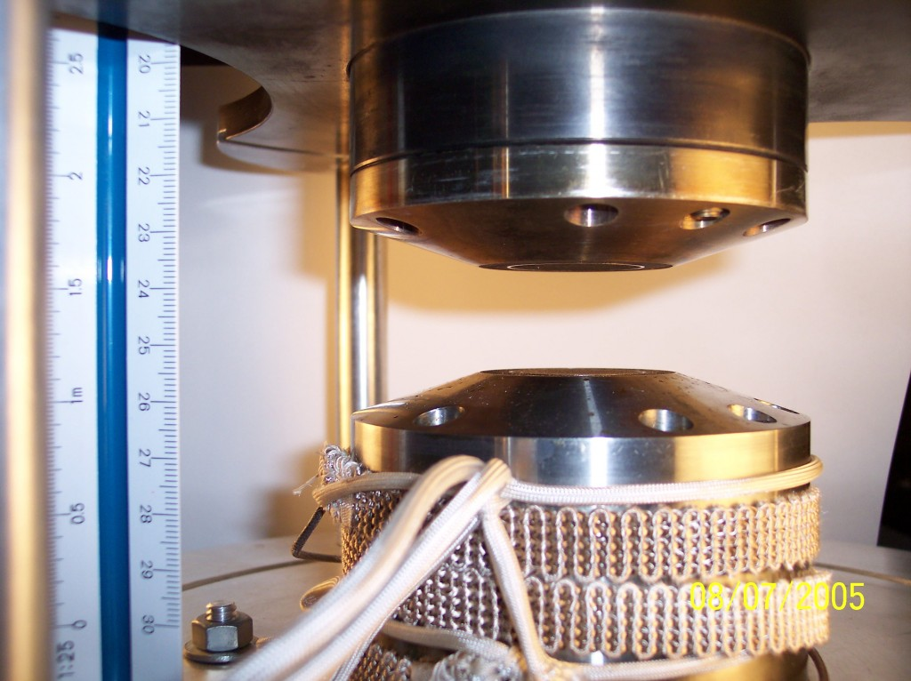
*Figure (2): Counterflow Diffusion burner from the Thomson Lab in Toronto: https://thomsonlab.mie.utoronto.ca/counterflow-diffusion-burner/.*
## Resources

The resources for this tutorial can be found in the [incompressible_flow/Inc_Laminar_Diffusion_Flame](https://github.com/su2code/Tutorials/tree/master/incompressible_flow/Inc_Laminar_Diffusion_Flame) directory in the [tutorial repository](https://github.com/su2code/Tutorials). You will need the following files:

1. *Configuration file*: The configuration file for this case is named [counterflow.cfg](https://github.com/su2code/Tutorials/tree/master/incompressible_flow/Inc_Laminar_Diffusion_Flame/counterflow.cfg).
2. *Mesh file*: The geometry for this test case is a simple, 2D counterflow burner geometry,  ([counterflow.su2](https://github.com/su2code/Tutorials/tree/master/incompressible_flow/Inc_Laminar_Diffusion_Flame/counterflow.su2)). 
3. *Manifold file*: We will use a 2D flamelet table with mixture fraction and enthalpy as the controlling variables. The lookup table contains a small enthalpy range for this specific setup. The detailed chemistry simulations were performed with cantera. The strain rate at which the counterflow flames were generated was 56 [1/s] to match the experimental setup. The file can be found at ([fgm_ch4_ZH.drg](https://github.com/su2code/Tutorials/tree/master/incompressible_flow/Inc_Laminar_Diffusion_Flame/fgm_ch4_ZH.drg)).

The mesh is created using [gmsh](https://gmsh.info/) and a respective `.geo` script is available to recreate/modify the mesh [counterflow.geo](https://github.com/su2code/Tutorials/tree/master/incompressible_flow/Inc_Laminar_Diffusion_Flame/counterflow.geo). The mesh has quadrilateral cells,  with 8324 elements and 8551 points. This very coarse mesh is sufficient to capture accurately resolve the flame for this testcase.

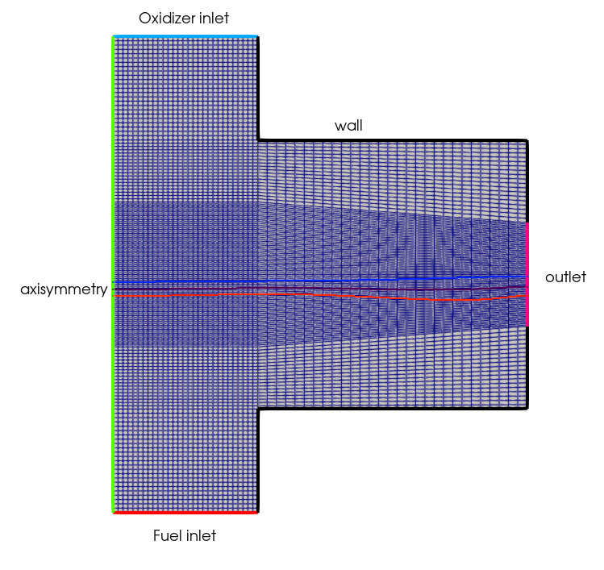
*Figure (3): Computational mesh with color indication of the used boundary conditions.*


## Background

For premixed flames, the controlling variable is the progress variable C, which monitors the progress of combustion. The smallest value represents the unburnt mixture and the largest value the burnt mixture, and in the reaction zone the progress variable is monotonously increasing. For nonpremixed flames, also called diffusion flames, the main controlling variable is the mixture fraction Z: Z=1 for the fuel and Z=0 for the oxidizer. In partially premixed combustion we need to solve a transport equation for both. The usual flamelet approach is to solve 1D flames using detailed chemistry. This can be done with detailed chemistry packages like cantera, FlameMaster, chem1d or other chemistry software. The solution is then rewritten into progress variable space or mixture fraction space. For example temperature T(x) is rewritten to T(Z). For purely premixed flames, the 1d solutions have to be generated for the equivalence ratio $\phi$ of the problem that you want to study. For purely nonmpremixed flames, the 1d solutions have to be generated for the strain rate $s$ of the problem. The equivalence ratio stays constant in purely premixed flames. However, in purely nonpremixed flames the strain rate is usually not constant except in exceptional cases like counterflow diffusion flames. So in general, a nonpremixed laminar flame needs 2 controlling variables: the mixture fraction and a controlling variable representing the strain rate. This will be treated in another tutorial. For this tutorial we will stick with a fixed strain rate. 
That means combustion is in our case described solely by the transport equation for mixture fraction: 

$$ \frac{\partial Z}{dt} + \nabla \cdot (\rho u Z) = \nabla\cdot (D \nabla Z) $$

Where the diffusion coefficient D is retrieved from the lookup table. 

When heat loss occurs, the enthalpy also has to be taken into account as a controlling variable. Usually, heat losses are important and are taken into account by default in flamelet approaches. We also generate a lookup table as function of mixture fraction and enthalpy here. In SU2, an additional enthalpy equation is solved together with mixture fraction (the original energy equation of the flow solver is de-activated). Fluid and chemistry properties are tabulated from cantera results, stored in a LUT.drg file and retrieved from the lookup table every iteration.


## Problem Setup

The Flamelet Generated Manifold method used the incompressible flow solver, so we set:
```
SOLVER = INC_NAVIER_STOKES
```


### Enabling Flamelet Fluid Model
Setting the fluid model to **FLAMELET** activates the scalar solver. The **CONTROLLING_VARIABLE_NAMES** determines the number of transport equations. The number of controlling variables and their names have to match what is in the lookup table. The lookup table file is given using **FILENAMES_INTERPOLATOR**. With **CONTROLLING_VARIABLE_SOURCE_NAMES** we define the main reaction source term for each of the controlling variables. Just put NULL if the controlling variable does not have a source term. Note that mixture fraction and enthalpy do not get any source terms here.

```
FLUID_MODEL= FLUID_FLAMELET
CONTROLLING_VARIABLE_NAMES= (MixtureFraction, EnthalpyTot)
FILENAMES_INTERPOLATOR= fgm_ch4_ZH.drg
CONTROLLING_VARIABLE_SOURCE_NAMES = (NULL, NULL)
```

We use a flamelet model for the other fluid submodels, except for density. For density, we use the incompressible ideal gas law. In that case we do not have to store density in the table. The results are the same.

```
KIND_SCALAR_MODEL= FLAMELET      
DIFFUSIVITY_MODEL= FLAMELET
VISCOSITY_MODEL= FLAMELET
CONDUCTIVITY_MODEL= FLAMELET
INC_DENSITY_MODEL= VARIABLE
INC_ENERGY_EQUATION = NO
```
Note that the energy equation from the flow solver will always be de-activated. 


### Passive look-up terms

To compare the species mole fractions with experiments, we need to look up these values from the table and then save them in for instance the paraview file for visualization. All quantities defined by **LOOKUP_NAMES** are passive values and are only retrieved from the table and then saved to an output file.
```
LOOKUP_NAMES = (MolarWeightMix, Conductivity, Cp, Heat_Release, DiffusionCoefficient, X-CO, X-CO2, X-H2O, X-CH4, X-O2)
```


### Boundary conditions

The inlet boundary conditions for the counterflow diffusion flame are U=0.45 m/s for the fuel and air inlet. 
At the wall, a zero heat flux is imposed. Note that for the flamelet method, we solve our own transport equation for the energy (total enthalpy). The regular energy equation of the flow solver is passive. We now have two methods to impose a boundary condition for the energy equation. The first one is using the temperature and heat flux from the flow solver:
```
MARKER_INLET = (inlet_fuel, 305., 0.45, 0.0, 1.0, 0.0, inlet_oxidizer, 305., 0.45, 0.0,-1.0, 0.0)
MARKER_HEATFLUX= (wall_fuel, 0.0, wall_oxidizer, 0.0, wall_outlet, 0.0)
```
The inlet temperature is then internally converted to a value for total enthalpy and this value is imposed on the total enthalpy equation of the flamelet solver. The second method is by directly imposing the inlet value and boundary for total enthalpy, 

```
MARKER_INLET_SPECIES = (inlet_fuel, 1.0, -4.654e6, inlet_oxidizer, 0.0, 1.9e3)
MARKER_WALL_SPECIES= (wall_fuel, FLUX, 0.0, VALUE, -4.645e6, wall_oxidizer, FLUX, 0.0, VALUE, 1.90e3) 
```

In this case, the temperature follows from the imposed enthalpy. 
To switch between the two methods, you can use the configuration option:
```
FLAMELET_ENTHALPY_BC= FLOW_MARKERS
% FLAMELET_ENTHALPY_BC= SPECIES_MARKERS
```
Since we know from the experiment the inlet temperature, we use **FLOW_MARKERS** to define temperature.

For the initialization of the flame we define a plane, and on one side of the plane we set Z=0 and on the other we set Z=1. We define a transition region of 1e-4 at the interface.
```
FLAME_INIT_METHOD= FLAME_FRONT
% make sure to put it to NONE when restarting
%FLAME_INIT_METHOD= NONE
FLAME_INIT= (-0.006, 0.00, 0.00, 1.0, 0.0, 0.0, 1.0e-4, 1.0)
```
This method also overrules any values defined using **SPECIES_INIT**.

### Manifold set-up 
The lookup table was generated using the SU2_DataMiner package, which can be found here:
[SU2_DataMiner](https://github.com/su2code/SU2_DataMiner)
We will not go into the table generation now, but merely provide the results. For the constant strain diffusion flamelets, we fix the strain rate and run a series of counterflow flames for different enthalpies (we vary the inlet temperature). The resulting solutions for temperature are shown below:

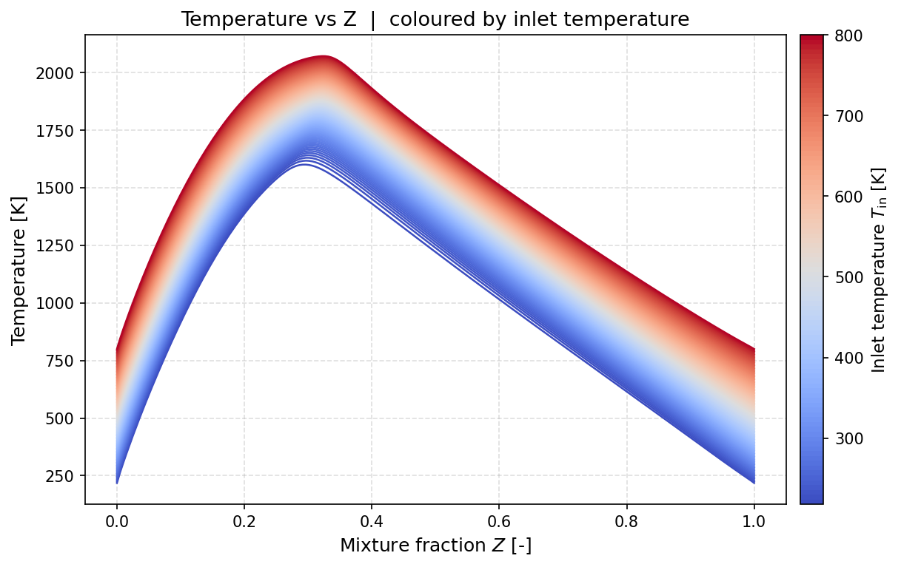
*Figure (4): The 1D cantera solutions for the counterflow flames, using a variation in inlet temperature.*

We then store the 1D solutions as a 2D field with mixture fraction and enthalpy as the independent variables. The result for temperature and heat release rate is shown below:

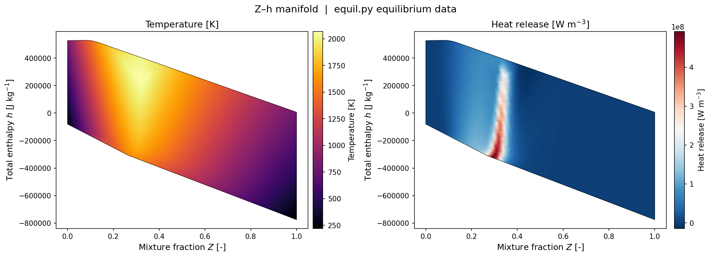
*Figure (5): A 2D surface representation of the FGM, showing the temperature and the heat release rate as function of mixture fraction and enthalpy. Note that our enthalpy range is not very large. We can represent constant strain flames with different inlet temperatures, but for simulations with large heat losses the table has to be extended to lower enthalpies.*

Note that the mixture fraction equation is a diffusion equation and does not contain any source terms, unlike the progress variable equation for premixed flames.


## Running SU2

The simulation can be run in serial using the following command:
```
$ SU2_CFD lam_nonprem_ch4.cfg
```
or in parallel with your preferred number of cores:
```
$ mpirun -n <#cores> SU2_CFD lam_nonprem_ch4.cfg
```

## Results

After 800 iterations, the simulation has converged. The convergence plot normalized with the first value of the residual looks like this: 

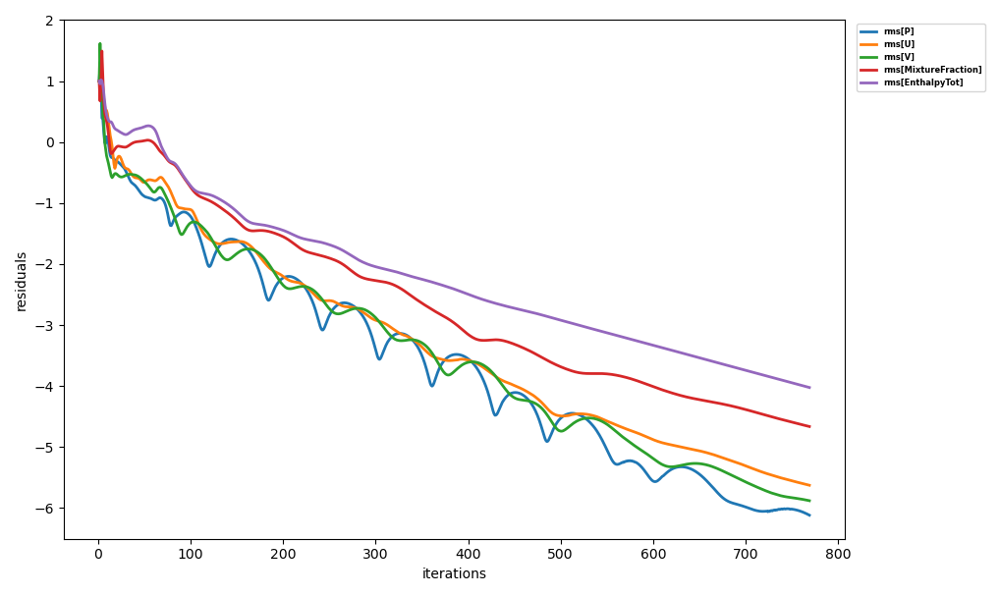
*Figure (6): Residual plot showing convergence of the counterflow diffusion flame.*

The residuals for pressure and velocity have dropped by 6 orders of magnitude, which is sufficient for this testcase.

A contour plot of the temperature field in the domain is shown below. Note that only 1/3 of the right vertical edge is an outlet. The smaller outlet will force the flow to accelerate close to the outlet. This prevents backflow, which deteriorates convergence. 


*Figure (7): Result visualized using paraview. Shown is the temperature field and the streamlines colored by mixture fraction.*

In the figure we have also indicated the isocontours of mixture fraction for values Z=0.4 (blue), Z=0.5 (dark purple) and Z=0.6 (red), showing that the maximum temperature occurs at $Z<0.4$. The flame looks very diffusive close to the outlet because of the blockage in the corners. Here, a low velocity recirculation zone in the top and bottom corner is mixing the fuel and air, causing the diffusive behavior. 

A figure of the temperature on the symmetry axis is shown below, together with measured results from Sung et al. (1995). These results are also mentioned in the book of C.K. Law, *Combustion Physics*.
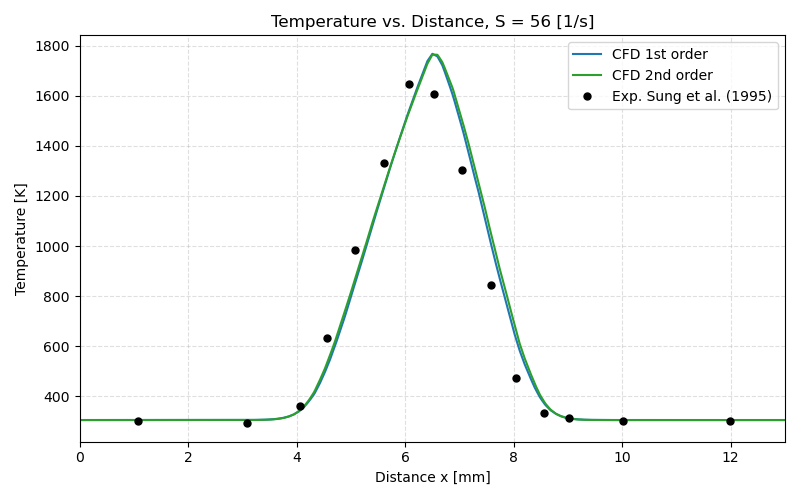
*Figure (8): Temperature as function of distance (from the fuel inlet) on the symmetry axis.*

We see that the temperature profile is predicted quite accurately, for the first order as well as for the second order MUSCL scheme. 

The methane mole fraction at the fuel inlet was 23%, which can be clearly seen in the figure for mole fraction of $CH_4$ below.
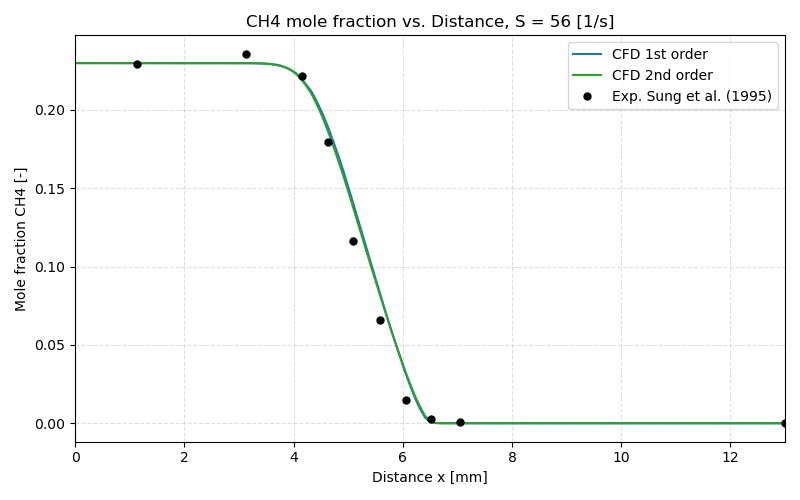
*Figure (9): Methane mole fraction as function of distance (from the fuel inlet) on the symmetry axis.*

A first sanity check is always to to check that inlet mass fraction or mole fractions are correct. The consumption of $CH_4$ in the flame is also predicted correctly

The $CO_2$ mole fraction is zero at both inlets and rises in the reaction zone.
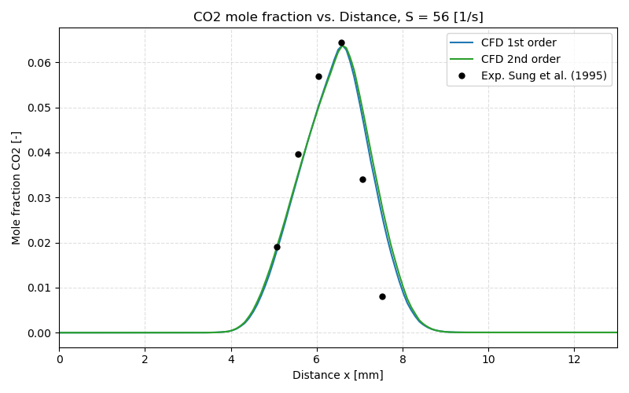
*Figure (10): Mole fraction of CO2 as function of distance (from the fuel inlet) on the symmetry axis.*

As for $CH_4$, the $CO_2$ mole fraction in the flame zone is correctly predicted, the maximum value as well as the slope is matching with the experiment.

The lookup value for CO is much lower than the experimentally measured value. CO as well as NO are very slow reactions, and are not accurately predicted by flamelet approaches. To get more accurate results for CO or NO, a separate transport equation should be solved for them. Instead of the value for CO, we look up the source term for the transport equation for CO. 
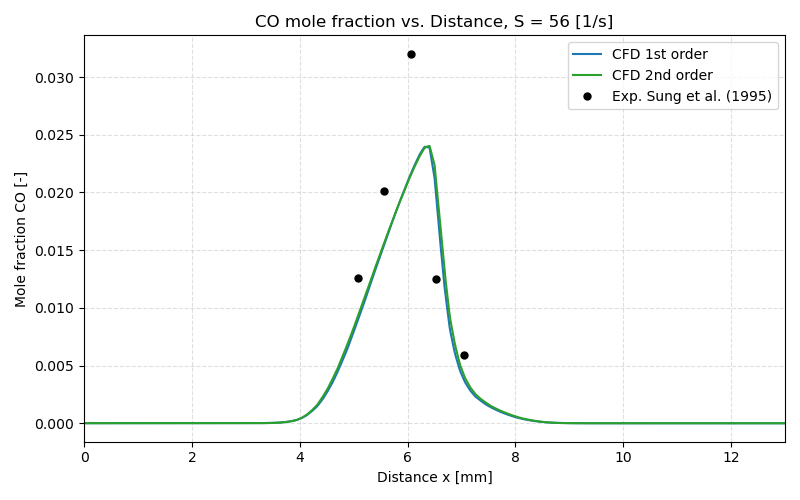
*Figure (11): Mole fraction of CO as function of distance (from the fuel inlet) on the symmetry axis.*

The temperature can also be plotted as function of the mixture fraction, leading to the 1D flamelet result shown below.
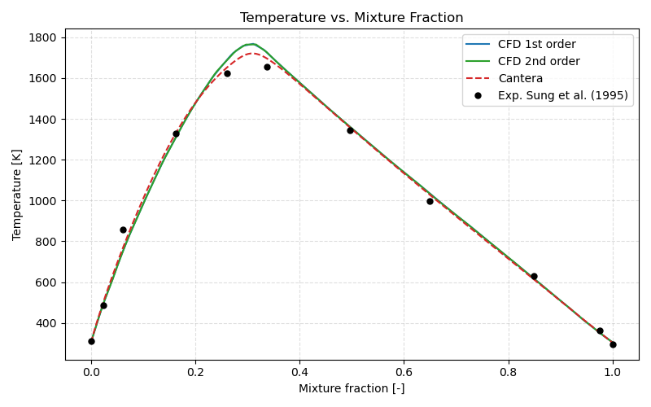
*Figure (12): Temperature as function of mixture fraction, using the values taken at the symmetry axis.*

This shows the typical Burke-Schumann- like behavior where the diffusion flame can be described by a pre-flame and a post-flame zone with almost linear slope for temperature.

Note that the lookup table for this tutorial is for methane-air and a strain rate of 56 1/s. If you have a different configuration, you will need to generate your own table.

