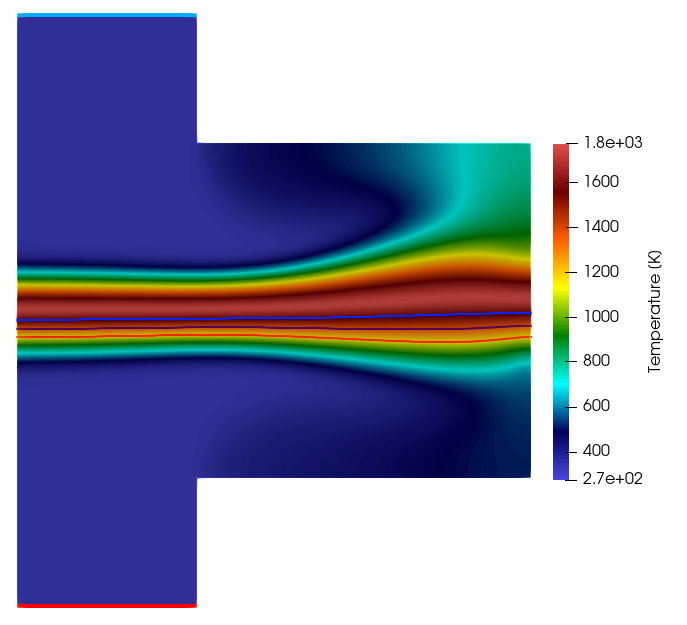

## Goals

In this tutorial we show how to setup a laminar diffusion flame computation for a counterflow flame. We will use a flamelet method to model combustion, which is a tabulated chemistry approach. We explain how to generate the flamelet lookup table from cantera counterflow flames and how to generate the lookup table. We then reproduce the experiments of C.K. Law, mentioned in his book *Combustion Physics* (2006).

Figure (1): Counterflow Diffusion burner from the Thomson Lab in Toronto: https://thomsonlab.mie.utoronto.ca/counterflow-diffusion-burner/.
## Resources and Prerequisites

The resources for this tutorial can be found in the [incompressible_flow/Inc_Laminar_Premixed_Flame](https://github.com/su2code/Tutorials/tree/master/incompressible_flow/Inc_Laminar_Diffusion_Flame) directory in the [tutorial repository](https://github.com/su2code/Tutorials). You will need the following files:

1. *Configuration file*: The configuration file for this case is named [counterflow.cfg](https://github.com/su2code/Tutorials/tree/master/incompressible_flow/Inc_Laminar_Diffusion_Flame/counterflow.cfg).
2. *Mesh file*: The geometry for this test case is a simple, 2D burner geometry with a cooled burner plate ([counterflow.su2](https://github.com/su2code/Tutorials/tree/master/incompressible_flow/Inc_Laminar_Diffusion_Flame/counterflow.su2)).
3. *Manifold files*: We will use a 2D flamelet table with mixture fraction and enthalpy as the controlling variables. The lookup table contains a small enthalpy range for this specific setup. The detailed chemistry simulations were performed with cantera. The strain rate at which the counterflow flames were generated was 56 [1/s]. The file can be found at ([fgm_ch4_ZH.drg](https://github.com/su2code/Tutorials/tree/master/incompressible_flow/Inc_Laminar_Diffusion_Flame/fgm_ch4_ZH.drg)).

The mesh is created using [gmsh](https://gmsh.info/) and a respective `.geo` script is available to recreate/modify the mesh [counterflow.geo](https://github.com/su2code/Tutorials/tree/master/incompressible_flow/Inc_Laminar_Diffusion_Flame/counterflow.geo). The mesh is unstructured (i.e. only contains triangular elements) with 8324 elements and 8551 points. This very coarse mesh is sufficient to capture accurately resolve the flame for this testcase.


Figure (2): Computational mesh with color indication of the used boundary conditions.


## Background

For premixed flames, the controlling variable is the progress variable, which monitors the progress of combustion. The smallest value is the unburnt mixture and the largest value is the burnt mixture, and in the reaction zone the progress variable is monotonously increasing. For nonpremixed flames, also called diffusion flames, the main controlling variable is the mixture fraction Z: Z=1 for the fuel and Z=0 for the oxidizer.

## Problem Setup


### Manifold set-up 


### Enabling Flamelet Fluid Model
Setting the fluid model to **FLAMELET** activates the scalar solver. The **CONTROLLING_VARIABLE_NAMES** determines the number of transport equations. The number of controlling variables and their names have to match what is in the lookup table. The lookup table file is given using **FILENAMES_INTERPOLATOR**. With **CONTROLLING_VARIABLE_SOURCE_NAMES** we define the main reaction source term for each of the controlling variables. Just put NULL if the controlling variable does not have a source term.

```
FLUID_MODEL= FLUID_FLAMELET
CONTROLLING_VARIABLE_NAMES= (MixtureFraction, EnthalpyTot)
FILENAMES_INTERPOLATOR= fgm_ch4_ZH.drg
CONTROLLING_VARIABLE_SOURCE_NAMES = (NULL, NULL)
```

We use a flamelet model for the other fluid submodels, except for density. For density, we use the incompressible ideal gas law. In that case we do not have to store density in the table.

```
KIND_SCALAR_MODEL= FLAMELET      
DIFFUSIVITY_MODEL= FLAMELET
VISCOSITY_MODEL= FLAMELET
CONDUCTIVITY_MODEL= FLAMELET
INC_DENSITY_MODEL= VARIABLE
INC_ENERGY_EQUATION = NO
```


### Manifold options


### Passive look-up terms

To compare the species mole fractions with experiments, we need to look up these values from the table and then save them in the paraview file. All quantities defined by **LOOKUP_NAMES** are passive values and are only retieved from the table and then saved to an output file.
```
LOOKUP_NAMES = (MolarWeightMix, Conductivity, Cp, Heat_Release, DiffusionCoefficient, X-CO, X-CO2, X-H2O, X-CH4, X-O2)
```


### Boundary conditions

The inlet boundary conditions for the counterflow diffusion flame are U=0.45 m/s for the fuel and air inlet. 
At the wall, a zero heat flux is imposed. Note that for the flamelet method, we solve our own transport equation for theenergy (total enthalpy). The regular energy equation of the flow solver is passive. We now have two methods to impose a boundary condition for the energy equation. The first one is using the temperature and heat flux from the flow solver:
```
MARKER_INLET = (inlet_fuel, 305., 0.45, 0.0, 1.0, 0.0, inlet_oxidizer, 305., 0.45, 0.0,-1.0, 0.0)
MARKER_HEATFLUX= (wall_fuel, 0.0, wall_oxidizer, 0.0, wall_outlet, 0.0)
```
The inlet temperature is then internally converted to a value for total enthalpy and this value is imposed on the total enthalpy equation of the flamelet solver. The second method is by directly imposing the inlet value and boundary for total enthalpy, 

```
MARKER_INLET_SPECIES = (inlet_fuel, 1.0, -1e6, inlet_oxidizer, 0.0, 1.9e3)
MARKER_WALL_SPECIES= (wall_fuel, FLUX, 0.0, VALUE, -4.645e6, wall_oxidizer, FLUX, 0.0, VALUE, 1.80e3) 
```

To switch between the two methods, you can use the configuration option:
```
FLAMELET_ENTHALPY_BC= FLOW_MARKERS
% FLAMELET_ENTHALPY_BC= SPECIES_MARKERS
```

For the initialization of the flame we define a plane, and on one side of the plane we set Z=0 and on the other we set Z=1. We define a transition region of 1e-4
```
FLAME_INIT_METHOD= FLAME_FRONT
% make sure to put it to NONE when restarting
%FLAME_INIT_METHOD= NONE
FLAME_INIT= (-0.006, 0.00, 0.00, 1.0, 0.0, 0.0, 1.0e-4, 1.0)
```
This method also overrules any values defined using **SPECIES_INIT**.


## Running SU2

The simulation can be run in serial using the following command:
```
$ SU2_CFD lam_nonprem_ch4.cfg
```
or in parallel with your preferred number of cores:
```
$ mpirun -n <#cores> SU2_CFD lam_nonprem_ch4.cfg
```

## Results

After 800 iterations, the simulation has converged. The convergence plot normalized with the first value of the residual looks like this: 

The residuals for pressure and velocity have dropped by 6 orders of magnitude, which is sufficient for this testcase.

A contour plot of the temperature field in the domain is shown below. Note that only 1/3 of the right vertical edge is an outlet. The smaller outlet will force the flow to accelerate close to the outlet. This prevents backflow, which deteriorates convergence. 

In the figure we have indicated the isocontours of mixture fraction for values Z=0.4,Z=0.5 and Z=0.6, showing that the maximum temperature occurs at $Z<0.4$. The flame looks very diffusive close to the outlet because of the blockage in the corners. Here, a low velocity recirculation zone in the top and bottom corner is mixing the fuel and air, causing the diffusive behavior. 

A figure of the temperature on the symmetry axis is shown below, together with measured results from Sung et al. (1995). These results are also mentioned in the book of C.K. Law, *Combustion Physics*.

We see that the temperature profile is predicted quite accurately, for the first order as well as for the second order MUSCL scheme. 

The methane mole fraction at the fuel inlet was 23%, which can be clearly seen in the figure for mole fraction of $CH_4$ below.

A first sanity check is always to to check that inlet mass fraction or mole fractions are correct. The consumption of $CH_4$ in the flame is also predicted correctly

The $CO_2$ mole fraction is zero at both inlets and rises in the reaction zone.

As for $CH_4$, the $CO_2$ mole fraction in the flame zone is correctly predicted, the maximum value as well as the slope is matching with the experiment.

The lookup value for CO is much lower than the experimentally measured value. CO as well as NO are very slow reactions, and are not accurately predicted by flamelet approaches. To get more accurate results for CO or NO, a separate transport equation should be solved for them. Instead of the value for CO, we look up the source term for the transport equation for CO. 


The temperature can also be plotted as function of the mixture fraction, leading to the 1D flamelet result shown below.

This shows the typical Burke-Schumann- like behavior where the diffusion flame can be described by a pre-flame and a post-flame zone with almost linear slope for temperature.

