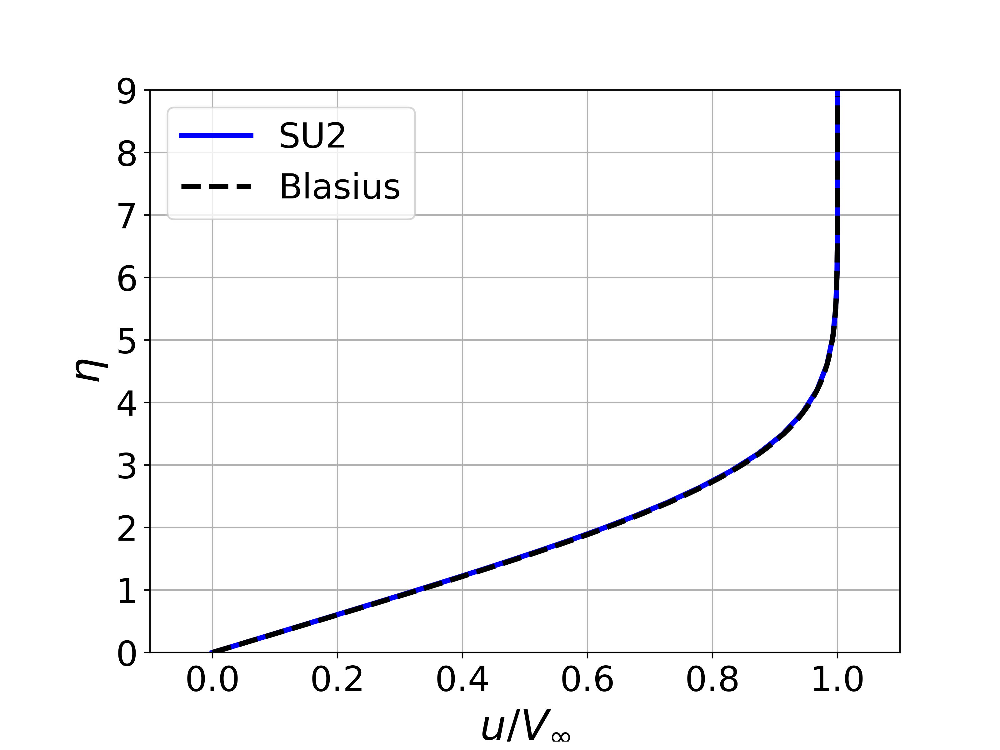
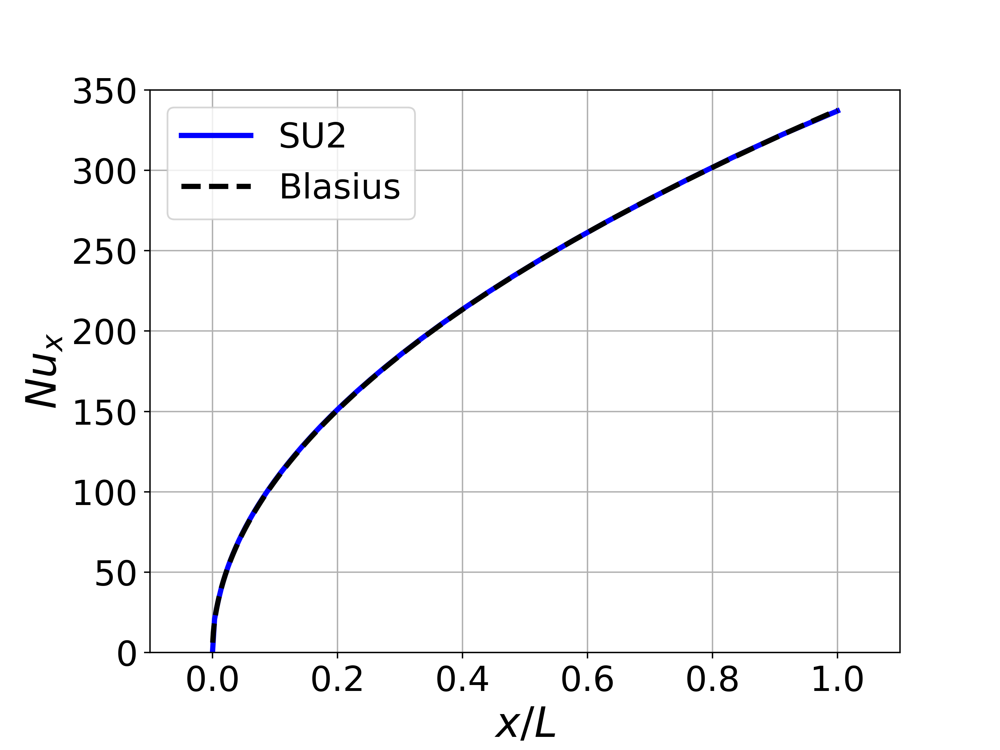

## Goals

Upon completing this tutorial, the user will be familiar with performing a simulation of external, laminar, incompressible flow over a flat plate. We repeat the [compressible laminar flate plate tutorial](/tutorials/Laminar_Flat_Plate/) with the addition of heat transfer on the plate. Consequently, the following capabilities of SU2 will be showcased in this tutorial:

- Steady, 2D, laminar, incompressible, Navier-Stokes equations 
- Multigrid
- Flux Difference Splitting (FDS) convective scheme in space (2nd-order, upwind)
- Euler implicit time integration
- Inlet, outlet, symmetry, and no-slip wall (constant temperature) boundary conditions

The intent of this tutorial is to introduce a simple viscous case for the incompressible solver along with solution of the energy equation for incompressible problems with constant density.

## Resources

The resources for this tutorial can be found in the [Inc_Laminar_Flat_Plate](https://github.com/su2code/su2code.github.io/tree/master/Inc_Laminar_Flat_Plate) directory in the [tutorial repository](https://github.com/su2code/su2code.github.io/tree/master/). You will need the configuration file ([lam_flatplate.cfg](../../Inc_Laminar_Flat_Plate/lam_flatplate.cfg)) and the mesh file ([mesh_flatplate_65x65.su2](../../Inc_Laminar_Flat_Plate/mesh_flatplate_65x65.su2)).


## Tutorial

The following tutorial will walk you through the steps required when solving for the flow over a flat plate using the incompressible solver in SU2. It is assumed you have already obtained and compiled the SU2_CFD code for a serial computation. If you have yet to complete these requirements, please see the [Download](/docs/Download/) and [Installation](/docs/Installation/) pages.

### Background

We will reuse the Blasius solution from the [compressible flat plate tutorial](/tutorials/Laminar_Flat_Plate/) as a verification of the incompressible solver. However, in addition to comparing the velocity profile and skin friction coefficient against the analytic solutions, we will also compare the local Nusselt number along the plate. Expressions for the skin friciton coefficient and local Nusslet number can be derived:


where Re_x is the Reynolds number along the plate and Pr_d is the dynamic Prandtl number. 

### Problem Setup

This problem will solve the for the incompressible flow over the flat plate with the following conditions that are set to match the Reynolds number of 1301233.166 for a plate length of 0.3048 m (1 ft) from the compressible tutorial:
- Density (constant) = 1.13235 kg/m^3
- Inlet Velocity Magnitude = 69.1687 m/s
- Inlet Flow Direction, unit vector (x,y,z) = (1.0, 0.0, 0.0) 
- Inlet Temperature = 297.62 K
- Outlet Pressure = 0.0 N/m^2
- Viscosity (constant) = 1.83463e-05 kg/(m-s)
- Prandtl Number (constant) = 0.72

### Mesh Description

The computational mesh for the flat plate is composed of quadrilaterals with 65 nodes in both the x- and y-directions. The flat plate is along the lower boundary of the domain (y = 0) starting at x = 0 m and is of length 0.3048 m (1 ft). In the figure of the mesh, this corresponds to the Navier-Stokes (no-slip) boundary condition highlighted in green. The domain extends a distance upstream of the flat plate, and a symmetry boundary condition is used to simulate a free-stream approaching the plate in this region (highlighted in purple). Axial stretching of the mesh is used to aid in resolving the region near the start of the plate where the no-slip boundary condition begins at x = 0 m, as shown in Figure (1).


Figure (1): Figure of the computational mesh with boundary conditions.

Uniform velocity inlet and uniform pressure outlet boundary conditions are used for the flow entrance plane (red) and the outflow regions along the upper region of the domain and the exit plane at x = 0.3048 m (blue). 

### Configuration File Options

Several of the key configuration file options for this simulation are highlighted here. In this case, the flat plate is fixed at a different temperature from that of the free-stream fluid, such that a thermal boundary layer appears. To accomplish this, we activate the energy equation while the fluid density is held constant (one-way coupling) with the following options:

```
% ---------------- INCOMPRESSIBLE FLOW CONDITION DEFINITION -------------------%
%
% Density model within the incompressible flow solver.
% Options are CONSTANT (default), BOUSSINESQ, or VARIABLE. If VARIABLE,
% an appropriate fluid model must be selected.
INC_DENSITY_MODEL= CONSTANT
%
% Solve the energy equation in the incompressible flow solver
INC_ENERGY_EQUATION = YES
```

The density model is `CONSTANT` by default for the incompressible solver, and it will be CONSTANT for any flows that do not also solve the energy equation. However, if the energy equations is activated by choosing `INC_ENERGY_EQUATION = YES`, then a Boussinesq approximation or a variable density incompressible flow governed by the ideal gas law can also be chosen with `INC_DENSITY_MODEL= BOUSSINESQ` and `INC_DENSITY_MODEL= VARIABLE`, respectively. These model choices will be described in later tutorials.

With the energy equation active, we choose an intial temperature value in the field with the following option:

```
% Initial temperature for incompressible flows that include the
% energy equation (288.15 K by default). Value is ignored if
% INC_ENERGY_EQUATION is false.
INC_TEMPERATURE_INIT= 297.62
```

We also now set the temperature as part of the input to the inlet boundary condition (although ''external'' this problem is driven by inlet and outlet BCs):

```
% Inlet boundary marker(s) (NONE = no marker) 
% Incompressible: (inlet marker, temperature, velocity magnitude, flow_direction_x,
%           flow_direction_y, flow_direction_z, ... ) where flow_direction is
%           a unit vector.
MARKER_INLET= ( inlet, 297.62, 69.1687, 1.0, 0.0, 0.0 )
```

Defining a no-slip boundary condition for viscous walls can be accomplished in the same manner as in the compressible solver with the `MARKER_HEATFLUX` and `MARKER_ISOTHERMAL` options. The constant temperature boundary condition of 197.62 K is set on the flat plate as follows:

```
% -------------------- BOUNDARY CONDITION DEFINITION --------------------------%
% Navier-Stokes (no-slip), isothermal wall marker(s) (NONE = no marker)
% Format: ( marker name, constant wall temperature (K), ... )
MARKER_ISOTHERMAL= ( wall, 197.62 )
```

Lastly, with the energy equation active, a value for the specific heat at constant pressure (Cp) should be specified. This is part of the definition of the fluid model. We can set a constant density fluid model (the default) and the Cp as follows:

```
% ---- IDEAL GAS, POLYTROPIC, VAN DER WAALS AND PENG ROBINSON CONSTANTS -------%
%
% Fluid model (STANDARD_AIR, IDEAL_GAS, VW_GAS, PR_GAS,
%              CONSTANT_DENSITY, INC_IDEAL_GAS)
FLUID_MODEL= CONSTANT_DENSITY
%
% Specific heat at constant pressure, Cp (1004.703 J/kg*K (air)).
% Incompressible fluids with energy eqn. only (CONSTANT_DENSITY, INC_IDEAL_GAS).
SPECIFIC_HEAT_CP= 1004.703
```

The first option will be set by default as `FLUID_MODEL= CONSTANT_DENSITY` when `INC_DENSITY_MODEL= CONSTANT` but is included here for completeness. The Cp is specified with `SPECIFIC_HEAT_CP` in SI units.

### Running SU2

The flat plate simulation for the 65x65 node mesh is small and will execute relatively quickly on a single workstation or laptop in serial. To run this test case, follow these steps at a terminal command line:
 1. Move to the directory containing the config file ([lam_flatplate.cfg](../../Inc_Laminar_Flat_Plate/lam_flatplate.cfg)) and the mesh file ([mesh_flatplate_65x65.su2](../../Inc_Laminar_Flat_Plate/mesh_flatplate_65x65.su2)). Make sure that the SU2 tools were compiled, installed, and that their install location was added to your path.
 2. Run the executable by entering 
 
    ```
    $ SU2_CFD lam_flatplate.cfg
    ```
 
    at the command line. 
 3. SU2 will print residual updates with each iteration of the flow solver, and the simulation will terminate after reaching the specified convergence criteria.
 4. Files containing the results will be written upon exiting SU2. The flow solution can be visualized in ParaView (.vtk) or Tecplot (.dat for ASCII).

### Results

Results are given here for the SU2 solution of incompressible laminar flow over the constant-temperature flat plate. The results show excellent agreement with the closed-form Blasius solution.


Figure (2):  Velocity data was extracted from the exit plane of the mesh (x = 0.3048 m) near the wall, and the boundary layer velocity profile was plotted compared to and using the similarity variables from the Blasius solution.


Figure (3): A plot of the skin friction coefficient along the plate created using the values written in the surface_flow.csv file and compared to Blasius.



Figure (4): A plot of the local Nusselt number along the plate created using the values written in the surface_flow.csv file and compared to Blasius.
