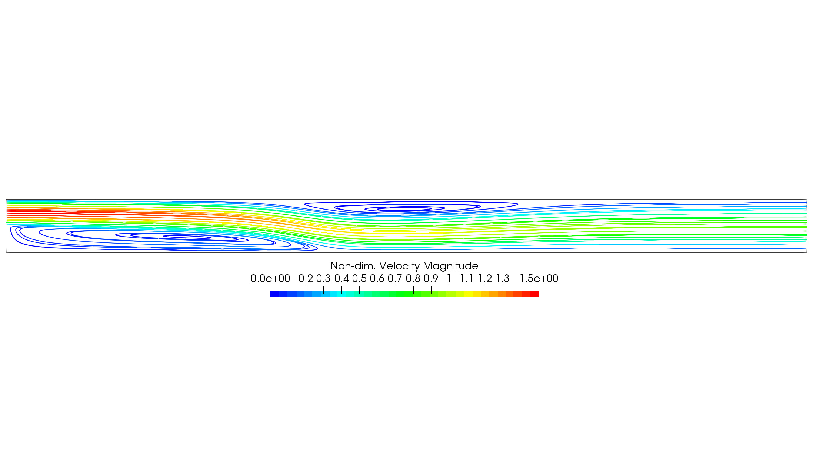
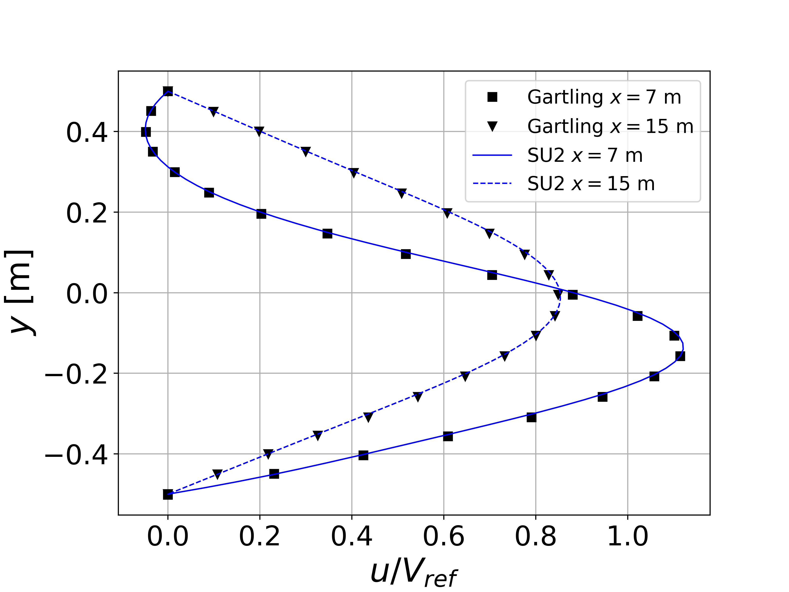

## Goals

Upon completing this tutorial, the user will be familiar with performing a simulation of internal, laminar, incompressible flow in a channel over a backward-facing step. Consequently, the following capabilities of SU2 will be showcased in this tutorial:
- Steady, 2D, laminar, incompressible, Navier-Stokes equations 
- Flux Difference Splitting (FDS) convective scheme in space (2nd-order, upwind)
- Euler implicit time integration
- Inlet, outlet, and no-slip wall boundary conditions

The intent of this tutorial is to introduce the capability for prescribing inlet condition data from a file instead of assuming uniform conditions. The new options needed for this feature will be explained. We will also compare velocity profile results against numerical results from literature.

## Resources

The resources for this tutorial can be found in the [Inc_Laminar_Step](https://github.com/su2code/su2code.github.io/tree/master/Inc_Laminar_Step) directory in the [tutorial repository](https://github.com/su2code/su2code.github.io/tree/master/). You will need the configuration file ([lam_backwardstep.cfg](../../Inc_Laminar_Step/lam_backwardstep.cfg)) and the mesh file ([mesh_backward_step_481x65.su2](../../Inc_Laminar_Step/mesh_backward_step_481x65.su2)).


## Tutorial

The following tutorial will walk you through the steps required when solving for the flow over a backward-facing step using the incompressible solver in SU2. It is assumed you have already obtained and compiled the SU2_CFD code for a serial computation. If you have yet to complete these requirements, please see the [Download](/docs/Download/) and [Installation](/docs/Installation/) pages.

### Background

The backward-facing step is another common test case for CFD codes. Although the geometry is very simple, the flow can feature interesting separation regions, which also makes it an ideal candidate for testing numerical boundary conditions as well. There are many studies in the literature for the backward-facing step. In this tutorial, we will focus on the laminar problem found in the following reference: D. K. Gartling, A test problem for outflow boundary conditions - flow over a backward-facing step. Int. J. Numer. Methods Fluids 11 953 (1990).


### Problem Setup

This problem will solve for the incompressible flow over the backward-facing step with the following conditions that are set to match the Reynolds numbers of 400 and 800 based on a channel height of 1 m:
- Density (constant) = 1.0 kg/m^3
- Outlet Pressure = 0.0 N/m^2
- Viscosity (constant) = 0.0025 kg/(m-s) for Re 400, 0.00125 kg/(m-s) for Re 800

The flow enters the domain from the inlet boundary on the upper half of the channel height in the positive x-direction with the following velocity profile: u(y) = 24.0 * y * (0.5 - y) for 0 <= y <= 0.5.

### Mesh Description

The computational mesh for the backward-facing step is composed of quadrilaterals with 485 nodes in the x-direction and 65 nodes in the y-direction. The spacing of the nodes is uniform in the x- and y-directions. The domain is 15 channel heights in width. We will impose that the upper and lower boundaries of the channel are no-slip walls.

The upper half of the left vertical boundary of the domain is the inlet, while the bottom half is a no-slip wall representing the step face. Rather than simulate the upstream portion of the channel leading up to the step, we will impose the developed velocity profile given above as an inlet condition. A typical pressure outlet condition is imposed at the downstream boundary of the domain.


### Configuration File Options

The necessary config options for imposing velocity profiles from file will be covered here. First, specify the inlet marker as we typically do for a uniform velocity inlet in incompressible flow. In order to override the uniform velocity inlet behavior, you should add two new options:

```
% Read inlet profile from a file (YES, NO) default: NO
SPECIFIED_INLET_PROFILE= YES
%
% Input file for a specified inlet profile (w/ extension)
INLET_FILENAME= inlet_step.dat
%
% Inlet boundary marker(s) with the following formats (NONE = no marker)
% Incompressible: (inlet marker, temperature, velocity magnitude, flow_direction_x,
%           flow_direction_y, flow_direction_z, ... ) where flow_direction is
%           a unit vector.
MARKER_INLET= ( inlet, 0.0, 1.0, 1.0, 0.0, 0.0 )
```

The first is a switch to activate the inlet profile mode with `SPECIFIED_INLET_PROFILE= YES` (`NO` by default). Once activated, SU2 will look for a file in the working directory with the name given in the option `INLET_FILENAME`. Here, we have given the custom name `inlet_step.dat`, but by default SU2 will look for a file named `inlet.dat`.

Now, we create the inlet profile file, which has a simple ASCII format. Open a new file named `inlet_step.dat` in the working directory and copy into place the following:
```
NMARK= 1
MARKER_TAG= inlet
NROW= 33
NCOL= 6
0.000000  0.000000  1.000000  0.000000  1.000000  0.000000
0.000000  0.015625  1.000000  0.181641  1.000000  0.000000
0.000000  0.031250  1.000000  0.351562  1.000000  0.000000
0.000000  0.046875  1.000000  0.509766  1.000000  0.000000
0.000000  0.062500  1.000000  0.656250  1.000000  0.000000
0.000000  0.078125  1.000000  0.791016  1.000000  0.000000
0.000000  0.093750  1.000000  0.914062  1.000000  0.000000
0.000000  0.109375  1.000000  1.025391  1.000000  0.000000
0.000000  0.125000  1.000000  1.125000  1.000000  0.000000
0.000000  0.140625  1.000000  1.212891  1.000000  0.000000
0.000000  0.156250  1.000000  1.289062  1.000000  0.000000
0.000000  0.171875  1.000000  1.353516  1.000000  0.000000
0.000000  0.187500  1.000000  1.406250  1.000000  0.000000
0.000000  0.203125  1.000000  1.447266  1.000000  0.000000
0.000000  0.218750  1.000000  1.476562  1.000000  0.000000
0.000000  0.234375  1.000000  1.494141  1.000000  0.000000
0.000000  0.250000  1.000000  1.500000  1.000000  0.000000
0.000000  0.265625  1.000000  1.494141  1.000000  0.000000
0.000000  0.281250  1.000000  1.476562  1.000000  0.000000
0.000000  0.296875  1.000000  1.447266  1.000000  0.000000
0.000000  0.312500  1.000000  1.406250  1.000000  0.000000
0.000000  0.328125  1.000000  1.353516  1.000000  0.000000
0.000000  0.343750  1.000000  1.289062  1.000000  0.000000
0.000000  0.359375  1.000000  1.212891  1.000000  0.000000
0.000000  0.375000  1.000000  1.125000  1.000000  0.000000
0.000000  0.390625  1.000000  1.025391  1.000000  0.000000
0.000000  0.406250  1.000000  0.914062  1.000000  0.000000
0.000000  0.421875  1.000000  0.791016  1.000000  0.000000
0.000000  0.437500  1.000000  0.656250  1.000000  0.000000
0.000000  0.453125  1.000000  0.509766  1.000000  0.000000
0.000000  0.468750  1.000000  0.351562  1.000000  0.000000
0.000000  0.484375  1.000000  0.181641  1.000000  0.000000
0.000000  0.500000  1.000000  0.000000  1.000000  0.000000
```

`NMARK` defines how many inlet markers will be described in the file (multiple markers are possible). For each marker, we start the specification with giving the marker string name, which should match the value in the grid and config file, with `MARKER_TAG`. Then the number of rows and columns to be prescribed should be defined with `NROW` and `NCOL`. Currently, only a 1-to-1 point matching of the values in the profile with the vertices on the marker is possible (interpolation will be added in the future), meaning that `NROW` should be equal to the number of nodes on the boundary marker. Each row in the set defines the inlet data for one vertex on the boundary. Note that the ordering of the rows does not matter, as the points are matched based on the postion coordinates given.

`NCOL` will be problem dependent. Here, since we have a 2D problem, the columns represent the following variables: x, y, temperature, velocity magnitude, x-component of flow direction unit vector, y-component of flow direction unit vector. In 3D, one would have x, y, z, temperature, velocity magnitude, x-component of flow direction unit vector, y-component of flow direction unit vector, z-component of flow direction unit vector. Note that inlet profiles are also available for use with the compressible solver, and the values for temperature and velocity magnitude here will be replaced by either the total temperature and total pressure or the density and velocity magnitude, depending on your compressible inlet type. For turbulent calculations, the turbulence variables can also be specified by including additional columns (1 for S-A, 2 for k and omega in SST, for example).

Lastly, to ease the process of generating the correct inlet profile format, SU2 can generate a template for you automatically. First, prepare the `MARKER_INLET` as if specifying uniform inlet conditions. Set `SPECIFIED_INLET_PROFILE= YES` and execute `SU2_CFD`. If SU2 does not find an inlet profile file in the working directory, it will generate one for you in the proper format for the case at hand and fill it with the uniform inlet data. This file can then be used as a template to swap in your own inlet profile data.

### Running SU2

The backward-facing step simulation will execute relatively quickly on a single workstation or laptop in serial. To run this test case, follow these steps at a terminal command line:
 1. Move to the directory containing the config file ([lam_backwardstep.cfg](../../Inc_Laminar_Step/lam_backwardstep.cfg)) and the mesh file ([mesh_backward_step_481x65.su2](../../Inc_Laminar_Step/mesh_backward_step_481x65.su2)). Make sure that the SU2 tools were compiled, installed, and that their install location was added to your path.
 2. Run the executable by entering 
 
    ```
    $ SU2_CFD lam_backwardstep.cfg
    ```
 
    at the command line. 
 3. SU2 will print residual updates with each iteration of the flow solver, and the simulation will terminate after reaching the specified convergence criteria.
 4. Files containing the results will be written upon exiting SU2. The flow solution can be visualized in ParaView (.vtk) or Tecplot (.dat for ASCII).

### Results

Results are given here for the SU2 solution of incompressible laminar flow over the backward-facing step. The velocity profiles show excellent agreement with the results from Gartling.


Figure (2): Streamlines for the Re = 800 backward-facing step case colored by non-dim. velocity magnitude.



Figure (3): Comparison of SU2 non-dim. x-velocity profiles at x = 7 m and x = 15 m with those of Gartling.
