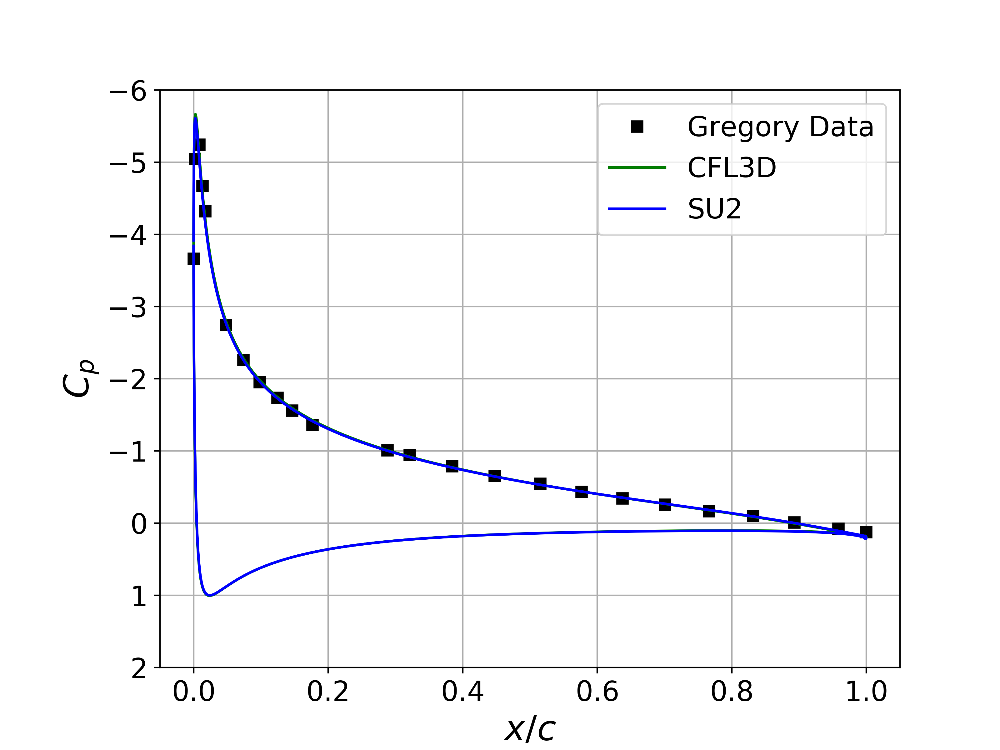
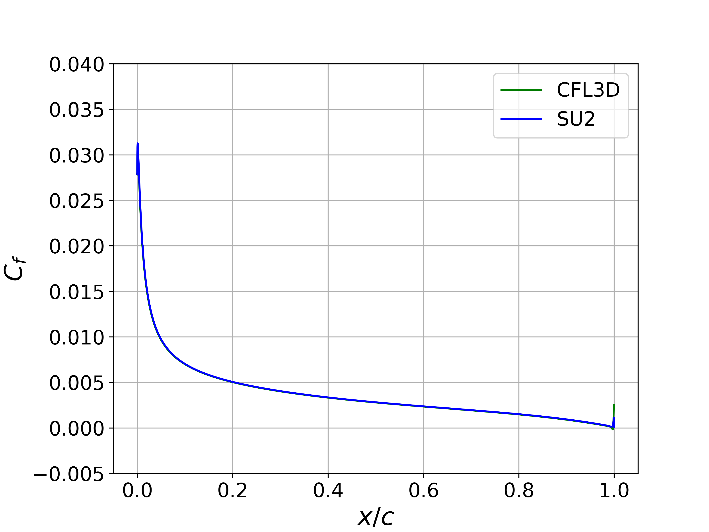

## Goals

Upon completing this tutorial, the user will be familiar with performing a simulation of external, viscous, incompressible flow around a 2D airfoil using a turbulence model. The specific geometry chosen for the tutorial is the classic NACA 0012 airfoil. Consequently, the following capabilities of SU2 will be showcased in this tutorial:
- Steady, 2D, incompressible RANS equations 
- Spalart-Allmaras turbulence model
- Flux Difference Splitting convective scheme in space (2nd-order, upwind)
- Euler implicit time integration
- Far-field and no-slip wall boundary conditions

This tutorial also provides an explanation of the non-dimensional scheme used for the incompressible solver in SU2. We will compare the results against other codes and experimental data for this case.


## Resources

The resources for this tutorial can be found in the [Inc_Turbulent_NACA0012](https://github.com/su2code/Tutorials/tree/master/incompressible_flow/Inc_Turbulent_NACA0012) directory in the [tutorial repository](https://github.com/su2code/Tutorials). You will need the configuration file ([turb_naca0012.cfg](https://github.com/su2code/Tutorials/tree/master/incompressible_flow/Inc_Turbulent_NACA0012/turb_naca0012.cfg)) and the mesh file ([n0012_897-257.su2](https://github.com/su2code/Tutorials/tree/master/incompressible_flow/Inc_Turbulent_NACA0012/n0012_897-257.su2)).

 The 897x257 mesh is obtained from the Langley Research Center Turbulence Modeling Resource (TMR) website, Additionally, skin friction and pressure distribution data for the CFL3D code, along with experimental pressure data of Gregory (N. Gregory and C. L. O’Reilly. Low-speed aerodynamic characteristics of naca 0012 aerofoil sections, including the effects
of upper-surface roughness simulation hoar frost. NASA R & M 3726, 1970.), from the TMR are used for later comparison with SU2 results. These files can be found on the following website: https://turbmodels.larc.nasa.gov/naca0012_val.html.

## Tutorial

The following tutorial will walk you through the steps required when solving for the turbulent flow over the NACA 0012 using the incompresible solver in SU2. It is assumed you have already obtained and compiled the SU2_CFD code for a serial computation or both the SU2_CFD and SU2_SOL codes for a parallel computation. If you have yet to complete these requirements, please see the [Download](/docs_v7/Download/) and [Installation](/docs_v7/Installation/) pages.

### Background

This test case is for the NACA 0012 in high Reynolds number flow. It has become a classic test case for RANS solvers due to the simple geometry and large amount of available numerical and experimental data for this case.

### Problem Setup

This problem will solve the flow past the NACA 0012 with these conditions to match a Reynolds number of 6e6 based on a chord of 1 m:
- Density (constant) = 2.13163 kg/m^3
- Far-field velocity vector (x,y,z) = ( 52.157, 0.0, 0.0 ) m/s for AoA = 0 deg, ( 51.365, 9.057, 0.0 ) m/s for AoA = 10 deg
- Viscosity (constant) = 1.853e-5 kg/(m-s)

Note that we will run this case at both a 0 deg angle of attack as well as a 10 degree angle of attack.

### Mesh Description

A series of C-grids are available from the NASA TMR, and for the results presented below, the quadrilateral grid with 897 nodes in the airfoil-normal and 257 in the airfoil-tangent directions is used. The far-field boundary is approximately 500 chord lengths away from the airfoil surface, and the mesh spacing near the airfoil is sufficient to ensure y+ < 1 over the airfoil surface. An adiabatic, no-slip condition is applied to the airfoil surface. See the [NACA 0012 TMR page](https://turbmodels.larc.nasa.gov/naca0012_val.html) for more details on the availabls grids.


### Configuration File Options

For this tutorial, we will focus on the non-dimensional scheme used by the incompressible solver, which is slightly different from the compressible version. The non-dimensionalization scheme requires the input of 3 references values for density, velocity, and temperature (only needed if the energy equations is solved), i.e., rho_ref, v_ref, T_ref. The reference value for pressure is derived from these quantities as p_ref = rho_ref * v_ref * v_ref. Given these reference values, a consistent non-dimensionalization is performed for all variables. Furthermore, the scheme is constructed so that a dimensional calculation can be performed by setting all reference values to 1.0.

This method for setting similar flow conditions assumes that all inputs are in SI units, including the mesh geometry, which should be in *meters*. As described in the inviscid wedge tutorial, you can easily scale your mesh file to the appropriate size with the SU2_DEF module.

The user has three different choices for selecting the required reference values: initialization values (default), user-prescribed reference values, or dimensional. The options controlling the reference values are as follows:

```
% Non-dimensionalization scheme for incompressible flows. Options are
% INITIAL_VALUES (default), REFERENCE_VALUES, or DIMENSIONAL.
% INC_*_REF values are ignored unless REFERENCE_VALUES is chosen.
INC_NONDIM= INITIAL_VALUES
%
% Reference density for incompressible flows (1.0 kg/m^3 by default)
INC_DENSITY_REF= 1.0
%
% Reference velocity for incompressible flows (1.0 m/s by default)
INC_VELOCITY_REF= 1.0
%
% Reference temperature for incompressible flows that include the
% energy equation (1.0 K by default)
INC_TEMPERATURE_REF = 1.0
```

The `INC_NONDIM` option controls your non-dim. scheme for incompressible flow problems. The default behavior is `INC_NONDIM= INITIAL_VALUES`, which automatically sets rho_ref = `INC_DENSITY_INIT`, v_ref = `INC_VELOCITY_INIT` (magnitude), and T_ref = `INC_VELOCITY_INIT`. No options are required for this mode. Alternatively, the user can specify custom reference values in order to separate the initialization and non-dim. values. To do so, set `INC_NONDIM= REFERENCE_VALUES` and prescribe values for `INC_DENSITY_REF`, `INC_VELOCITY_REF`, and `INC_TEMPERATURE_REF`. If you wish to perform a dimensional simulation you can pick the `INC_NONDIM= DIMENSIONAL` option, which is equivalent to choosing  `INC_NONDIM= REFERENCE_VALUES` and setting the reference values to 1.0.

Don't forget that SU2 will print all input dimensional values, the selected reference values, and the resulting non-dim. values to the console before the start of a calculation. This information is useful for verifying that the desired non-dim. has been set and also for re-dimensionalizion of outputs after the calculation.

### Running SU2

Instructions for running this test case are given here for both serial and parallel computations.

#### In Serial

To run this test case in serial, follow these steps at a terminal command line:
1. Copy the config file ([turb_naca0012.cfg](https://github.com/su2code/Tutorials/tree/master/incompressible_flow/Inc_Turbulent_NACA0012/turb_naca0012.cfg)) and the mesh file ([n0012_897-257.su2](https://github.com/su2code/Tutorials/tree/master/incompressible_flow/Inc_Turbulent_NACA0012/n0012_897-257.su2)) so that they are in the same directory. Move to the directory containing the config file and the mesh file. Make sure that the SU2 tools were compiled, installed, and that their install location was added to your path.
 1. Run the executable by entering in the command line:
      
    ```
    $ SU2_CFD turb_naca0012.cfg
    ```

 2. SU2 will print residual updates with each iteration of the flow solver, and the simulation will terminate after reaching the specified convergence criteria.
 3. Files containing the results will be written upon exiting SU2. The flow solution can be visualized in ParaView (.vtk) or Tecplot (.dat for ASCII).

#### In Parallel

If SU2 has been built with parallel support, the recommended method for running a parallel simulation is through the use of the parallel_computation.py Python script. This automatically handles the domain decomposition and execution with SU2_CFD, and the merging of the decomposed files using SU2_SOL. Follow these steps to run the case in parallel:
 1. Move to the directory containing the config file ([turb_naca0012.cfg](https://github.com/su2code/Tutorials/tree/master/incompressible_flow/Inc_Turbulent_NACA0012/turb_naca0012.cfg)) and the mesh file ([n0012_897-257.su2](https://github.com/su2code/Tutorials/tree/master/incompressible_flow/Inc_Turbulent_NACA0012/n0012_897-257.su2)). Make sure that the SU2 tools were compiled with parallel support, installed, and that their install location was added to your path.
 2. Run the python script which will automatically call SU2_CFD and will perform the simulation using `NP` number of processors by entering in the command line:

    ```
    $ parallel_computation.py -f turb_naca0012.cfg -n NP
    ```

 3. SU2 will print residual updates with each iteration of the flow solver, and the simulation will terminate after reaching the specified convergence criteria.
 4. The python script will automatically call the SU2_SOL executable for generating visualization files from the native restart file written during runtime. The flow solution can then be visualized in ParaView (.vtk) or Tecplot (.dat for ASCII).

### Results

Results for the turbulent flow over the NACA 0012 are shown below. The computed SU2 solutions are in good agreement with the published data from Gregory. In addition, the computed values for Cp and Cf for both angle conditions are nearly indistinguishable from the CFL3D results.
     

Figure (1): Cp comparison for the NACA 0012 at 0 deg angle of attack.


Figure (2): Upper surface Cf comparison for the NACA 0012 at 0 deg angle of attack.


Figure (3): Cp comparison for the NACA 0012 at 10 deg angle of attack.


Figure (4): Upper Surface Cf comparison for the NACA 0012 at 10 deg angle of attack.

