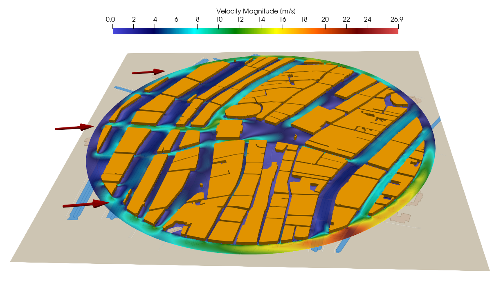
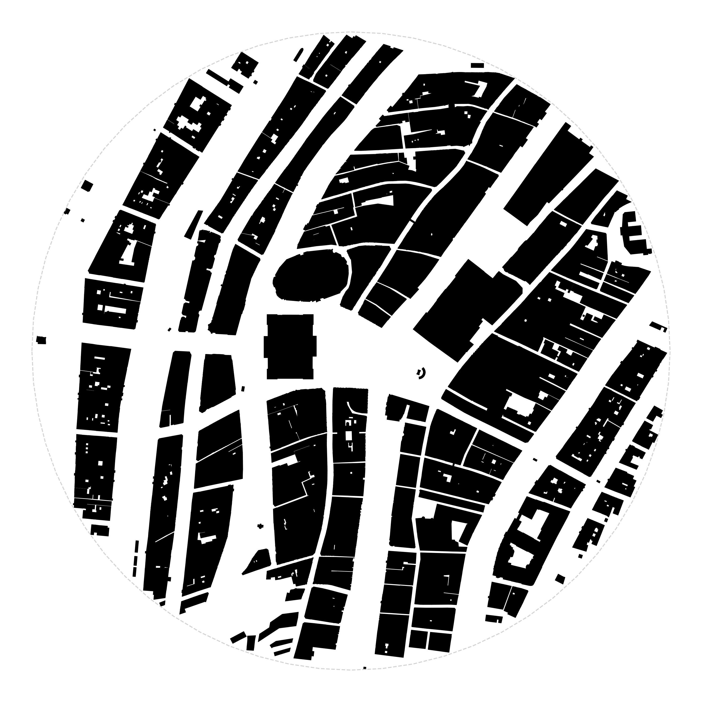
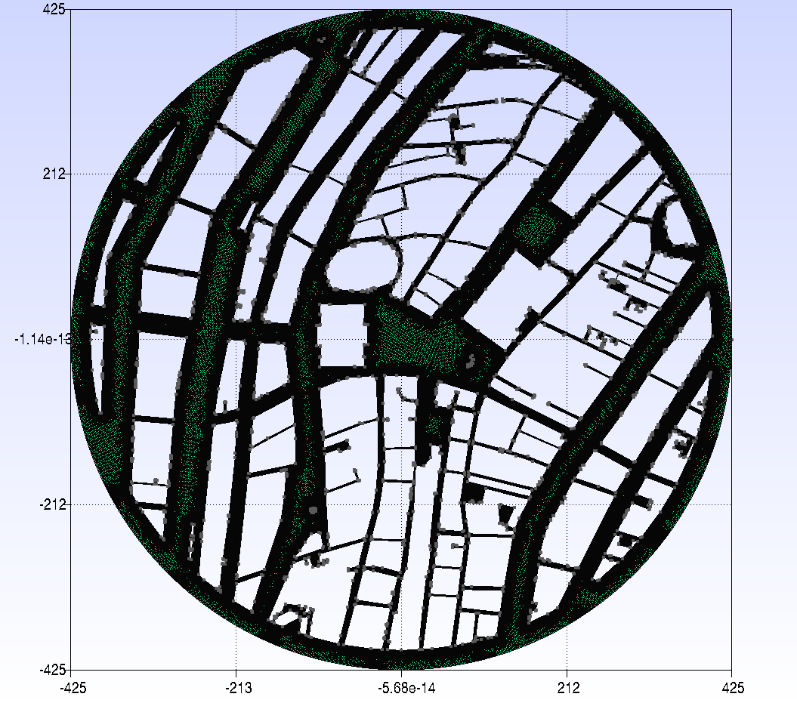
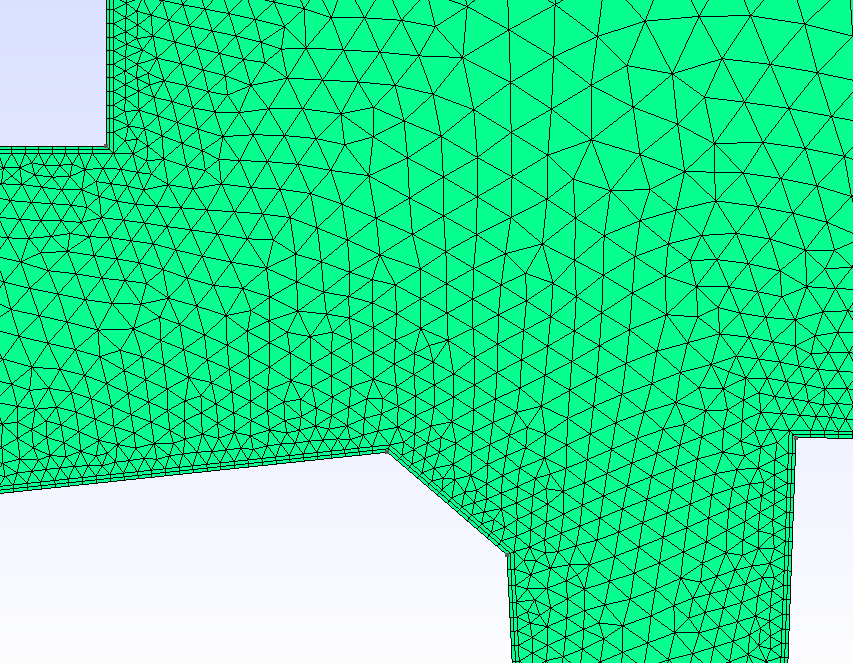
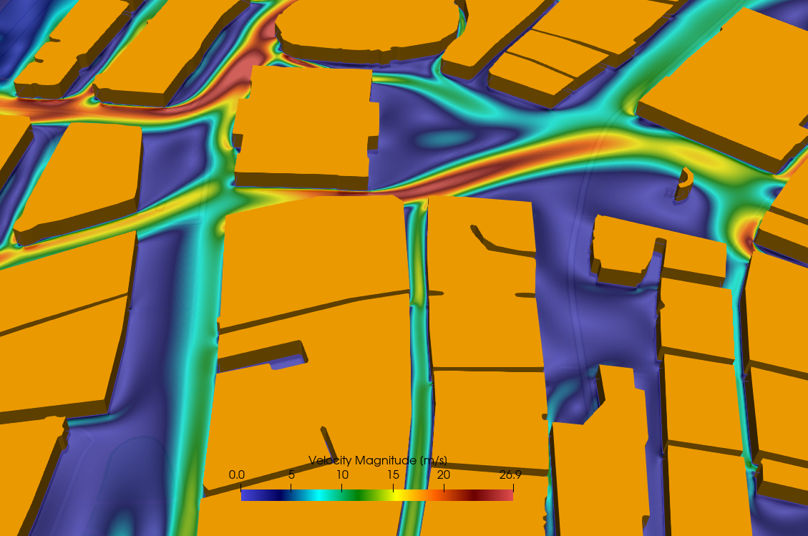

Figure (1): Flow through the streets of the city center of amsterdam.

## Goals

In this tutorial we will look at the modeling of wind speed and pollutant dispersion in a realistic depiction of a city - in this case the city center of Amsterdam. We will show the following aspects:
- outline of creating a mesh of a city using GIS data
- obtaining weather data of a specific date
- simulate wind velocity to map pedestrian comfort.
- simulate dispersion of a smoke cloud from a point source (burning car for instance) through streets to assess evacuation zone


## Resources

The resources for this tutorial can be found in the [incompressible_flow/Inc_Urban_City](https://github.com/su2code/Tutorials/tree/master/incompressible_flow/Inc_Urban_City) directory in the [tutorial repository](https://github.com/su2code/Tutorials). 


### Background

CFD simulations around buildings in a city have many applications. One application is to investigate pedestrian comfort due to strong winds that can occur around large buildings. Another application is the risk assessment in case of an accident where harmful polutants are released, for instance the smoke of a car fire. Both of these cases can be simulated with SU2 very easily. The challenge is in obtaining a mesh of the region of interest. 

Information about buildings, specifically their surface shape and often even their height and 3D shape, is available in many countries like the Netherlands. This data is stored in GIS-databases (Geographic Information System). Google maps and google earth are examples of well-known GIS databases. We will use 2D building information and create a 2D mesh from it.
With a simple python script it is possible to retrieve information of buildings given a city name, or longitude-latitude coordinates. 
These building contours then need to be converted into a set of closed contours that can be given to a mesher like gmsh to create a 2D mesh for the SU2 CFD solver.


### Pedestrian comfort: flow through the streets of Amsterdam

What was the least comfortable street to walk on in the city center of Amsterdam, on new years day 2026 at noon?

First, we need the average wind velocity at that time. A simple python script can get that information from open-meteo, given the latitude and longitude, using the python requests library:

```python
import requests
city center of amsterdam
[lat,lon]=[52.373080,4.892453]
# Open-Meteo API endpoint (free, no API key needed)
url = "https://api.open-meteo.com/v1/forecast"
date="2026-01-01"
#time=12:00
params = {
            'latitude': lat,
            'longitude': lon,
            'start_date': date,
            'end_date': date,
            'daily': 'temperature_2m_mean,pressure_msl_mean,wind_speed_10m_max,wind_speed_10m_mean,wind_direction_10m_dominant,relative_humidity_2m_mean',
            'timezone': 'auto'
        }
response = requests.get(url, params=params)
data = response.json()
print(data)
```

We can also get the building information as polygons. For this information, we can use the overpass API (). We can grab all buildings within a certain radius from our given latitude and longitude. The core of the program is:
```python
overpass_url = "https://overpass-api.de/api/interpreter"
  overpass_query = f"""
        [out:json][timeout:60];
        (
          way["building"](around:{radius_meters},{latitude},{longitude});
          relation["building"](around:{radius_meters},{latitude},{longitude});
          way["building:part"](around:{radius_meters},{latitude},{longitude});
          relation["building:part"](around:{radius_meters},{latitude},{longitude});
        );
        out geom;
        """
```
This information can then be saved as polygon data to a file. The information that we retrieved is visualized in Figure 2:



Figure 2: Visualization of the building information that was retrieved. The polygon data was saved as a pickle file for further processing.

We found 1615 buildings in this region.
With this polygon information, we can build a 2D CFD mesh, but the first step towards that goal is to merge all the connecting and overlapping buildings. For buildings that are not touching but are separated by a very small distance, we use the dilate-erode method. First, let buildings that are very close grow in size, then compute the new contours of the merged shapes, then erode the shapes again to go back to their original size. We also remove any contours with small surface areas. We are then left with only 125 buildings, a  huge reduction!

We can further smooth the shapes by using dilation-erosion, and also by using the Douglas-Peucker method to simplify polygons and reduce node and edge count. After this procedure we went from 10730 vertices to 2374 . We also remove all buildings with an are smaller than 25 square meters. We are now left with 115 buildings and 2209 edges.


### Mesh Description

The final step in creating this setup is to give all polygons to gmsh and create the mesh. We use a triangulated mesh with a quadrilateral inflation layer around the buildings. The final mesh is 786k cells.

<div align="center">
<a href="gmsh_mesh">
  
</a>
<a href="gmsh_mesh_zoom">
  
</a>
</div>
Figure 3: Gmsh mesh and zoom of the mesh around the royal palace showing the inflation layers. 

Note that the mesh is very coarse close to the wall and needs to be refined for more accurate results. For resolved boundary layers the dimensionless wall cell size needs to be $y^{+} < 1$. 
We have also made some simplifications in the geometry and physics. Note that cutting to a circular shape means that at the edges the results are inaccurate because we are missing the effect of buildings outside of the circular area. Also note that assuming a 2D planar scenario is not accurate. We do not take into account the different heights of the buildings and we also do not take into account that the wind blows over the entire city and has a downward component as well. So although this simulation will not accurately represent the wind velocity through the streets in a quantitative way, at least qualitatively they give an impression of the accelerating wind speeds through the streets of the city center.
 

### Configuration File Options

The setup itself is a standard setup. The main input is the velocity:
```
% wind speed on 01-01-2026 at 12:00 in Amsterdam (262 degrees 6.81 m/s)
INC_VELOCITY_INIT = (6.74, 0.95, 0.0 )
```

And we need to define the boundaries. We only have a far-field and the walls of the building:
```
MARKER_FAR= farfield
MARKER_HEATFLUX= wall_buildings
```


### Running SU2

If possible, always use a parallel setup to reduce computational time (wall clock time). Run the SU2_CFD executable in parallel using MPI and 4 nodes by entering: 

    $ mpirun -n 4 SU2_CFD amsterdam.cfg


### Results



Figure (4): Zoom of the flow through the streets of the city center of amsterdam.

The zoom of the wind velocity in Figure 4 shows the wind around the royal palace on the 'dam' with the national monument for war victims on the right. It is clear that walking through the 'paleisstraat' into the main square would have been very uncomfortable.


### Fire!

What if there was a fire on the main square? How would the smoke be transported by the wind through the streets of Amsterdam? This can be simulated very easily by adding a species source term using the python wrapper. We will use a simple circular constant source of smoke and add it to the species transport equation. 
```python
# ################################################################## #
# Source term for smoke/fire                                         #
# ################################################################## #
def smoke(SU2Driver, iPoint, nDim):
  
    allCoords = SU2Driver.Coordinates()
    coord = allCoords.Get(iPoint)
    x = coord[0]
    y = coord[1]
    R = np.sqrt(x*x + y*y)
    # source size: R = 5 m, source term located at center (0,0)
    if (R < 5.0):
      # source is kg.m^-3.s^-1
      Sc = 0.1 
    else:
      Sc = 0.0
    return Sc

```

This source term was added to a standard python wrapper script, the configuration file was left unchanged, except for the addition of the keyword 
```bash
PYTHON_CUSTOM_SOURCE= YES
```
to activate the custom source term.


Figure (5): Zoom of the 'Dam' square in front of the royal palace. 

Figure 5 clearly shows that the smoke blows into the 'Damrak' street. 


