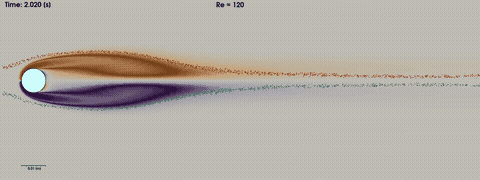
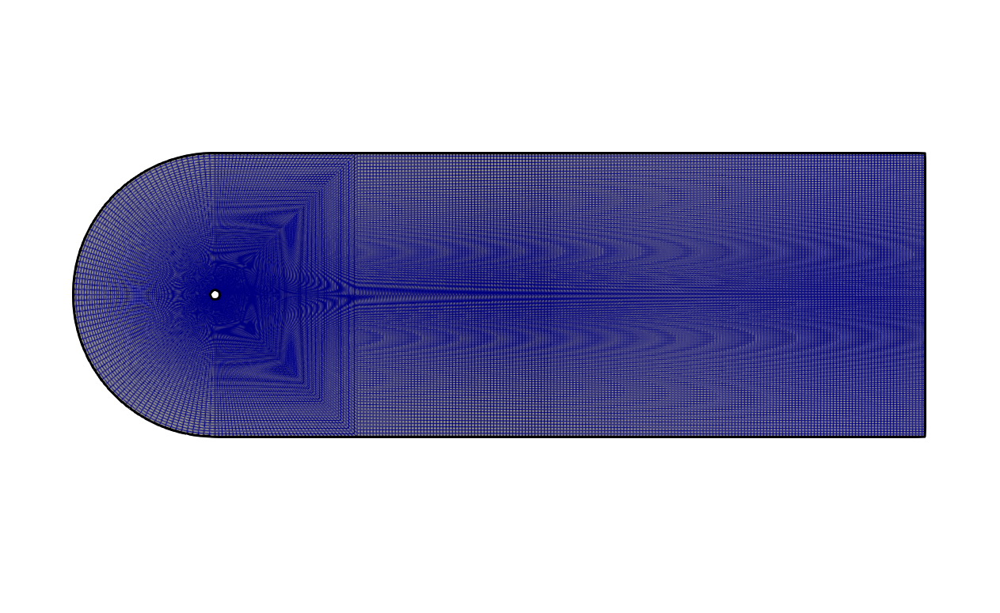
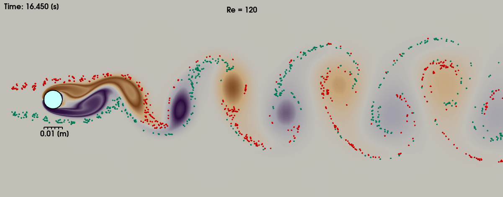
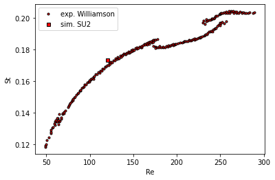
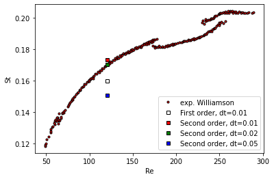
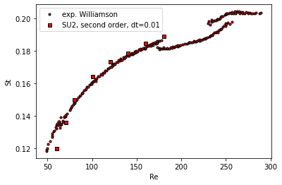

Figure (1): impression of the von Karman vortex shedding. A high quality mp4 video can be found [here](../../../tutorials_files/incompressible_flow/Inc_Von_Karman/images/unsteady_cylinder.mp4)

## Goals

In this tutorial we will simulate the laminar but unsteady vortex shedding behind a 2D circular cylinder, also known as von Karman vortex shedding. The unsteady pattern behind the cylinder is known as a von Karman sheet. In this tutorial we will touch upon the following aspects:
- Setting up an unsteady simulation in SU2
- Choosing appropriate settings for the unsteady simulation
- Inspecting the effects of our choices for the numerical setup
- Creating movies with paraview
- Extracting the shedding frequency with paraview
- visualize the forces on the cylinder with paraview


## Resources

The resources for this tutorial can be found in the [incompressible_flow/Inc_Von_Karman](https://github.com/su2code/Tutorials/tree/master/incompressible_flow/Inc_Von_Karman_Cylinder) directory in the [tutorial repository](https://github.com/su2code/Tutorials). You will need the configuration file ([unsteady_incomp_cylinder.cfg](https://github.com/su2code/Tutorials/tree/master/incompressible_flow/Inc_Von_Karman_Cylinder/unsteady_incomp_cylinder.cfg)) and the mesh file ([cylinder_wake.su2](https://github.com/su2code/Tutorials/tree/master/incompressible_flow/Inc_Von_Karman_cylinder/cylinder_wake.su2)). Additionally, the Gmsh geometry is also provided so you can recreate the mesh yourself: [cylinder_wake.geo](https://github.com/su2code/Tutorials/tree/master/incompressible_flow/Inc_Von_Karman_Cylinder/cylinder_wake.geo).


### Background

When the Reynolds number $$Re=\rho \cdot V \cdot D / \mu$$ is low (Re < 40), the flow around a circular cylinder is laminar and steady. At around Re=49, the flow becomes unsteady and a periodic shedding of vortices forms in the wake of the cylinder, known as vortex shedding. The frequency of this vortex shedding is usually expressed in terms of the Strouhal number $$St= f \cdot D / U_{\infty}$$, with f the shedding frequency, D the diameter of the cylinder and U the far-field velocity. Important experimental work can be found in the paper of Williamson, *Vortex Dynamics in the Cylinder Wake*, Annual Review of Fluid Mechanics (1996) [doi](https://doi.org/10.1146/annurev.fl.28.010196.002401). After around Re=180, a second frequency is observed experimentally, in the longitudinal direction. This frequency can only be observed in a 3D simulation. The increase in number of frequencies continues until after around Re=1000 the flow is considered fully turbulent.

### Problem Setup

The configuration is a circular cylinder of diameter $$D=0.01 m$$ surrounded by a far field at $$L = 30 D$$ and a rectangular wake region of $$X = 150 D$$. The far-field velocity is $$U_{\infty} = 0.12 m/s$$. With a viscosity of $$\mu=1.0 \cdot 10^{-5}$$ and a density of $$\rho = 1 kg/m3$$, the Reynolds number is $$Re = 120$$.


Figure 2: Computational domain for the von Karman vortex shedding.

The solution is initialized with uniform flow conditions. After an initial phase of around 4 seconds, the flow becomes periodic with a specific frequency depending on the Reynolds number. 


### Mesh Description

The mesh consists of a structured mesh with 70k cells and 75k points. The mesh was created using Gmsh and the configuration file to create the mesh can be found here: [cylinder_wake.geo](https://github.com/su2code/Tutorials/tree/master/incompressible_flow/Inc_Von_Karman/cylinder_wake.geo). The only thing you need to do to create a mesh from the geometry is start Gmsh, and then load the .geo file. You will then see the geometry in the Gmsh visualization window. If you click on *Mesh->2D* the 2D mesh will be generated. You can then export the mesh as a .su2 file by choosing *File->Export*. The mesh will automatically be saved in su2 format when the filename has the extension .su2. In general, you should not choose *save all elements* because this will also save additional points that were used to construct the geometry but are not part of the final mesh, like for example the center of a circle. 


### Configuration File Options

Several of the key configuration file options for this simulation are highlighted here. First, we activate the turbulence model:

```
SOLVER= INC_NAVIER_STOKES
INC_NONDIM= DIMENSIONAL
KIND_TURB_MODEL= NONE
```

We use the incompressible NAVIER-STOKES without turbulence model, since the flow is unsteady but laminar.

```
TIME_DOMAIN = YES
TIME_MARCHING= DUAL_TIME_STEPPING-2ND_ORDER
TIME_STEP= 0.005
MAX_TIME=25.00
TIME_ITER=2500
INNER_ITER= 20
```

The **TIME_DOMAIN** keyword activates transient simulations. We use a second order timestep, with a step size of $$\Delta t = 0.01 s$$. The maximum time is set to $$t_{max} = 25 s$$ or 2500 iterations, whichever is reached first. We use 20 inner iterations per timestep, which sufficiently converges the residuals. This is important to check, insufficient convergence per time step quickly leads to large errors.

```
INC_VELOCITY_INIT= ( 0.12, 0.0, 0.0 )
MARKER_HEATFLUX= ( cylinder, 0.0 )
MARKER_FAR= ( farfield_in,farfield_side,farfield_out )
MARKER_MONITORING= ( cylinder )
```

There is no heat transfer, so we set zero heatflux boundary conditions on the walls and we impose a far-field velocity of 0.12 m/s. The **MARKER_MONITORING** keyword is used to monitor forces at the cylinder surface. We are interested in the lift and drag coefficient.

```
% monitoring points in the cylinder wake
CUSTOM_OUTPUTS= 'velocity : Macro{sqrt(pow(VELOCITY_X, 2) + pow(VELOCITY_Y, 2) )};\
                 probe1 : Probe{$velocity}[0.15, 0.0]'
HISTORY_OUTPUT= (TIME_ITER, CUR_TIME, RMS_RES, LIST, DRAG, LIFT, SURFACE_STATIC_PRESSURE, CUSTOM)
```

We define a monitoring point called *probe1* at location $$(x,y)=(0.15, 0.0)$$ downstream of the cylinder and at the centerline. In this probe, we monitor the velocity magnitude $velocity$, that we compute from the existing velocity components. We write the probe information to the history output using the keyword **CUSTOM**.


### Running SU2

If possible, always use a parallel setup to reduce computational time (wall clock time). Run the SU2_CFD executable in parallel using MPI and 4 nodes by entering: 

    $ mpirun -n 4 SU2_CFD unsteady_incomp_cylinder.cfg


### Results


Figure (3): Developed von Karman street with injected particles.

The figure above shows the von Karman vortices. A movie of the von Karman Vortex shedding as shown in this tutorial can be made using the paraview statefile here: [statefile_with_particles.pvsm](https://github.com/su2code/Tutorials/tree/master/incompressible_flow/Inc_Von_Karman_Cylinder/statefile_with_particles.pvsm). The colored vorticity gradients are created in the wake immediately behind the cylinder, and transported downstream. In paraview, we inject particles and let them be transported downstream over streamlines. We can clearly see that the particles are not mixed homogeneously but are being transported in batches of red and green particles moving with their corresponding vortices.


A link to a high quality video can be found [here](https://github.com/su2code/su2code.github.io/tree/master/tutorials_files/incompressible_flow/Inc_Von_Karman/images/unsteady_cylinder_arrow.mp4).

The forces on the cylinder can also be visualized, see the above movie. We see the unsteady velocity magnitude, and on the cylinder surface we visualize the local force as the local pressure normal to the surface. For this we need to extract the surface data only and then compute the surface normal using a programmable filter. We can then visualize the glyph distribution. The total lift force is the integrated vertical component, whose size can be visualize as a colored arrow of a size proportional to the lift force using another programmable filter. Below the image we visualize the lift force in time using the PlotSelectionOverTime feature.  



Figure (4): Strouhal number, comparison with experimental data from Williamson (2006).

The Strouhal number can be computed from the lift coefficient that was stored in the history.csv file. A simple python file gives us the frequency from the FFT:

```python
#%matplotlib inline
#import matplotlib.pyplot as plt
import pandas as pd
import numpy as np
import scipy.fftpack
import csv

# Return value belonging to key in config.cfg 
# (splits key= value for you)
def find_config_key_value(filename,config_key):
  with open(filename, "r") as file:
    for line in file:
        line = line.split('=')
        if line[0] == config_key:
            print(line[-1].strip() )
            return(line[-1].strip())
  raise ValueError('key not found:',config_key)

# diameter of cylinder
D = 0.01

# read history, use comma as separator, with zero or more spaces before or after 
df = pd.read_csv('history.csv', sep='\s*,\s*')

T = float(find_config_key_value('unsteady_incomp_cylinder.cfg','TIME_STEP'))
U = find_config_key_value('unsteady_incomp_cylinder.cfg','INC_VELOCITY_INIT')
N = len(df.index)
print('timestep=',T)
print('samplepoints=',N)
print('velocity=',U)
U = float(U.replace('(','').replace(')','').split(',')[0].strip())
print('velocity=',U)

# assign data 
x = df['"Cur_Time"']
y = df['"CL"']

# compute DFT with optimized FFT 
xf = np.linspace(0.0, 1.0/(2.0*T), N//2)
yf = np.fft.fft(y)
yf2 = 2.0/N * np.abs(yf[:N//2])

#fig, ax = plt.subplots()
#plt.xlim(0,5.0)
#ax.plot(xf, yf2 )
#plt.show()

print("index of max = ",np.argmax(yf2))
freq = xf[np.argmax(yf2)]
print("frequency of max = ",freq)
St = freq * D / U
print("strouhal number = ",St)
```


When we compare the Strouhal number with the experimental data from Williamson, we see in Figure 4 that the frequency is slightly overpredicted. We will vary some numerical settings to investigate the impact on the prediction of the Strouhal number.


### Numerical variations



Figure (5): Comparison of different numerical settings.

In Figure 5, we see the effect of different numerical settings on the prediction of the Strouhal number. The second order scheme predicts a Strouhal number of $$St = 0.1734$$, slightly over predicting the experimental value of $$St_{exp} = 0.170$$. Note that our predictions of the Strouhal frequency depends on the number of samples and sampling rate that we provide to the FFT. We took 2500 timesteps of 0.01 s which contains enough cycles for an accurate frequency prediction using an fft. 
When switching from second order in time to first order, the Strouhal number is under predicted by 6 % compared to the experimental value. Also, when increasing the time step from 0.01 s to 0.02 seconds, the St decreases by 2 \%. When increasing the time step even further to $$ \Delta t = 0.04 s $$, St is under predicted  by 8 %. The period of the dimensional frequency is $$f \approx 0.5 s$$, so with a timestep of 0.01 s we have 50 time steps per period, we have 25 time steps when $$\Delta t = 0.02 s$$, and only 12 time steps when $$\Delta t = 0.04 s$$. It is clear that 12 time steps per period is not sufficient.

It is also known that the size of the computational domain influences the results, so we reduce the domain by half, $$L = 15 D$$ and $$X = 75 D$$. The Strouhal then increases to $$St = 0.1768$$, an increase of 2 %. It seems that a far-field that is 15D away from the cylinder is sufficient.
 
As a final test, the testcase can be executed for varying Reynolds numbers, ranging from Re=60 to Re=180, giving the result in Figure  (6).



Figure (6): Comparison of numerical Strouhal numbers with experiments for varying Reynolds numbers.

We get a pretty good agreement compared to the experimentally measured values.

### Final notes

The paraview statefile to create the movie can be found here: [statefile_with_particles.pvsm](https://github.com/su2code/Tutorials/blob/master/incompressible_flow/Inc_Von_Karman/statefile_with_particles.pvsm)
and here: 
[statefile_movablearrow_timeseries.pvsm](https://github.com/su2code/Tutorials/blob/master/incompressible_flow/Inc_Von_Karman/statefile_movablearrow_timeseries.pvsm)
Note that you have to select your own, local files when you load the statefile.
