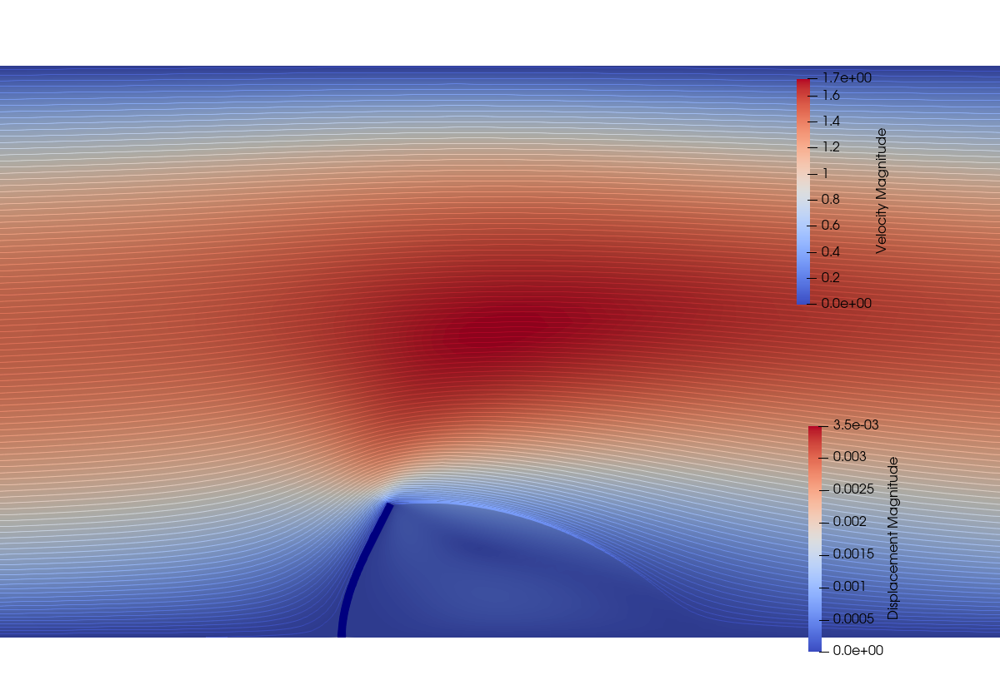
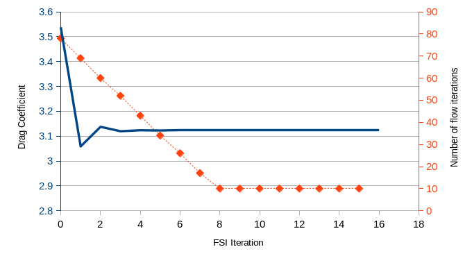

### Goals

This tutorial uses SU2's python wrapper and its native solvers for incompressible flow and solid mechanics to solve a steady-state Fluid-Structure Interaction problem. This document will cover:
- Setting up a python script to run SU2
- Extracting flow loads and structural displacements from two different python instances of SU2
- Coupling the two instances

In this tutorial, we will solve the exact same problem as for the [Static FSI](../Static_FSI/) tutorial. Please take a moment to familiarize yourself with that tutorial in case you haven't yet.

### Resources

You can find the resources for this tutorial in the folder [python_fsi](https://github.com/su2code/Tutorials/tree/feature_python_fsi/multiphysics/python_fsi) of the [Tutorials repository](https://github.com/su2code/Tutorials). There is a [python script](https://github.com/su2code/Tutorials/tree/feature_python_fsi/multiphysics/python_fsi/run_fsi_primal.py) and two sub-config files for the [flow](https://github.com/su2code/Tutorials/tree/feature_python_fsi/multiphysics/python_fsi/config_channel.cfg) and [structural](https://github.com/su2code/Tutorials/tree/feature_python_fsi/multiphysics/python_fsi/config_cantilever.cfg) subproblems.

Moreover, you will need two mesh files for the [flow domain](https://github.com/su2code/Tutorials/tree/feature_python_fsi/multiphysics/python_fsi/mesh_channel.su2) and the [cantilever](https://github.com/su2code/Tutorials/tree/feature_python_fsi/multiphysics/python_fsi/mesh_cantilever.su2).

### Background 

For this tutorial, you will need to use advanced features of SU2, in particular the python-wrapped version of the code which needs to be built from source. 

This tutorial has been tested on a linux system with the following specs

```
Linux kernel 5.3.18-1-MANJARO
GCC compilers version 9.2.0
Open MPI version 4.0.2
Python version 3.8.1
SWIG version 4.0.1
```

compiling the code from source using the following meson settings

```
./meson.py build -Dwith-mpi=enabled -Denable-autodiff=true -Denable-pywrapper=true
```

It requires an adequate setup of the system and a correct linkage of both the ```mpi4py``` and ```swig``` libraries. For questions, updates, or notes on the usability of this tutorials on different systems or configurations, please use the comment section below.

#### Mesh Description

The cantilever is discretized using 1000 4-node quad elements with linear interpolation. The fluid domain is discretized using a finite volume mesh with 7912 nodes and 15292 triangular volumes. The wet interface is matching between the fluid and structural domains.

#### Configuration File Options

We reuse the [flow](https://github.com/su2code/Tutorials/tree/feature_python_fsi/multiphysics/python_fsi/config_channel.cfg) and [structural](https://github.com/su2code/Tutorials/tree/feature_python_fsi/multiphysics/python_fsi/config_cantilever.cfg) config files from the [Static FSI](../Static_FSI/), with only very minor modifications. 

First of all, SU2 will see each instance as a single-zone problem. Therefore, it is necessary to set the output appropriately in order to prevent overwriting files. For the flow config

```
OUTPUT_FILES = (RESTART, PARAVIEW)
SOLUTION_FILENAME = solution_fsi_steady_0
RESTART_FILENAME = restart_fsi_steady_0
VOLUME_FILENAME = fsi_steady_0
```

and for the structural config

```
OUTPUT_FILES = (RESTART, PARAVIEW)
SOLUTION_FILENAME = solution_fsi_steady_1
RESTART_FILENAME = restart_fsi_steady_1
VOLUME_FILENAME = fsi_steady_1
```

Next, we choose the output that we require to the history files. In this tutorial, we are interested on the drag coefficient of the cantilever once deformed. Therefore, for the flow config, we need to include the ```AERO_COEFF```

```
HISTORY_OUTPUT = ITER, RMS_RES, AERO_COEFF
CONV_FILENAME= history_0
```

while for the structural config it's enough with the residuals

```
HISTORY_OUTPUT = ITER, RMS_RES
CONV_FILENAME= history_1
```

Finally, it is necessary to indicate the structural solver that the boundary solution will be used to update a fluid field. This is done by setting the config options

```
MARKER_FLUID_LOAD = ( feabound )
MARKER_DEFORM_MESH = ( feabound )
```

on the structural config file.

#### Applying coupling conditions to the individual domains

The key part of this tutorial is the [python script](https://github.com/su2code/Tutorials/tree/feature_python_fsi/multiphysics/python_fsi/run_fsi_primal.py) to run the FSI problem. Please take a moment to evaluate its contents, as we will go through some of its most important aspects.

First, we will need to import the SU2 python library along with mpi4py, using

```
import pysu2
from mpi4py import MPI
```

We define the names of the config files required by SU2 using

```
flow_filename = "config_channel.cfg"
fea_filename = "config_cantilever.cfg"
```

We will exemplify the initialization of SU2 using the flow domain. First, we create a driver object using

```
FlowDriver = pysu2.CSinglezoneDriver(flow_filename, 1, comm);
```

which is analogous to the SU2 driver in the C++ executable. We use a ```comm``` that is imported from ```mpi4py```

```
comm = MPI.COMM_WORLD
```

and the ```flow_filename``` previously defined. The ```1``` corresponds to the number of zones (remember, we consider each instance of SU2 to be independent).

Next, we need to identify the FSI boundary. We retrieve the list of all the flow boundary tags and their associated indices using

```
FlowMarkerList = FlowDriver.GetAllBoundaryMarkersTag()
FlowMarkerIDs = FlowDriver.GetAllBoundaryMarkers()
```

For the boundary ```FlowMarkerName = 'flowbound' ```, we identify the corresponding index

```
if FlowMarkerName in FlowMarkerList and FlowMarkerName in FlowMarkerIDs.keys():
  FlowMarkerID = FlowMarkerIDs[FlowMarkerName]
```

and, finally, the number of vertices on the boundary is

```
nVertex_Marker_Flow = FlowDriver.GetNumberVertices(FlowMarkerID)
```

An analogous process can be followed for the FSI boundary on the structural domain. In this case, the boundaries are matching, so the number of vertices is the same.

We start the FSI loop and limit it to the same number of iterations required for convergence in the [Static FSI](../Static_FSI/) tutorial

```
for i in range(17):
```

First, the flow solution is run

```
    FlowDriver.ResetConvergence()
    FlowDriver.Preprocess(0)
    FlowDriver.Run()
    FlowDriver.Postprocess() 
    stopCalc = FlowDriver.Monitor(0)
```

and the flow loads are recovered using

```
    flow_loads=[]
    for iVertex in range(nVertex_Marker_Flow):
      vertexLoad = FlowDriver.GetFlowLoad(FlowMarkerID, iVertex)
      flow_loads.append(vertexLoad)
```

The ```flow_loads``` array now contains the loads in all the vertices of the flow FSI interface. Now, we need to set the flow loads to the FEA nodes. By construction for this case, the vertex IDs are matching for both meshes except for vertex 0 and 1, which are inverted. Therefore, we set the flow loads on the structural domain using

```
    FEADriver.SetFEA_Loads(FEAMarkerID, 0, flow_loads[1][0], flow_loads[1][1], flow_loads[1][2])
    FEADriver.SetFEA_Loads(FEAMarkerID, 1, flow_loads[0][0], flow_loads[0][1], flow_loads[0][2]) 
    for iVertex in range(2, nVertex_Marker_FEA):
      FEADriver.SetFEA_Loads(FEAMarkerID, iVertex, flow_loads[iVertex][0], flow_loads[iVertex][1], flow_loads[iVertex][2])
```

You can ensure the vertices are coincidental by the coordinates of the nodes using ```FlowDriver.GetVertexCoordX(FlowMarkerID, iVertex)``` and ```FlowDriver.GetVertexCoordY(FlowMarkerID, iVertex)``` for the flow domain, and ```FEADriver.GetVertexCoordX(FEAMarkerID, iVertex)``` and ```FEADriver.GetVertexCoordY(FEAMarkerID, iVertex)``` for the structural domain.

Next, the structural simulation is run with

```
    FEADriver.ResetConvergence()
    FEADriver.Preprocess(0)  
    FEADriver.Run()
    FEADriver.Postprocess() 
    stopCalc = FEADriver.Monitor(0)
```

and the structural displacements at the ```feabound``` interface are retrieved using

```
    fea_disp=[]
    for iVertex in range(nVertex_Marker_FEA):
      vertexDisp = FEADriver.GetFEA_Displacements(FEAMarkerID, iVertex)
      fea_disp.append(vertexDisp)
```

Finally, these boundary displacements are imposed to the flow mesh

```
    FlowDriver.SetMeshDisplacement(FlowMarkerID, 0, fea_disp[1][0], fea_disp[1][1], fea_disp[1][2])
    FlowDriver.SetMeshDisplacement(FlowMarkerID, 1, fea_disp[0][0], fea_disp[0][1], fea_disp[0][2])    
    for iVertex in range(2, nVertex_Marker_FEA):
      FlowDriver.SetMeshDisplacement(FlowMarkerID, iVertex, fea_disp[iVertex][0], fea_disp[iVertex][1], fea_disp[iVertex][2])
```

Once the loop is completed, it only remains to write the solution of each domain to file using

```
FlowDriver.Output(0)
FEADriver.Output(0)
```

### Running SU2

Follow the links provided to download the [python script](https://github.com/su2code/Tutorials/tree/feature_python_fsi/multiphysics/python_fsi/run_fsi_primal.py) and the two sub-config files for the [flow](https://github.com/su2code/Tutorials/tree/feature_python_fsi/multiphysics/python_fsi/config_channel.cfg) and [structural](https://github.com/su2code/Tutorials/tree/feature_python_fsi/multiphysics/python_fsi/config_cantilever.cfg) subproblems.

Also, you will need the two mesh files for the [flow domain](https://github.com/su2code/Tutorials/tree/feature_python_fsi/multiphysics/python_fsi/mesh_channel.su2) and the [cantilever](https://github.com/su2code/Tutorials/tree/feature_python_fsi/multiphysics/python_fsi/mesh_cantilever.su2).

Execute the code using Python

```
$ python run_fsi_primal.py
```

The convergence history of each individual domain will be printed to screen, starting with the flow domain

```
+---------------------------------------------------+
|  Inner_Iter|      rms[P]|      rms[U]|      rms[V]|
+---------------------------------------------------+
|           0|   -4.799717|  -19.870540|  -32.000000|
|          10|   -5.421646|   -4.859176|   -5.558343|
|          20|   -6.200459|   -5.584293|   -6.120761|
|          30|   -6.852188|   -6.205093|   -6.958953|
|          40|   -7.502751|   -6.854100|   -8.034484|
|          50|   -8.316190|   -7.662838|   -8.492639|
|          60|   -9.153994|   -8.509430|   -9.696622|
|          70|  -10.119472|   -9.498203|  -10.117162|
|          80|  -11.035958|  -10.448171|  -11.143732|
|          90|  -11.613994|  -10.982943|  -11.842820|
|         100|  -12.264740|  -11.616077|  -12.556728|
|         104|  -12.684964|  -12.046580|  -12.778620|
```

followed by the structural domain

```
+----------------------------------------------------------------+
|  Inner_Iter|      rms[U]|      rms[R]|      rms[E]|    VonMises|
+----------------------------------------------------------------+
|           0|   -1.121561|   -2.706864|   -4.419338|  2.2876e+03|
|           1|   -1.708123|    1.269382|   -1.716845|  2.2429e+03|
|           2|   -2.583705|    0.631041|   -3.175890|  2.2237e+03|
|           3|   -2.508726|   -0.795411|   -5.686295|  2.0701e+03|
|           4|   -2.751613|   -1.306797|   -6.550284|  2.0544e+03|
|           5|   -3.147799|   -1.271416|   -6.914834|  2.0364e+03|
|           6|   -2.962716|   -2.664273|   -7.800357|  2.0171e+03|
|           7|   -4.083257|   -2.080066|   -8.553973|  2.0155e+03|
|           8|   -4.522566|   -4.400710|  -11.005428|  2.0149e+03|
|           9|   -7.252524|   -5.240218|  -14.876499|  2.0149e+03|
|          10|  -10.834476|  -10.711888|  -23.634504|  2.0149e+03|
```

After 17 iterations, both the flow and structural fields will be successfully converged,

```
+---------------------------------------------------+
|  Inner_Iter|      rms[P]|      rms[U]|      rms[V]|
+---------------------------------------------------+
|           0|  -15.808168|  -15.358431|  -15.769282|
|          10|  -16.714759|  -16.074145|  -17.174991|

+----------------------------------------------------------------+
|  Inner_Iter|      rms[U]|      rms[R]|      rms[E]|    VonMises|
+----------------------------------------------------------------+
|           0|  -11.937375|  -11.637725|  -25.999458|  1.8531e+03|
|           1|  -15.794016|  -11.636749|  -28.541279|  1.8531e+03|
|           2|  -16.165350|  -11.621837|  -28.528692|  1.8531e+03|
|           3|  -16.056047|  -11.608302|  -28.544055|  1.8531e+03|
|           4|  -16.156344|  -11.627675|  -28.565975|  1.8531e+03|
|           5|  -16.204699|  -11.633976|  -28.581277|  1.8531e+03|
```

Which correspond to the exact same residuals as for the last iteration on the [Static FSI](../Static_FSI/) tutorial. This can be tested by running the latter with

```
WRT_ZONE_CONV = YES
```

which yields for its last iteration

```
+----------------------------------------------------------------+
|                     Zone 0 (Incomp. Fluid)                     |
+----------------------------------------------------------------+
|  Outer_Iter|  Inner_Iter|      rms[P]|      rms[U]|      rms[V]|
+----------------------------------------------------------------+
|          16|           0|  -15.808168|  -15.358431|  -15.769282|
|          16|          10|  -16.714759|  -16.074145|  -17.174991|
+-----------------------------------------------------------------------------+
|                              Zone 1 (Structure)                             |
+-----------------------------------------------------------------------------+
|  Outer_Iter|  Inner_Iter|      rms[U]|      rms[R]|      rms[E]|    VonMises|
+-----------------------------------------------------------------------------+
|          16|           0|  -11.937375|  -11.637725|  -25.999458|  1.8531e+03|
|          16|           1|  -15.794016|  -11.636749|  -28.541279|  1.8531e+03|
|          16|           2|  -16.165350|  -11.621837|  -28.528692|  1.8531e+03|
|          16|           3|  -16.056047|  -11.608302|  -28.544055|  1.8531e+03|
|          16|           4|  -16.156344|  -11.627675|  -28.565975|  1.8531e+03|
|          16|           5|  -16.204699|  -11.633976|  -28.581277|  1.8531e+03|
+----------------------------------------------------------------+
|                        Multizone Summary                       |
+----------------------------------------------------------------+
|  Outer_Iter| avg[bgs][0]| avg[bgs][1]|MinVolume[0]|DeformIter[0|
+----------------------------------------------------------------+
|          16|  -11.228939|   -9.130581|  8.7338e-10|          44|
```

The displacement field on the structural domain and the velocity field on the flow domain obtained in ```fsi_steady_1.vtu```_and ```fsi_steady_0.vtu``` respectively are shown below:




which is, as expected, identical to the result of the [Static FSI](../Static_FSI/) tutorial. The convergence of the drag coefficient is as follows:



The drag coefficient will be used as the objective function for the adjoint computation in the [next tutorial](../Adjoint_FSI_Python/).

### Attribution

If you are using this content for your research, please kindly cite the following reference in your derived works:

Sanchez, R. _et al._ (2016), ASSESSMENT OF THE FLUID-STRUCTURE INTERACTION CAPABILITIES FOR AERONAUTICAL APPLICATIONS OF THE OPEN-SOURCE SOLVER SU2, _Proceedings of the VII European Congress on Computational Methods in Applied Sciences and Engineering_. DOI: [10.7712/100016.1903.6597](https://doi.org/10.7712/100016.1903.6597)

<dl>
This work is licensed under a <a rel="license" href="http://creativecommons.org/licenses/by/4.0/">Creative Commons Attribution 4.0 International License</a>
<br />
<a rel="license" href="http://creativecommons.org/licenses/by/4.0/"></a>
</dl>

