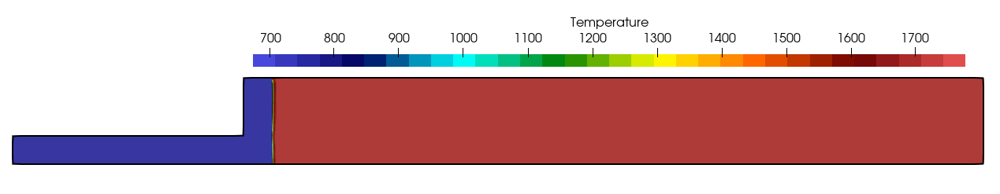
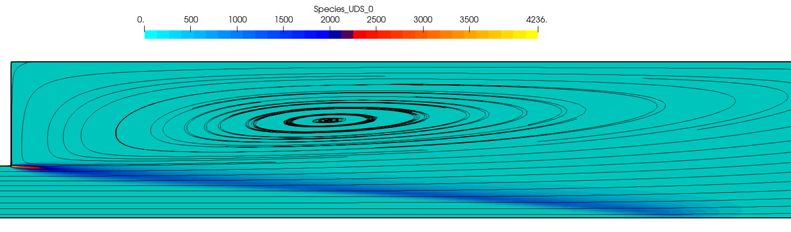
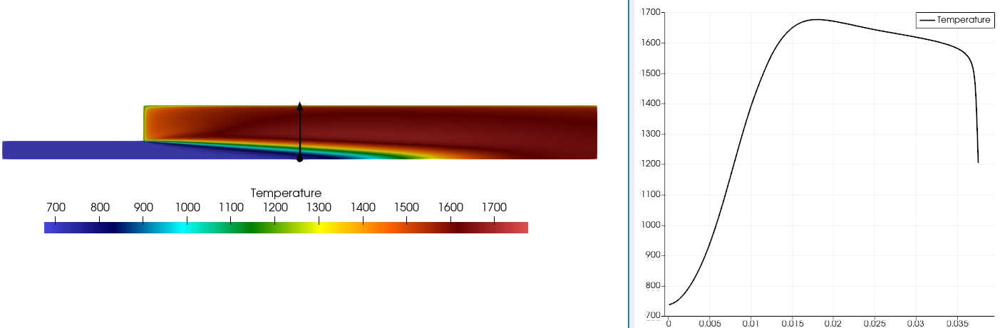
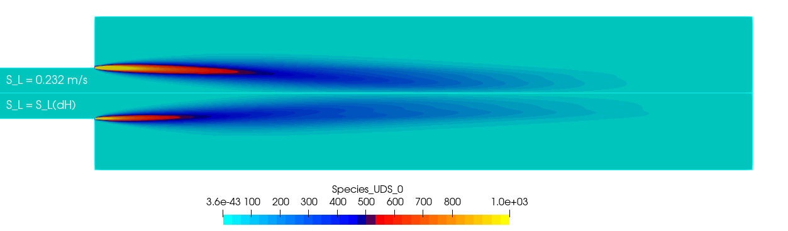
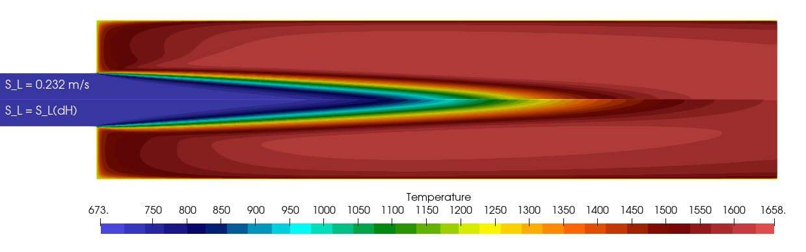
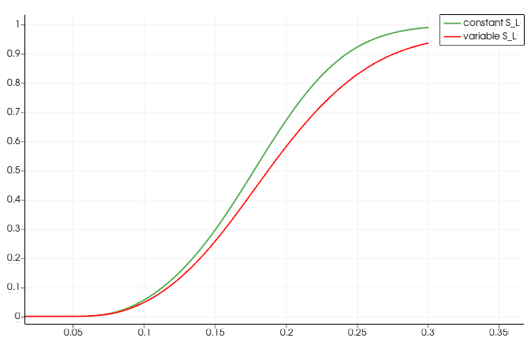

Figure (1): high-pressure turbulent premixed flame of the Paul-Scherrer Institute (PSI), Switzerland

## Goals

In this tutorial we will simulate a high pressure turbulent premixed flame using the Turbulent Flamespeed Closure (TFC) model. This is a simple turbulent combustion model that can be implemented with a User Defined Source (UDS) in python.
In this tutorial we will touch upon the following aspects:
- Compile and run SU2 from within python using the python wrapper
- Create a User Defined Source
- Create User Defined boundary conditions
- Create User Defined initial conditions
- Overwrite the enthalpy (temperature) field with a user defined field.


## Resources

The resources for this tutorial can be found in the [TFC_python](https://github.com/su2code/Tutorials/tree/master/multiphysics/TFC_python) directory in the [tutorial repository](https://github.com/su2code/Tutorials). You will need the configuration file ([psi.cfg](https://github.com/su2code/Tutorials/tree/master/multiphysics/TFC_python/adiabatic/psi.cfg)) and the mesh file ([psi.su2](https://github.com/su2code/Tutorials/tree/master/multiphysics/TFC_python/adiabatic/psi.su2)). Additionally, the Gmsh geometry is also provided so you can recreate the mesh yourself: [psi.geo](https://github.com/su2code/Tutorials/tree/master/multiphysics/TFC_python/psi.geo). Files for the non-adiabatic case are in the folder [enthalpy](https://github.com/su2code/Tutorials/tree/master/multiphysics/TFC_python/enthalpy) and files for the case with source term quenching and custom wall boundary conditions are in the folder [quench](https://github.com/su2code/Tutorials/tree/master/multiphysics/TFC_python/quench)


### Background

Turbulent combustion can be very expensive to simulate, especially when high accuracy is required and detailed information about specific species (NOx emissions for instance) is required. The Turbulent Flamespeed Closure (TFC) model, first pioneered by Zimont, is a very simple model for turbulent premixed combustion that aims to give accurate predictions for temperature in turbulent premixed combustion. When the goal is to mainly resolve the flame structure and gas temperature to compute for instance burner temperatures in a conjugate heat transfer setup, then the TFC model has sufficient accuracy. In the TFC model, a transport equation for the progress variable is solved:

$$ \frac{\partial c}{dt} + \nabla \cdot (\rho u c) = \nabla\cdot (\frac{\mu_t}{Sc_t}\nabla c) + \rho S_c$$

and the combustion source term is given by 
$$ S_c = \rho_u U_t \nabla c$$,
with $$\rho_u$$ the unburnt density of the gas an $$U_t$$ the turbulent flamespeed. The Zimont model uses the gradient of the progress variable to construct the source term, but other models exist as well. These models can be implemented easily in SU2 by writing a user defined source term in the python wrapper.

### Problem Setup

First, SU2 needs to be compiled with python support. Add the option *-Denable-pywrapper=true* to the meson setup. In this case, we compile including mpi support:

```bash	
$ ./meson.py setup build --optimization=2 -Ddebug=false -Denable-pywrapper=true -Dwith-mpi=enabled -Dcustom-mpi=true --prefix=/home/user/Codes/su2code/su2/
```

Note that the python wrapper (or your python setup) might need additional python packages that you need to install. Especially the python package mpi4py is important if you would like to work with mpi. The mpi4py package should match your installed mpi library, usually openmpi or mpich. The easiest way to setup a working environment is to create a conda environment and install all necessary packages in this environment.


### Mesh Description

The geometry of this testcase is provided as a gmsh file and matches the of the experimental setup of Griebel et al (2007), https://doi.org/10.1016/j.proci.2006.07.042.

The mesh consists of a a coarse structured mesh with 16.3k cells and 16.6k points. The mesh was created using Gmsh and the configuration file to create the mesh can be found here: [psi.geo](https://github.com/su2code/Tutorials/tree/master/multiphysics/TFC_python/psi.geo). The only thing you need to do to create a mesh from the geometry is start Gmsh, and then load the .geo file. You will then see the geometry in the Gmsh visualization window. If you click on *Mesh->2D* the 2D mesh will be generated. You can then export the mesh as a .su2 file by choosing *File->Export*. The mesh will automatically be saved in su2 format when the filename has been given the extension .su2. In general, you should not choose *save all elements* because this will also save additional points that were used to construct the geometry but are not part of the final mesh, like for example the center of a circle. 


### Configuration File Options

The setup for this testcase consists of 2 files:
- the run.py file is the python file that runs the case. in this file, we simply import the su2 capabilities using *import pysu2*
- the psi.cfg file for the basic setup. Some settings will be overwritten by python.

In the configuration file, we have set up a case for turbulent incompressible flow using the k-omega SST model. We have also deactivated the energy equation (sensible enthalpy) and species transport. 
```
SOLVER= INC_RANS
KIND_TURB_MODEL= SST
INC_ENERGY_EQUATION= NO
KIND_SCALAR_MODEL= SPECIES_TRANSPORT
PYTHON_CUSTOM_SOURCE= YES
```

Note that the although the enthalpy equation is not solved, the enthalpy field is present. It is just a constant field and not altered by any computation. Every iteration, the temperature is computed from the enthalpy field, independent of the energy equation being active or not.
To activate the custom source term, we keyword **PYTHON_CUSTOM_SOURCE= YES** is used.

in the python file, we have defined several functions to set up the testcase. The first function creates a simple initial condition for the progress variable c:
```python

################################################################## #
# create a function for the initial progress variable c            #
# ################################################################ #
def initC(coord):
    x = coord[0]
    #y = coord[1]
    #z = coord[2]
    # location where the flame should be
    flame_x = 0.012
    if (x < flame_x):
      C = 0.0
    else:
      C = 1.0

    return C
    
# ###################################################################
# loop over all vertices and set the species progress variable c    #
# ################################################################# #
def SetInitialSpecies(SU2Driver):
    allCoords = SU2Driver.Coordinates()
    iSPECIESSOLVER = SU2Driver.GetSolverIndices()['SPECIES']
    for iPoint in range(SU2Driver.GetNumberNodes()):
      coord = allCoords.Get(iPoint)
      C = initC(coord)
      # now update the initial condition for the species
      SU2Driver.Solution(iSPECIESSOLVER).Set(iPoint,0,C)

```


Figure(2): initial temperature field created using the python wrapper

Note that when setting the species solution, we use the index=0, because we have only 1 species transport equation. When setting a flow solution, the index to the required field should be used. The indices can be retrieved using:
```python
print("indices of solver variables: ", getsolvar(driver))
```
with the result:
```
indices of solver variables:  {'PRESSURE': 0, 'VELOCITY_X': 1, 'VELOCITY_Y': 2, 'TEMPERATURE': 3}
```

Note that index 3 is actually the sensible enthalpy, and from this, we compute the temperature. In our setup we want to overwrite the temperature. Because internally, temperature is always computed from the energy equation (be that temperature, or enthalpy), it is best to overwrite the enthalpy and let SU2 compute the temperature internally.

in the main function, we simply check in the config file if **RESTART=YES** to decide if we want to overwrite the initial solution for the progress variable with our user defined initial solution:

```python
  # ### Check if we do a restart or not. ###
  with open('psi.cfg') as f:
    if 'RESTART_SOL= YES' in f.read():
      if rank == 0:
        print("restarting from file")
    else:
        # We can set an initial condition by calling this function:
        if rank == 0:
          print("Using user defined initial condition.")
        SetInitialSpecies(driver)

```

The functions *update_temperature* and *zimont* implement the algebraic temperature relationship and the source term for the progress variable. Then in the main function, we simply loop over all points in the domain, compute the source term and add it to the progress variable equation:
```python
    Source = driver.UserDefinedSource(iSPECIESSOLVER)

    # set the source term, per point
    for i_node in range(driver.GetNumberNodes() - driver.GetNumberHaloNodes()):
      # add source term:
      # default TFC of Zimont: rho*Sc = rho_u * U_t * grad(c)
      S = zimont(driver,i_node)
      Source.Set(i_node,0,S)

```

Note that we do not add the source term to the halo nodes, which are used in parallel computing. In parallel computing we divide the mesh in parts and each cpu gets a part, which is called a rank. The points on the interface between ranks need information from the other side of the interface. But this information is computed on another rank and not directly available. This is why each rank has halo points, which are copies of the points on the other side of the rank. During a synchronisation step, all information in the halo nodes is updated so the local computations on each of the ranks can proceed with the correct information present at the rank boundaries. They should not be taken into account in any computation, because they are in fact copies of points that *are* taken into account during the computation. 
For the temperature update, we update all points, including the halo points. Because we overwrite the entire enthalpy (and temperature) field, and no other computations are performed on the enthalpy field, the halo points would not get updated and this will lead to incorrect computations of gradients at the rank interface.

```python
   # for the update of temperature, we need to update also the halo nodes
    for i_node in range(driver.GetNumberNodes()):
      # set the temperature to T = c*Tf + (1-c)*Tu
      update_temperature(driver, i_node)
```

The actual temperature update is done in update_temperature:
```python
# ################################################################## #
# Temperature is an algebraic function of c
# ################################################################## #
def update_temperature(SU2Driver, iPoint):
    # first, get the progress variable
    iSPECIESSOLVER = SU2Driver.GetSolverIndices()['SPECIES']
    # Note: returns a list
    C = SU2Driver.Solution(iSPECIESSOLVER)(iPoint,0)
    T = Tu*(1-C) + Tf*C
           
    iFLOWSOLVER = SU2Driver.GetSolverIndices()['INC.FLOW']
    # 0         1           2           3
    # pressure, velocity-x, velocity-y, enthalpy
    iENTH = 3
    SU2Driver.Solution(iFLOWSOLVER).Set(iPoint,iENTH, cp_u*(T-Tref))
```
We update the sensible enthalpy and let SU2 compute the temperature internally. 

The computation of the source term according to Zimon is given by:
```python
# ################################################################## #
# Source term according to Zimont
# ################################################################## #
def zimont(SU2Driver, iPoint, nDim):

    iSSTSOLVER = SU2Driver.GetSolverIndices()['SST']
    tke, dissipation = SU2Driver.Solution(iSSTSOLVER)(iPoint)

    iSPECIESSOLVER = SU2Driver.GetSolverIndices()['SPECIES']
    # get the gradient of species_0
    gradc = SU2Driver.Gradient(iSPECIESSOLVER)(iPoint,0)
    primindex = SU2Driver.GetPrimitiveIndices()
    iDENSITY = primindex.get("DENSITY")
    iMU = primindex.get("LAMINAR_VISCOSITY")

    rho = SU2Driver.Primitives()(iPoint,iDENSITY)
    mu = SU2Driver.Primitives()(iPoint,iMU)
    nu=mu/rho
    # Turbulent Flamespeed Closure with Dinkelacker correction
    up = np.sqrt((2.0/3.0) * tke )
    lt = (0.09**0.75) * (tke**1.5) / dissipation
    Re = up*lt/nu

    Ut = Slu * (1.0 + (0.46/Le) * np.power(Re,0.25) * np.power(up/Slu,0.3) * np.power(Pu,0.2) )

    norm_gradc = 0.0
    for idim in range(nDim):
      norm_gradc += gradc[idim]*gradc[idim]
    norm_gradc = np.sqrt(norm_gradc)
    Sc = rho_u * Ut * norm_gradc

    return Sc
```
Note that we are using here a different formulation for the turbulent velocity, as described in papers by Dinkelacker and Muppala. The turbulence velocity is now such that if the turbulent kinetic energy is zero, the laminar flame velocity is retrieved. We also include a correction for the Lewis number to take into account the effect of preferential diffusion on the flame speed. This allows to work with hydrogen as a fuel as well. Note that for accurate simulations of hydrogen flames, especially in the laminar regime, preferential diffusion needs to be taken into account in a more elaborate way by introducing the mixture fraction and by considering the flame as a partially premixed flame (even a perfectly premixed hydrogen flame will become partially premixed in the flame zone).
 

### Running SU2

If possible, always use a parallel setup to reduce computational time (wall clock time). Run the SU2_CFD executable in parallel using MPI and 4 nodes by entering: 

```bash
$ mpirun -n 4 python run.py
```


### Results


Figure (3): visualization of the TFC source term for the turbulent combustion model, together with the streamlines. 


The solution of the flame region can be visualised using the User Defined Source UDS_0. A large recirculation region has also formed between the flame and the wall of the combustion chamber, causing heat transfer between the flame and the wall.

Note that we clip the species between [0,1] to prevent (temporary) unphysical values and prevent divergence. Sometimes this clipping is necessary on coarse grids. The clipping will be visible in the residuals of the progress variable, since clipping prevents local convergence. 

### Heat losses: enthalpy source term

When heat losses at the wall need to be taken into account, this can be done by solving the energy (enthalpy) equation. The wall boundaries can be given a wall temperature in the usual way. To take into account combustion, we add a source term similar to the Zimont source term for the progress variable. This replaces the algebraic computation of the enthalpy and temperature.

```python
      iENTH = 3
      Source_h.Set(i_node, iENTH, 0.0284*50.5*1e6*S)
```

The source term S needs to be multiplied by the lower heating value of the mixture 50.5 MJ/kg and the mass fraction of methane in the mixture (with equivalence ratio 0.5, this amounts to Y=0.0284).
In the config file, the wall temperature can now be set to an appropriate temperature. Since the combustion chamber is known to become very hot, we set the walls to 1200K. The wall temperature is imposed weakly, meaning that we compute the wall flux from Fourier's law and impose that flux:

$$q_w = k_f \left( 
  \frac{\partial T}{\partial n} 
\right)_{\textrm{wall}}$$

The near wall mesh needs to be fine enough to accurately represent the flux.



Figure (4): visualization of the temperature with a line plot showing the wall temperature. 

Figure 4 shows the temperature in the domain, clearly showing the thermal boundary layer at the wall. In the upper left corner the temperature redistribution due to the recirculation zone is also clearly present.
More accurate modeling can be achieved by taking into account the effect of heat loss on the laminar flame speed. In cantera, the laminar flame speed can be computed and a relationship for the laminar flame speed $$S_L(\Delta h_t)$$ as a function of the enthalpy deficiency can be used instead of a constant $$S_L$$. The local flame quenching due to heat losses at the wall can then be taken into account. The total enthalpy can be computed from the sensible enthalpy and the progress variable, noticing that when the progress variable is 1, then all chemical enthalpy has been converted into sensible enthalpy. 

The heating value of methane is 50.5 MJ/kg, and with a mass fraction of $$Y=0.0284$$ we have a chemical enthalpy of 

$$h_{\textrm{chem}}^{\textrm{max}} = 1.4342 MJ/kg$$. 

With our chemical enthalpy converted to sensible enthalpy, our flame temperature ends up to be around 1735K.  

With the measured flame temperature of T=1777K (used in our algebraic relationship for temperature), we compute a sensible enthalpy of 2MJ/kg, very close to the total enthalpy computed using the sum of the initial sensible enthalpy and the chemical enthalpy.

Our progress variable now tells us that the chemical enthalpy that we have left is 

$$h_{\textrm{chem}} = c \cdot h_{chem}^{\textrm{max}}$$.

Since total enthalpy is conserverved during combustion, the temperature difference between the actual temperature and the temperature computed from the sensible enthalpy gives us the heat loss. With this enthalpy deficiency we can compute the local laminar flame speed and the corrected source term. 


Figure (4): visualization of the source term showing the results using constant laminar flamespeed (top) and the variable laminar flamespeed (bottom).



Figure (5): visualization of the temperature showing the result using constant laminar flamespeed (top) and the variable laminar flamespeed (bottom).

Figures 4 and 5 show a comparison between the simulation results using a constant laminar flamespeed and a variable laminar flamespeed that takes into account local heat losses. In Figure 4, the source term is smaller close to the wall where the flame attaches. The temperature field in Figure 5 shows that the flame zone is more diffusive.  

Figure (6): Line plot of the progress variable on the centerline showing the result using constant laminar flamespeed and variable laminar flamespeed.

Figure 6 confirms that the flame is more diffuse with variable S_L.  

Note that with python it is also very easy to impose temperature profiles. The code is simply:
```python

def ApplyWallTemperature(SU2Driver, marker_ids):
  """Applies an isothermal wall boundary condition on a specific wall"""
  for marker_id in marker_ids:
    if marker_id < 0:
      continue
    allCoords = SU2Driver.Coordinates()
    # the top horizontal wall is 1200K, but the vertical side wall goes from 1200K down to 700K
    # to match the inlet pipe temperature (which has zero heat flux BC)
    for i_vertex in range(driver.GetNumberMarkerNodes(marker_id)):
      i_point = SU2Driver.GetMarkerNode(marker_id, i_vertex)
      coord = allCoords.Get(i_point)
      Tw = 673 + 500.0 * (coord[1]-0.0125)/0.025  
      driver.SetMarkerCustomTemperature(marker_id, i_vertex, hf)
```
And in the config file, we simply add 
```bash
MARKER_PYTHON_CUSTOM= (wall_top, wall_side )
```

The wall temperature is now a function of the vertical coordinate y.


  
