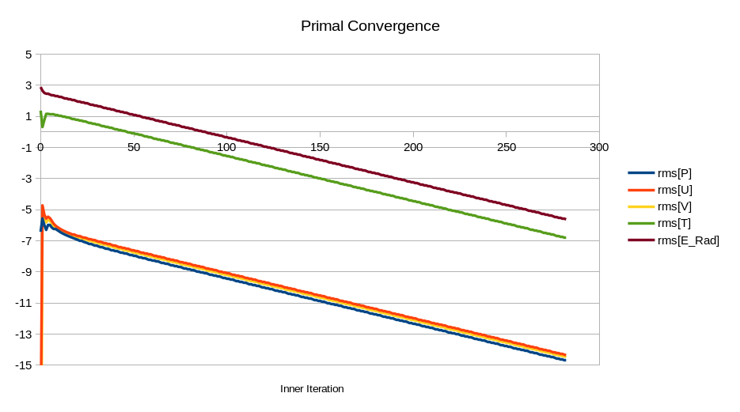
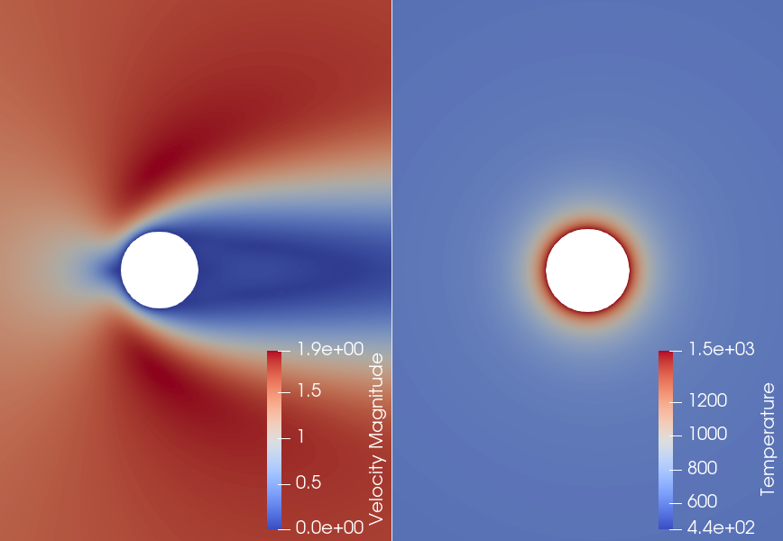

### Goals

This tutorial builds up on SU2's [Conjugate Heat Transfer](../Inc_Heated_Cylinders) and [Radiative Heat Transfer](../Coupled_RHT_Adjoint) capabilities, to solve a multizone, multiphysics problem involving incompressible turbulent flows, radiation, and conjugate heat transfer between a solid domain and a buoyancy-driven cavity. Upon the completion of this example, the user will be capable of
- Setting up a multiphysics simulation with Conjugate Heat Transfer interfaces between zones
- Solving a turbulent buoyancy-driven cavity with participating media and radiation
- Computing coupled adjoint solutions of problems involving incompressible flow and radiation
- Generating multiple FFD boxes to deform the system outer walls
- Projecting the surface sensitivities into the FFD parameters

In this tutorial, we define a problem similar to the [Laminar Buoyancy-Driven Cavity](../Basic_RHT), however using in this case the right wall is a solid wall rather than an isothermal boundary condition. 


### Resources

For this tutorial, please download the contents of the folder [multiphysics/turb_rht_cht](https://github.com/su2code/Tutorials/blob/feature_radiation/multiphysics/turb_rht_cht) of the [Tutorials repository](https://github.com/su2code/Tutorials). 

### Background 

CHT simulations become important when we cannot assume an isomthermal wall boundary or suitable temperature distribution estimate. In this tutorial, we assume that this is the case for the right boundary of our buoyancy-driven cavity, and the interface temperature distribution becomes part of the solution of the simulation, by balancing the energy in all physical domains.

#### Mesh Description

The flow domain is discretized with a structured mesh with a total of 4800 elements. The solid domain is discretized using 960 elements. The interface between the domains is matching.

#### FFD Box Generation

First, we will define the FFD boxes to 

 to convert the solution of our adjoint problem into usable magnitudes for a shape optimization problem. In order to do so, we will define a Free-Form Deformation (FFD) box around the body such as


where the design parameters $$x_1$$ to $$x_{50}$$ correspond to the vertical deformation of the FFD box for 50 nodes.

In order to build the FFD box, please download the [FFD config file](https://github.com/su2code/Tutorials/blob/feature_radiation/multiphysics/adjoint_rht/config_rht_ffd.cfg). First, we need to define the mesh file as the input, and we choose the name for the resulting mesh file that will include the FFD box information to be ```mesh_adjoint_rht_ffd.su2```:

```
MESH_FORMAT = SU2
MESH_FILENAME = mesh_adjoint_rht.su2
MESH_OUT_FILENAME = mesh_adjoint_rht_ffd.su2
```

The code requires all boundaries to be indicated in the config file, it is sufficient if we use 

```
MARKER_CUSTOM = ( body, farfield )
```

to indicate SU2 that there are 2 boundaries, ```body``` and ```farfield``` in our mesh file. Next, we set up the keyword

```
DV_KIND = FFD_SETTING
```

to determine that the objective of this config file is to set up an FFD box. The boundary for which the FFD box is ```body```, and we are interested in having 24 boxes in $$x$$ direction and 1 box in $$y$$ direction according to our definition above, that will move in direction (0,1)

```
DV_MARKER = ( body )
DV_PARAM = ( MAIN_BOX, 24, 1, 0.0, 1.0 )
```

The FFD box will range in $$x \in [-0.55, 0.55]$$, and in $$y \in [-0.55, 0.55]$$. There is no dimension $$z$$ as we are solving a 2D problem.

```
FFD_DEFINITION = (MAIN_BOX, -0.55, -0.55, 0.0, 0.55, -0.55, 0.0, 0.55, 0.55, 0.0, -0.55, 0.55, 0.0, 0.0, 0.0, 0.0, 0.0, 0.0, 0.0, 0.0, 0.0, 0.0, 0.0, 0.0, 0.0)
```

Finally, the parameters for the computation of the FFD box are set.

```
FFD_TOLERANCE = 1E-8
FFD_ITERATIONS = 500
FFD_DEGREE = ( 24, 1, 0)
FFD_CONTINUITY = 2ND_DERIVATIVE
```

We run the following command

```
$ SU2_DEF config_rht_ffd.cfg
```

which returns

```
----------------------- Write deformed grid files -----------------------
|SU2 mesh                           |mesh_adjoint_rht_ffd.su2           |
Adding any FFD information to the SU2 file.
```

In order to confirm that the FFD information has been added to the mesh file, we open ```mesh_adjoint_rht_ffd.su2``` and check that the FFD information is appended below

```
FFD_NBOX= 1
FFD_NLEVEL= 1
FFD_TAG= MAIN_BOX
FFD_LEVEL= 0
FFD_DEGREE_I= 24
FFD_DEGREE_J= 1
FFD_BLENDING= BEZIER
FFD_PARENTS= 0
FFD_CHILDREN= 0
FFD_CORNER_POINTS= 4
-0.55	-0.55
0.55	-0.55
0.55	0.55
-0.55	0.55
FFD_CONTROL_POINTS= 100
0	0	0	-0.55	-0.55	-0.5
0	0	1	-0.55	-0.55	0.5
0	1	0	-0.55	0.55	-0.5
0	1	1	-0.55	0.55	0.5
...
24	0	0	0.55	-0.55	-0.5
24	0	1	0.55	-0.55	0.5
24	1	0	0.55	0.55	-0.5
24	1	1	0.55	0.55	0.5
FFD_SURFACE_POINTS= 396
body	0	4.545454545454555e-02	5.000000000000000e-01	5.000000000000000e-01
body	20	4.551176014851176e-02	5.072118017603070e-01	5.000000000000000e-01
body	21	4.568338982691677e-02	5.144217879880573e-01	5.000000000000000e-01
body	22	4.596939128289383e-02	5.216281436075275e-01	5.000000000000000e-01
...
body	409	4.596939127778600e-02	4.783718564996967e-01	5.000000000000000e-01
body	410	4.568338982421771e-02	4.855782120969652e-01	5.000000000000000e-01
body	411	4.551176014774048e-02	4.927881982883025e-01	5.000000000000000e-01
```


#### Multiphysics Configuration File

We start the tutorial by definining the problem as a multiphysics case,

```
SOLVER = MULTIPHYSICS
```

We set the config files for each sub-problem using the command ```CONFIG_LIST```, and state that each sub-problem will use a different mesh file:

```
MULTIZONE_MESH = NO
CONFIG_LIST = (config_flow_rht.cfg, config_solid_cht.cfg)
```

Now, we define the coupling conditions. In this case, the interface between the marker ```right``` in the flow domain, and ```leftSolid``` in the solid domain, is defined as

```
MARKER_ZONE_INTERFACE= (right, leftSolid)
```

We define the number of outer iterations for the multizone problem for a maximum of 30000 outer iterations

```
OUTER_ITER = 30000
```

Then, the convergence criteria is set to evaluate the averaged residual of the flow state vector (zone 0) (```AVG_BGS_RES[0]```) and the solid temperature (zone 1) (```AVG_BGS_RES[1]```) in two consecutive outer iterations, $$\mathbf{w}^{n+1}-\mathbf{w}^{n}$$ and $$\mathrm{T}^{n+1}-\mathrm{T}^{n}$$ respectively.

```
CONV_FIELD = AVG_BGS_RES[0], AVG_BGS_RES[1]
CONV_RESIDUAL_MINVAL = -8
```

The last step is defining our desired output. In this tutorial, we will use the following configuration for the history output

```
OUTPUT_WRT_FREQ = 1000
OUTPUT_FILES = (RESTART, PARAVIEW)
TABULAR_FORMAT= CSV

HISTORY_OUTPUT = (ITER, RMS_RES[0], HEAT[0], RMS_RES[1])
```

where the restart and paraview solution files are written every 1000 iterations, and the residuals of both zones and the heat properties of zone 1 are written to the history file, which has the same name as the config file but with extension .csv. 

#### Applying simulation conditions to the individual domains: Flow domain

The flow domain is defined in ```config_flow_rht.cfg```. An incompressible, Raynolds-Averaged Navier Stokes simulation with an SST turbulence model is set

```
SOLVER= INC_RANS
KIND_TURB_MODEL= SST
```

We set the properties for the flow according to the problem definition

```
INC_DENSITY_MODEL= VARIABLE
INC_ENERGY_EQUATION = YES
INC_VELOCITY_INIT= ( 1.0, 0.0, 0.0 )
INC_DENSITY_INIT= 0.006
INC_TEMPERATURE_INIT= 450

INC_NONDIM = DIMENSIONAL

VISCOSITY_MODEL= CONSTANT_VISCOSITY
MU_CONSTANT= 1e-5

CONDUCTIVITY_MODEL= CONSTANT_CONDUCTIVITY
KT_CONSTANT= 0.01

FLUID_MODEL= INC_IDEAL_GAS
SPECIFIC_HEAT_CP= 1000
MOLECULAR_WEIGHT= 30

BODY_FORCE= YES
BODY_FORCE_VECTOR= ( 0.0, -9.81, 0.0 )
```

And the radiation model is defined as

```
RADIATION_MODEL = P1
MARKER_EMISSIVITY= ( upper, 0.0, lower, 0.0, left, 1.0, right, 1.0, inlet, 1.0, outlet, 1.0 )
ABSORPTION_COEFF = 1.0
CFL_NUMBER_RAD = 1E12
TIME_DISCRE_RADIATION= EULER_IMPLICIT
```

We incorporate a volumetric heat source in the form of an ellipse with principal axes $$a = 0.2$$, $$b = 0.05$$, centered at $$(0.2,0.875,0)$$, to mimic the effect of a flame in the domain

```
HEAT_SOURCE = YES
HEAT_SOURCE_VAL = 50000
HEAT_SOURCE_ROTATION_Z = 0
HEAT_SOURCE_CENTER = (0.2,0.875,0)
HEAT_SOURCE_AXES = (0.2,0.05,0)
```

Next, the flow boundary conditions are applied

```
MARKER_ISOTHERMAL= ( left, 600.0 )
MARKER_HEATFLUX= ( upper, 0.0, lower, 0.0 )
MARKER_PLOTTING= ( right )
MARKER_MONITORING= ( right )

INC_INLET_TYPE= VELOCITY_INLET
MARKER_INLET= ( inlet, 450.0, 3.0, 1.0, 0.0, 0.0)

INC_OUTLET_TYPE = PRESSURE_OUTLET
MARKER_OUTLET= ( outlet, 0.0 )
```

and the ```right``` boundary is defined as a CHT interface

```
MARKER_CHT_INTERFACE= (right)
```

#### Applying simulation conditions to the individual domains: Solid domain

The solid domain is defined in ```config_solid_cht.cfg```. Only heat transfer is considered in the FVM solver

```
SOLVER= HEAT_EQUATION_FVM
```

The properties of the solid domain are defined next

```
SOLID_TEMPERATURE_INIT= 300.0
SOLID_DENSITY= 2000

SPECIFIC_HEAT_CP = 1000.0
SOLID_THERMAL_CONDUCTIVITY = 1.0

INC_NONDIM = DIMENSIONAL
```

And the boundary conditions are, for this case

```
MARKER_ISOTHERMAL= ( rightSolid, 300.0,  upperSolid, 300.0,  lowerSolid, 300.0)
MARKER_MONITORING= ( NONE )
```

while the coupling conditions are defined using

```
MARKER_CHT_INTERFACE= (leftSolid)
```


And now run the simulation without radiation model enabled. We obtain

```
Simulation Run using the Single-zone Driver
+---------------------------------------------------+
|  Inner_Iter|      rms[P]|      rms[T]|          CD|
+---------------------------------------------------+
|           0|   -6.415080|   -0.935921|   34.561397|
|           1|   -6.646410|   -1.167251|   12.154547|
|           2|   -6.857411|   -1.378252|    5.701560|
|           3|   -6.930843|   -1.451684|    4.159827|
|           4|   -7.096321|   -1.617162|    3.264458|
|           5|   -7.270927|   -1.791768|    2.613077|
|           6|   -7.412334|   -1.933175|    2.212900|
|           7|   -7.520525|   -2.041366|    1.950251|
|           8|   -7.608128|   -2.128969|    1.788462|
|           9|   -7.687862|   -2.208703|    1.687670|
|          10|   -7.766279|   -2.287120|    1.623157|
...

|          82|  -17.477938|  -11.998908|    1.509865|
|          83|  -17.591619|  -12.112953|    1.509865|
|          84|  -17.697791|  -12.218540|    1.509865|
|          85|  -17.809936|  -12.330734|    1.509865|
|          86|  -17.916902|  -12.437406|    1.509865|
|          87|  -18.025352|  -12.546016|    1.509865|
|          88|  -18.136105|  -12.655410|    1.509865|
|          89|  -18.240080|  -12.761985|    1.509865|
|          90|  -18.350192|  -12.872918|    1.509865|
|          91|  -18.454120|  -12.975104|    1.509865|
|          92|  -18.557342|  -13.082067|    1.509865|
```

We observe that the resulting drag coefficient is $$C_D = 1.509865$$, which agrees well with results 

|  | $$C_D$$ |
| [Park,  J.,  Kwon,  K.,  Choi,  H. (1998)](https://doi.org/10.1007/bf02942594)| 1.51  |
| [Sen,  S.,  Mittal,  S.,  Biswas,  G., (2009)](https://doi.org/10.1017/S0022112008004904) | 1.5093 |
| [Economon, T. (2018)](https://doi.org/10.2514/6.2018-3111) | 1.507 |

#### Incorporating Radiation effects

To incorporate radiation effects, we increase the temperature of the body boundary to 1500 K

```
MARKER_ISOTHERMAL = ( body, 1500.0 )
```

Now, we follow the same approach as for the [incompressible CFD-RHT tutorial](../Basic_RHT). We define the radiative model to P1, and the absorption coefficient of the problem. Both the body and the farfield are considered emissive. Finally, the CFL number for the P1 equation is set to 1.0E4.

```
RADIATION_MODEL = P1
ABSORPTION_COEFF = 0.01
MARKER_EMISSIVITY = ( body, 1.0, farfield, 1.0 )
CFL_NUMBER_RAD = 1.0E4
```

It only remains to set the output of the problem using


```
SCREEN_OUTPUT = (INNER_ITER, RMS_PRESSURE, RMS_TEMPERATURE, RMS_RAD_ENERGY, DRAG)

OUTPUT_FILES = (RESTART, PARAVIEW)
SOLUTION_FILENAME = solution_rht
RESTART_FILENAME = restart_rht
VOLUME_FILENAME = volume_rht

TABULAR_FORMAT = CSV
CONV_FILENAME= history
```

Follow the links provided to download the [config](https://github.com/su2code/Tutorials/blob/feature_radiation/multiphysics/adjoint_rht/config_rht_primal.cfg) and [mesh](https://github.com/su2code/Tutorials/blob/feature_radiation/multiphysics/adjoint_rht/mesh_adjoint_rht.su2) files.

Execute the code with the standard command

```
$ SU2_CFD config_rht_primal.cfg
```

which will show the following convergence history:

```
+----------------------------------------------------------------+
|  Inner_Iter|      rms[P]|      rms[T]|  rms[E_Rad]|          CD|
+----------------------------------------------------------------+
|           0|   -6.415080|    1.372397|    2.891724|   66.901414|
|           1|   -5.565021|    0.322939|    2.658304|    5.940759|
|           2|   -5.984899|    0.770693|    2.514670|   -6.198429|
|           3|   -6.294298|    1.163968|    2.470076|   -6.175578|
|           4|   -5.963378|    1.169388|    2.439879|   -4.752942|
|           5|   -6.001536|    1.157978|    2.410318|   -3.907486|
|           6|   -6.141469|    1.150189|    2.381443|   -3.502636|
|           7|   -6.218988|    1.125991|    2.352114|   -3.104089|
|           8|   -6.255746|    1.103723|    2.323083|   -2.641888|
|           9|   -6.313092|    1.077849|    2.293892|   -2.169670|
|          10|   -6.395249|    1.052317|    2.264864|   -1.726404|

...
|         272|  -14.409785|   -6.525393|   -5.330613|    2.768221|
|         273|  -14.437955|   -6.555088|   -5.359712|    2.768221|
|         274|  -14.467762|   -6.583369|   -5.388589|    2.768221|
|         275|  -14.495931|   -6.613064|   -5.417688|    2.768221|
|         276|  -14.525739|   -6.641345|   -5.446565|    2.768221|
|         277|  -14.553908|   -6.671040|   -5.475664|    2.768221|
|         278|  -14.583715|   -6.699321|   -5.504541|    2.768221|
|         279|  -14.611885|   -6.729016|   -5.533640|    2.768221|
|         280|  -14.641693|   -6.757297|   -5.562517|    2.768221|
|         281|  -14.669862|   -6.786992|   -5.591616|    2.768221|
|         282|  -14.699669|   -6.815274|   -5.620493|    2.768221|

```

The code is stopped as soon as the cauchy criteria set for $$C_D$$ has been met 

```
All convergence criteria satisfied.
+-----------------------------------------------------------------------+
|      Convergence Field     |     Value    |   Criterion  |  Converged |
+-----------------------------------------------------------------------+
|                  Cauchy[CD]|   9.39203e-10|       < 1e-09|         Yes|
+-----------------------------------------------------------------------+
```

And we observe that the higher temperature has a significant impact in the drag coefficient. The problem presents a very uniform and fast convergence, as it is shown next



The resulting velocity and temperature fields are



#### Computing the drag adjoint

Next, we will compute the adjoint of the drag coefficient. Go ahead and download the [adjoint config file](https://github.com/su2code/Tutorials/blob/feature_radiation/multiphysics/adjoint_rht/config_rht_adjoint.cfg), where you will observe there is very little change with respect to the primal case. Only the fact that we will be computing a discrete adjoint problem is specified using

```
MATH_PROBLEM = DISCRETE_ADJOINT
```

and the choice of function for which the adjoint will be computed is set by using

```
OBJECTIVE_FUNCTION = DRAG
```

The adjoint simulation requires the solution of the primal problem as an input. We define

```
SOLUTION_FILENAME = solution_rht
```

where the name of the solution of the primal is ```solution_rht.dat```. Therefore, we need to rename the restart file that we have just obtained from the primal run as ```restart_rht.dat``` &rarr; ```solution_rht.dat```.

Finally, the file names for the output of the adjoint simulation are set using

```
RESTART_ADJ_FILENAME = restart_rht_adj
VOLUME_ADJ_FILENAME = volume_rht_adj
CONV_FILENAME= history_adjoint
```

We run the discrete adjoint simulation with

```
$ SU2_CFD_AD config_rht_adjoint.cfg
```

The adjoint version of SU2 is executed, and the first output that we obtain for the solution method is as follows

```
-------------------------------------------------------------------------
Direct iteration to store the primal computational graph.
Compute residuals to check the convergence of the direct problem.
log10[U(0)]: -14.7278, log10[U(1)]: -14.3765, log10[U(2)]: -14.5019.
log10[U(3)]: -6.84497.
log10[E(rad)]: -5.64959
-------------------------------------------------------------------------
```

The solution fields have been reconstructed from the converged primal solution and read from ```solution_rht.dat```. One further primal iteration is run, which will be recorded using the AD tool [CoDiPack](https://www.scicomp.uni-kl.de/codi/), to compute the adjoint path. Therefore, the residuals printed above correspond to those of the direct iteration used for the recording. We observe that the order of magnitude of the residual agrees well with the last iterations in the primal run and the convergence trend. Further information on the recording process can be found on reference$$^2$$, exemplified for an FSI test case, and in reference$$^1$$.

An iterative process is then started by running in reverse mode through the adjoint path. The convergence of the adjoint variables is printed to screen:

```
+---------------------------------------------------+
|  Inner_Iter|    rms[A_P]|    rms[A_T]|   rms[A_P1]|
+---------------------------------------------------+
|           0|    0.536827|   -5.533690|   -7.531835|
|           1|    0.408385|   -5.610806|   -7.654074|
|           2|    0.335350|   -5.589543|   -7.728060|
|           3|    0.269327|   -5.721695|   -7.755364|
|           4|    0.187740|   -5.874327|   -7.802688|
|           5|    0.104252|   -6.001200|   -7.932024|
|           6|    0.033401|   -6.154544|   -8.079773|
|           7|   -0.027314|   -6.300318|   -8.234414|
|           8|   -0.082738|   -6.400961|   -8.389625|
|           9|   -0.134240|   -6.479417|   -8.539712|
|          10|   -0.183190|   -6.556494|   -8.661314|

...

|         238|   -8.673651|  -15.009655|  -15.952779|
|         239|   -8.707716|  -15.043698|  -15.984012|
|         240|   -8.741777|  -15.077716|  -16.015307|
|         241|   -8.775835|  -15.111755|  -16.046587|
|         242|   -8.809889|  -15.145764|  -16.077962|
|         243|   -8.843942|  -15.179796|  -16.109124|
|         244|   -8.877993|  -15.213834|  -16.140440|
|         245|   -8.912040|  -15.247850|  -16.171762|
|         246|   -8.946085|  -15.281872|  -16.202980|
|         247|   -8.980126|  -15.315881|  -16.234266|
|         248|   -9.014163|  -15.349893|  -16.265597|

```

Some convergence properties of the primal problem are inherited in the adjoint run, as further explained by Albring _et al_$$^3$$. This can be observed in the convergence of the adjoint variables


#### FFD Box


#### FFD Projection

Finally, we project the solution we obtained from the adjoint simulation into the design parameters of the FFD box. Starting from the [adjoint config file](https://github.com/su2code/Tutorials/blob/feature_radiation/multiphysics/adjoint_rht/config_rht_adjoint.cfg), only minor modifications are required to run the projection, which have been included to the [projection config file](https://github.com/su2code/Tutorials/blob/feature_radiation/multiphysics/adjoint_rht/config_rht_project.cfg).

First, it is necessary to use the mesh that includes the FFD information

```
MESH_FILENAME = mesh_adjoint_rht_ffd.su2
MESH_FORMAT = SU2
```

The code will read the adjoint solution computed in the previous steps. The name of the solution file for the adjoint is set as

```
SOLUTION_ADJ_FILENAME = solution_rht_adj
```

and we need to rename the restart file from the adjoint run as ```restart_rht_adj_cd.dat``` &rarr; ```solution_rht_adj_cd.dat```. Note that the objective function ```cd``` is appended to the filename.


Next, the information on Design Variables (DV) is provided. We need to indicate that all 50 points correspond to an ```FFD_CONTROL_POINT_2D``` and refer to the marker ```body```. 

```
DV_KIND = FFD_CONTROL_POINT_2D, FFD_CONTROL_POINT_2D, ..., FFD_CONTROL_POINT_2D, FFD_CONTROL_POINT_2D, 
DV_MARKER = ( ( body ) )
```

The FFD parameters are indicated in structures of the form 

```(BOX NAME, X-INDEX, Y-INDEX, X-DISP, Y-DISP)```, 

separated by semicolons. In this case, we have 25 positions in X direction, $$[0,24]$$, and 2 in Y direction, $$[0,1]$$, and their range of movement is only allowed in Y direction ```X-DISP = 0.0```, ```Y-DISP = 1.0```

```
DV_PARAM = ( MAIN_BOX, 0.0, 0.0, 0.0, 1.0) ; ( MAIN_BOX, 1.0, 0.0, 0.0, 1.0) ;  ...  ; ( MAIN_BOX, 23.0, 0.0, 0.0, 1.0) ; ( MAIN_BOX, 24.0, 0.0, 0.0, 1.0) ; ( MAIN_BOX, 0.0, 1.0, 0.0, 1.0) ; ( MAIN_BOX, 1.0, 1.0, 0.0, 1.0) ; ... ; ( MAIN_BOX, 23.0, 1.0, 0.0, 1.0) ; ( MAIN_BOX, 24.0, 1.0, 0.0, 1.0) 
```

Finally, we need to provide a value to the 50 design points. Initially, we project the gradients for the undeformed FFD box

```
DV_VALUE = 0.0, 0.0, ..., 0.0, 0.0
```

Running the code with

```
$ SU2_DOT_AD config_rht_project.cfg
```

we obtain the following printout to screen

```
----------------- FFD technique (parametric -> cartesian) ---------------
Checking FFD box dimension.
Checking FFD box intersections with the solid surfaces.
SU2 is fixing the planes to maintain a continuous 2nd order derivative.
Update cartesian coord        | FFD box: MAIN_BOX. Max Diff: 1.04738e-15.

Design variable (FFD_CONTROL_POINT_2D) number 0.
DRAG gradient : -0.000954173
-------------------------------------------------------------------------

Design variable (FFD_CONTROL_POINT_2D) number 1.
DRAG gradient : -0.00432376
-------------------------------------------------------------------------

...

-------------------------------------------------------------------------

Design variable (FFD_CONTROL_POINT_2D) number 48.
DRAG gradient : 0.00391057
-------------------------------------------------------------------------

Design variable (FFD_CONTROL_POINT_2D) number 49.
DRAG gradient : 0.00131275
-------------------------------------------------------------------------
```

To finalize this tutorial, the sensitivities for the FFD points are written to the file ```of_grad.dat``` and are plotted next


### References

$$^1$$ Sanchez, R. _et al._ (2020), Adjoint-based sensitivity analysis in high-temperaturefluid flows with participating media, _(Submitted to) Modeling, Simulation and Optimization in the Health- and Energy-Sector, SEMA SIMAI SPRINGER SERIES_

$$^2$$ Sanchez, R. _et al._ (2018), [Coupled Adjoint-Based Sensitivities in Large-Displacement Fluid-Structure Interaction using Algorithmic Differentiation](https://spiral.imperial.ac.uk/handle/10044/1/51023), _Int J Numer Meth Engng, Vol 111, Issue 7, pp 1081-1107_. DOI: [10.1002/nme.5700](https://doi.org/10.1002/nme.5700)

$$^3$$ Albring, T. _et al._ (2015): Development of a consistent discrete adjoint solver in an evolving aerodynamic design framework, _AIAA paper 2015-3240_ DOI: [10.2514/6.2015-3240](https://doi.org/10.2514/6.2015-3240)

### Attribution

If you are using this content for your research, please kindly cite the following reference in your derived works (reference$$^1$$ in the text above):

Sanchez, R. _et al._ (2020), Adjoint-based sensitivity analysis in high-temperaturefluid flows with participating media, _(Submitted to) Modeling, Simulation and Optimization in the Health- and Energy-Sector, SEMA SIMAI SPRINGER SERIES_

<dl>
This work is licensed under a <a rel="license" href="http://creativecommons.org/licenses/by/4.0/">Creative Commons Attribution 4.0 International License</a>
<br />
<a rel="license" href="http://creativecommons.org/licenses/by/4.0/"></a>
</dl>

