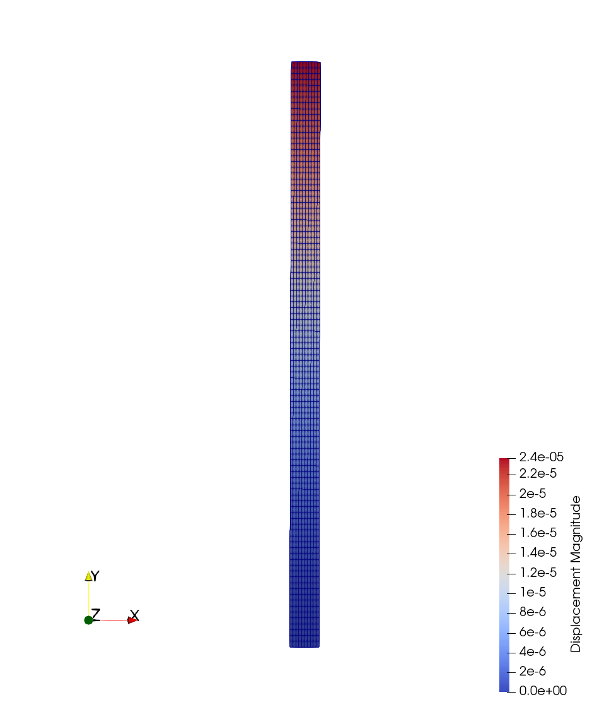

### Goals

As a first approach to the structural solver in SU2, this tutorial will cover the solution of linear elastic problems. This tutorial will guide you through the basic commands for structural analysis, including:
- Setting up an elasticity problem with small deformations
- Linear elastic material model with plane stress formulation
- Non-follower load boundary definition
- Clamped boundary definition

The problem that we will be solving consists of a vertical, slender cantilever, clamped in its base, and subject to a horizontal, distributed load $$P$$ on its left boundary. This is shown in Fig. 1.


### Resources

First, please make sure you have followed the [installation guide](https://su2code.github.io/docs_v7/home/) and that you have SU2 up and running in your system. You will only need the `SU2_CFD` binary for this tutorial. If you are [building the code from source](https://su2code.github.io/docs_v7/Build-SU2-Linux-MacOS/), a single core version of the code is sufficient for this tutorial.

You can find the resources for this tutorial in the folder [structural_mechanics/cantilever](https://github.com/rsanfer/Tutorials/blob/master/structural_mechanics/cantilever) in the [Tutorials repository](https://github.com/rsanfer/Tutorials). You will need the mesh file [mesh_cantilever.su2](https://github.com/rsanfer/Tutorials/blob/master/structural_mechanics/cantilever/mesh_cantilever.su2)
and the config file [config_linear.cfg](https://github.com/rsanfer/Tutorials/blob/master/structural_mechanics/cantilever/config_linear.cfg).

### Background

This tutorial covers the solution of static, solid mechanics problems. The mathematical problem that we will be solving has the well-known form  

$$\mathbf{K} \mathbf{u} = \mathbf{F},$$  

where $$\mathbf{K}$$ is the stiffness matrix of the cantilever, $$\mathbf{u}$$ is the vector of displacements of the structural nodes and $$\mathbf{F}$$ is the vector of applied forces.  

This tutorial will be solved the for the cantilever with the following conditions:
- Young's modulus: $$\mathrm{E = 5.0}$$ $$\mathrm{GPa}$$  
- Poisson ratio: $$\nu$$ $$\mathrm{= 0.35}$$ 
- Height: $$\mathrm{H = 10}$$ $$\mathrm{mm}$$   
- Thickness: $$\mathrm{t = 0.5}$$ $$\mathrm{mm}$$

#### Mesh Description

The cantilever is discretized using 1000 4-node quad elements with linear interpolation. The boundaries are defined as follows:


#### Configuration File Options

We start building the configuration file for SU2 (\*.cfg). First of all, we need to determine the solver that we will be using. The keyword for structural problems is **ELASTICITY**, therefore

```
SOLVER = ELASTICITY
```
 
Structural problems can undergo both geometrical and material non-linearities. In this tutorial, we will be assuming small deformations and linear elastic material behaviour. We set these options using

```
GEOMETRIC_CONDITIONS = SMALL_DEFORMATIONS
MATERIAL_MODEL = LINEAR_ELASTIC
```

The structural properties are set through the Young's modulus, $$\mathrm{E}$$, and the Poisson ratio $$\nu$$ of the structure, which in this case are set respectively to $$\mathrm{E = 5.0}$$ $$\mathrm{GPa}$$ and $$\nu$$ $$\mathrm{= 0.35}$$. As the problem is solved in 2D, a plane stress assumption is imposed,

```
ELASTICITY_MODULUS = 5.0E9
POISSON_RATIO = 0.35
FORMULATION_ELASTICITY_2D = PLANE_STRESS
```

The configuration requires to input a mesh file. The mesh that we will be using in this problem is provided for download [here](https://github.com/rsanfer/Tutorials/blob/master/structural_mechanics/cantilever/mesh_cantilever.su2), in SU2 format. The options to be added to the config file are

```
MESH_FORMAT = SU2
MESH_FILENAME = mesh_cantilever.su2
```

It's now time to set the boundary conditions of the problem. The load definition is, for this case, $$P(y, t) = P = 1.0 \textrm{kPa}$$. To comply with our linear elasticity assumptions, we define $$P$$ as a non-follower load, that is, the direction of the load remains constant throughout the simulation, in the x-axis (1, 0). This boundary condition is imposed in the boundary _left_ as

```
MARKER_LOAD = ( left, 1.0, 1000, 1, 0, 0)
```

where the ```1.0``` corresponds to the value of the load, and the ```1000``` is a multiplier to set the load in kPa. The direction of the load is finally set with the vector ```(1, 0, 0)```. Next, the clamped boundary is set as

```
MARKER_CLAMPED = ( clamped )
```

Finally, it is required that every other boundary in the problem has a boundary condition imposed. This is because SU2 was originally designed as a Finite-Volume CFD solver, and this imposes some constraints over the boundary description. Therefore, we set the remaining boundaries to have a zero pressure,

```
MARKER_PRESSURE = ( upper, 0, right, 0)
```

The equation $$\mathbf{K} \mathbf{u} = \mathbf{F}$$ is a linear system, which requires the use of the linear solvers implemented in SU2. There are several options available, and the choice depends on the particular properties of the problem being solved. In this case, we opt for a conjugate gradient solver with ILU preconditioner. The tolerance is set to 1E-8, and the number of iterations is fixed in 1000 to allow for the convergence of the solver.

```
LINEAR_SOLVER = CONJUGATE_GRADIENT
LINEAR_SOLVER_PREC = ILU
LINEAR_SOLVER_ERROR = 1E-8
LINEAR_SOLVER_ITER = 1000
```

Finally, the output of the solver needs to be set. We set the screen output to print out the residual of the linear solver in the x and y components of the displacement, and the maximum Von Mises Stress (VMS) in the structure.

In this case, we will write the volume file in [Paraview](https://www.paraview.org/) format, as _linear_elastic.vtk_. The convergence file will be written as _history.csv_, which in this case will only consists of one line as the linear problem is computed in a single iteration. The binary restart file will be saved as *restart_linear_elastic.dat*.


```
SCREEN_OUTPUT = (INNER_ITER, RMS_DISP_X, RMS_DISP_Y, VMS)

TABULAR_FORMAT = CSV
OUTPUT_FILES = (RESTART, PARAVIEW_BINARY)

CONV_FILENAME = history
VOLUME_FILENAME = linear_elastic
RESTART_FILENAME = restart_linear_elastic
```

### Running SU2

This is a very small example that we will run in serial. To run this test case, follow these steps at a terminal command line:
 1. Move to the directory containing the config file ([config_linear.cfg](https://github.com/rsanfer/Tutorials/blob/master/structural_mechanics/cantilever/config_linear.cfg)) and the mesh file ([mesh_cantilever.su2](https://github.com/rsanfer/Tutorials/blob/master/structural_mechanics/cantilever/mesh_cantilever.su2)). Make sure that the SU2 tools were compiled, installed, and that their install location was added to your path.
 2. Run the executable by entering 
 
    ```
    $ SU2_CFD config_linear.cfg
    ```
     
     at the command line.
 3. SU2 will print the residual of the linear solver, and the simulation will finish after one iteration.
 4. Files containing the results will be written upon exiting SU2. The flow solution can be visualized in ParaView (.vtk) or Tecplot (.dat for ASCII).
 
For this particular problem, the solver should have run very quickly. The screen output of the code will go over your settings, before initializing the solver. Once done so, you will obtain an output such as

```
+---------------------------------------------------+
|  Inner_Iter|  rms[DispX]|  rms[DispY]|    VonMises|
+---------------------------------------------------+
|           0|   -9.779193|   -9.986436|  1.1541e+06|
```

where ```rms[DispX]``` and ```rms[DispY]``` correspond to the residual of the linear solver in the x and y components of the displacements, and ```VonMises``` corresponds to the maximum Von Mises Stress in the structural domain.

### Results


The output file contains the displacement field, the nodal tensions $$\sigma_{xx}$$, $$\sigma_{yy}$$ and $$\sigma_{xy}$$ (as Sxx, Syy and Sxy), and the Von Misses stress. In order to visualize the deformation of the cantilever on Paraview, one can use the filter _Warp By Vector_ applied on the displacement field. The solution of the problem is shown next.



### Attribution

If you are using this content for your research, please kindly cite the following reference in your work:

Sanchez, R. _et al._ (2016), [Towards a Fluid-Structure Interaction solver for problems with large deformations within the open-source SU2 suite](https://spiral.imperial.ac.uk/handle/10044/1/28633), 57th AIAA/ASCE/AHS/ASC Structures, Structural Dynamics, and Materials Conference, 4-8 January 2016, San Diego, California, USA. DOI: [10.2514/6.2016-0205](https://doi.org/10.2514/6.2016-0205)


<dl>
This work is licensed under a <a rel="license" href="http://creativecommons.org/licenses/by/4.0/">Creative Commons Attribution 4.0 International License</a>
<br />
<a rel="license" href="http://creativecommons.org/licenses/by/4.0/"></a>
</dl>

