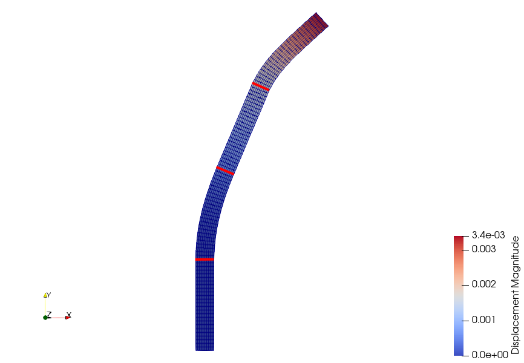

### Goals

Once completed the tutorial on [Nonlinear Elasticity](../Nonlinear_Elasticity/), we can move on to more advanced features. This document will guide you through the setup of a non-linear problem with multiple material definitions.

In this tutorial, we use the same problem definition as for the nonlinear elasticity tutorial: a vertical, slender cantilever, clamped in its base, and subject to a horizontal, follower load $$P$$ on its left boundary. However, in this section, we will discretize the cantilever into four regions, R0, R1, R2 and R3,


### Resources

You can find the resources for this tutorial in the same [structural_mechanics/cantilever](https://github.com/su2code/Tutorials/blob/master/structural_mechanics/cantilever) folder in the [Tutorials repository](https://github.com/su2code/Tutorials). You can reuse the mesh file [mesh_cantilever.su2](https://github.com/su2code/Tutorials/blob/master/structural_mechanics/cantilever/mesh_cantilever.su2)
from the Non-linear Elasticity tutorial, but you will need a new config file, [config_nonlinear_multimaterial.cfg](https://github.com/su2code/Tutorials/blob/master/structural_mechanics/cantilever/config_nonlinear_multimaterial.cfg), and an element properties file, [element_properties.dat](https://github.com/su2code/Tutorials/blob/master/structural_mechanics/cantilever/element_properties.dat)

### Background

SU2 has been designed using a finite-deformation framework$$^1$$ to account for geometrical and material non-linearities. We can write the non-linear structural problem via the residual equation

$$\mathscr{S}(\mathbf{u}) = \mathbf{T}(\mathbf{u}) - \mathbf{F}_b - \mathbf{F}_{\Gamma}(\mathbf{u})$$

which has been obtained from the weak formulation of the structural problem defined using the principle of virtual work and discretized using FEM.

In a Finite Element framework, it is normally possible to define different properties for each element. In this tutorial, we will exemplify the ability of SU2 to deal with this kind of problems.


#### Configuration File Options

The first thing required to deal with multiple materials, is to add the command

```
FEA_FILENAME = element_properties.dat
```

that defines the name of the element-based input file for material definition. This file has the format

```
INDEX MPROP
0     0
1     0
...
249   0
250   1
...
499   1
500   2
...
749   2
750   3
...
999   3
```

where the fields, that must be separated by tabs, are:
- `INDEX` corresponds to the element ID number from the mesh file.
- `MPROP` sets the material properties. In this case, the Young's modulus and the Poisson ratio are:
  - `0`: $$E$$ = 80 GPa, $$\nu$$ = 0.4 
  - `1`: $$E$$ = 10 MPa, $$\nu$$ = 0.35
  - `2`: $$E$$ = 50 GPa, $$\nu$$ = 0.4
  - `3`: $$E$$ = 0.5 MPa, $$\nu$$ = 0.35

The regions R0, R1, R2 and R3 are assigned the `MPROP` `0`, `1`, `2` and `3` respectively, using the config options

```
ELASTICITY_MODULUS = (8.0E10, 1.0E7, 5.0E10, 5.0E5)
POISSON_RATIO = (0.4, 0.35, 0.4, 0.35)
```

Finally, given the flexibility of the regions R1 and R3, an incremental approach with 10 increments is adopted. 

### Running SU2

Follow the links provided to download the [config](https://github.com/su2code/Tutorials/blob/master/structural_mechanics/cantilever/config_nonlinear_multimaterial.cfg), [mesh](https://github.com/su2code/Tutorials/blob/master/structural_mechanics/cantilever/mesh_cantilever.su2) and [element_properties](https://github.com/su2code/Tutorials/blob/master/structural_mechanics/cantilever/element_properties.dat) files. Execute the code with the standard command

```
SU2_CFD config_nonlinear_multimaterial.cfg
```

which will show the following convergence history:

```
+-----------------------------------------------------------------------------+
|  Inner_Iter|     Load[%]|      rms[U]|      rms[R]|      rms[E]|    VonMises|
+-----------------------------------------------------------------------------+
|           0|     100.00%|   -1.331677|   -0.001635|   -2.028421|  1.0799e+06|
|           1|     100.00%|   -1.913135|    6.972674|    3.447084|  1.0925e+06|

Incremental load: increment 1
+-----------------------------------------------------------------------------+
|  Inner_Iter|     Load[%]|      rms[U]|      rms[R]|      rms[E]|    VonMises|
+-----------------------------------------------------------------------------+
|           0|      10.00%|   -2.331677|   -1.001635|   -4.028421|  1.0799e+05|
|           1|      10.00%|   -3.953012|    5.031711|   -0.519843|  1.0811e+05|
|           2|      10.00%|   -5.865271|    2.061363|   -6.461089|  1.0801e+05|
|           3|      10.00%|   -4.917638|   -1.802157|   -9.113119|  1.0815e+05|
|           4|      10.00%|   -7.297420|    0.015521|  -10.552833|  1.0815e+05|
|           5|      10.00%|   -8.662326|   -5.220135|  -16.527473|  1.0815e+05|
|           6|      10.00%|  -10.815817|   -6.023510|  -20.970444|  1.0815e+05|

...

Incremental load: increment 10
+-----------------------------------------------------------------------------+
|  Inner_Iter|     Load[%]|      rms[U]|      rms[R]|      rms[E]|    VonMises|
+-----------------------------------------------------------------------------+
|           0|     100.00%|   -2.283509|   -0.993242|   -3.982743|  1.0465e+06|
|           1|     100.00%|   -3.756525|    5.121588|   -0.339856|  1.0346e+06|
|           2|     100.00%|   -3.896361|    2.241346|   -6.029630|  1.0345e+06|
|           3|     100.00%|   -3.627203|    1.451203|   -6.004211|  1.0324e+06|
|           4|     100.00%|   -4.983506|    2.651319|   -5.278535|  1.0327e+06|
|           5|     100.00%|   -3.331444|    0.181474|   -5.953341|  1.0275e+06|
|           6|     100.00%|   -4.756347|    3.176148|   -4.231894|  1.0285e+06|
|           7|     100.00%|   -5.265075|   -1.650930|   -9.520310|  1.0285e+06|
|           8|     100.00%|   -6.374912|   -0.472377|  -11.419412|  1.0285e+06|
|           9|     100.00%|   -7.163173|   -2.954409|  -13.740312|  1.0285e+06|
|          10|     100.00%|   -7.779284|   -4.698500|  -14.967597|  1.0285e+06|
|          11|     100.00%|   -8.401311|   -5.725573|  -16.209560|  1.0285e+06|
|          12|     100.00%|   -9.025030|   -5.856932|  -17.456694|  1.0285e+06|
|          13|     100.00%|   -9.649048|   -5.830228|  -18.704672|  1.0285e+06|
|          14|     100.00%|  -10.273113|   -5.868586|  -19.952520|  1.0285e+06|
|          15|     100.00%|  -10.897181|   -5.857269|  -21.195730|  1.0285e+06|
|          16|     100.00%|  -11.521238|   -5.879621|  -22.365896|  1.0285e+06|
|          17|     100.00%|  -12.145524|   -5.909298|  -23.057966|  1.0285e+06|
|          18|     100.00%|  -12.769967|   -5.910878|  -23.152629|  1.0285e+06|
|          19|     100.00%|  -13.393813|   -5.839072|  -23.069515|  1.0285e+06|
```

The code is stopped as soon as the values of ```rms[U]```, ```rms[R]``` and ```rms[E]``` are below the convergence criteria set in the config file, although for some increments it reaches the maximum number of iterations (20). This is due to the ill conditioning of the matrix of the problem because of the large differences in stiffness between regions.

The displacement field obtained in _nonlinear_multimaterial.vtk_ is shown below:



where it can be observed how the flexible regions undergo large deformations, while the regions R0 and R2 remain virtually unaltered due to their high stiffness. The highlighted elements correspond to the interfaces between R1, R2, R3 and R4.

### References
$$^1$$ Bonet, J. and Wood, R.D. (2008), Nonlinear Continuum Mechanics for Finite Element Analysis, _Cambridge University Press_

### Attribution

If you are using this content for your research, please kindly cite the following reference (reference $$^2$$ in the text above) in your derived works:

Sanchez, R. _et al._ (2018), [Coupled Adjoint-Based Sensitivities in Large-Displacement Fluid-Structure Interaction using Algorithmic Differentiation](https://spiral.imperial.ac.uk/handle/10044/1/51023), _Int J Numer Meth Engng, Vol 111, Issue 7, pp 1081-1107_. DOI: [10.1002/nme.5700](https://doi.org/10.1002/nme.5700)

<dl>
This work is licensed under a <a rel="license" href="http://creativecommons.org/licenses/by/4.0/">Creative Commons Attribution 4.0 International License</a>
<br />
<a rel="license" href="http://creativecommons.org/licenses/by/4.0/"></a>
</dl>
